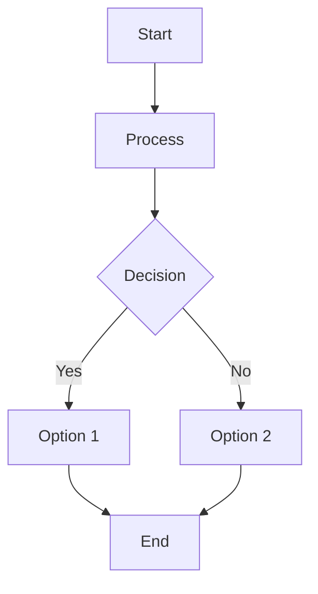
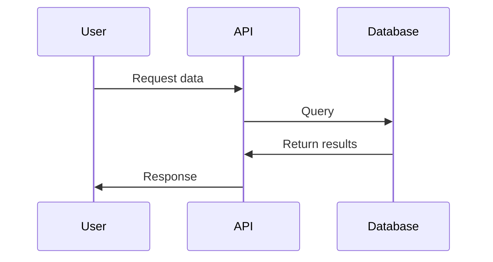
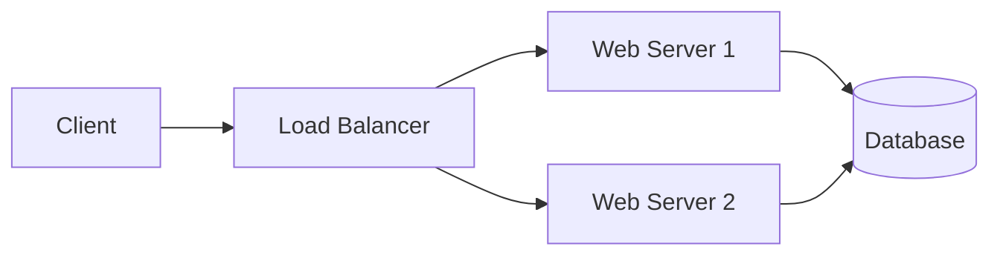
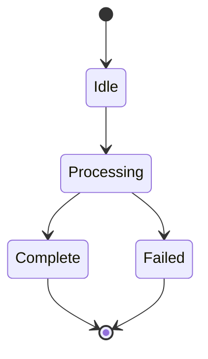

# Tech Blogs for DevOps & CloudOps

A professional technology blog built with Jekyll and GitHub Pages, featuring in-depth articles on DevOps, CloudOps, Kubernetes, Infrastructure Automation, and Cloud Architecture.

🌐 **Live Site**: [https://pramodksahoo.github.io/](https://pramodksahoo.github.io/)

---

## 📖 About This Blog

This blog explores modern DevOps practices, CloudOps strategies, and Infrastructure Automation through real-world engineering experiences. Topics include:

- **Kubernetes & Container Orchestration**
- **CI/CD Pipelines & GitOps**
- **Infrastructure as Code (Terraform, Ansible)**
- **Security & Zero-Trust Architecture**
- **Observability & Monitoring (EFK, Prometheus)**
- **Cloud Architecture (AWS, Azure, GCP)**

---

## 🏗️ Repository Structure

```
pramodksahoo.github.io/
├── _config.yml              # Jekyll site configuration
├── _includes/               # Reusable HTML components
│   ├── head.html           # Site head with fonts, Mermaid.js
│   ├── navlinks.html       # Post navigation links
│   └── sharelinks.html     # Social sharing buttons
├── _layouts/                # Page templates
│   ├── home.html           # Custom homepage layout
│   └── post.html           # Blog post layout
├── _posts/                  # 📝 Blog posts go here!
│   ├── 2025-07-11-zero-trust-security-in-kubernetes.md
│   └── 2025-09-12-efk-stack-with-20-elasticsearch-nodes-at-scale.md
├── css/
│   └── override.css        # Custom styling
├── js/                      # JavaScript libraries
│   └── highlightjs/        # Code syntax highlighting
├── index.md                 # Homepage content
├── archive.md               # All posts archive page
└── README.md               # This file
```

---

## ✍️ How to Add a New Blog Post

### Step 1: Create the Blog Post File

Create a new Markdown file in the `_posts/` directory following this naming convention:

```
YYYY-MM-DD-title-with-hyphens.md
```

**Examples:**
- ✅ `2025-11-07-kubernetes-security-best-practices.md`
- ✅ `2025-12-15-terraform-multi-cloud-deployment.md`
- ❌ `kubernetes-security.md` (missing date)
- ❌ `2025-11-07-post.md` (not descriptive)

### Step 2: Add Front Matter

Every blog post must start with YAML front matter:

```yaml
---
layout: post
title: "Your Blog Post Title"
date: 2025-11-07
categories: [DevOps, Kubernetes]
tags: [kubernetes, security, devops]
author: Pramoda Sahoo
---
```

**Front Matter Fields:**
- `layout`: Always use `post`
- `title`: Your post title (will appear in browser tab and post header)
- `date`: Publication date (YYYY-MM-DD)
- `categories`: Main categories (optional)
- `tags`: Keywords for the post (optional)
- `author`: Your name (optional, defaults to site author)

### Step 3: Write Your Content

Write your blog post content in Markdown format below the front matter:

```markdown
---
layout: post
title: "Building a Production-Ready Kubernetes Cluster"
date: 2025-11-07
categories: [Kubernetes, Infrastructure]
tags: [kubernetes, k8s, production, infrastructure]
---

# Building a Production-Ready Kubernetes Cluster

## Introduction

Your content starts here...

## Section 1: Prerequisites

More content...

### Subsection

Even more content...
```

---

## 📝 Markdown Formatting Guide

### Headings
```markdown
# H1 - Main Title (use once per post)
## H2 - Major Sections
### H3 - Subsections
#### H4 - Minor subsections
```

### Text Formatting
```markdown
**Bold text**
*Italic text*
~~Strikethrough~~
`Inline code`
[Link text](https://example.com)
```

### Code Blocks

**Single language:**
````markdown
```bash
kubectl get pods -n production
```
````

**With syntax highlighting:**
````markdown
```yaml
apiVersion: v1
kind: Pod
metadata:
  name: nginx
```
````

**Supported languages:** bash, yaml, json, python, javascript, java, go, terraform, dockerfile, and more.

### Lists

**Unordered:**
```markdown
- Item 1
- Item 2
  - Nested item
  - Another nested item
- Item 3
```

**Ordered:**
```markdown
1. First step
2. Second step
3. Third step
```

### Tables
```markdown
| Header 1 | Header 2 | Header 3 |
|----------|----------|----------|
| Row 1    | Data     | More     |
| Row 2    | Data     | More     |
```

### Images
```markdown

```

### Blockquotes
```markdown
> This is a quote
> It can span multiple lines
```

---

## 📊 Adding Diagrams with Mermaid

This blog supports **Mermaid.js** for creating diagrams directly in Markdown!

### Flowcharts
````markdown

````

### Sequence Diagrams
````markdown

````

### Architecture Diagrams
````markdown

````

### State Diagrams
````markdown

````

**Note**: When using state diagrams, avoid `<br/>` tags and bullet points in labels. Use plain text or parentheses instead.

### More Diagram Types
- Class diagrams
- Entity relationship diagrams
- Gantt charts
- Pie charts
- User journey maps

📚 [Full Mermaid Documentation](https://mermaid.js.org/)

---

## 🎨 Styling & Customization

### Custom CSS

Add custom styles to `css/override.css`. The site uses CSS variables for easy theming:

```css
:root {
  --primary-color: #2563eb;
  --secondary-color: #7c3aed;
  --accent-color: #06b6d4;
  /* ... more variables */
}
```

### Fonts

The site uses:
- **Inter** - Primary font (body text, headings)
- **Fira Code** - Monospace font (code blocks)

Fonts are loaded from Google Fonts in `_includes/head.html`.

---

## 🚀 Publishing Workflow

### Local Testing (Optional)

If you have Jekyll installed locally:

```bash
# Install dependencies
bundle install

# Run local server
bundle exec jekyll serve

# Visit http://localhost:4000
```

### Publishing to GitHub Pages

1. **Commit your changes:**
```bash
git add _posts/YYYY-MM-DD-your-post-title.md
git commit -m "Add new post: Your Post Title"
```

2. **Push to GitHub:**
```bash
git push origin main
```

3. **Wait for deployment:**
   - GitHub Pages automatically builds your site
   - Build takes 2-5 minutes
   - Check the Actions tab for build status

4. **Verify live site:**
   - Visit https://pramodksahoo.github.io/
   - Your new post should appear on the homepage

---

## 📁 File Naming Conventions

### Blog Posts
```
Format: YYYY-MM-DD-descriptive-title.md
Location: _posts/

Examples:
✅ 2025-11-07-kubernetes-networking-deep-dive.md
✅ 2025-12-01-terraform-aws-infrastructure.md
❌ kubernetes-post.md (no date)
❌ 2025-11-07.md (no description)
```

### Pages
```
Format: lowercase-with-hyphens.md
Location: Root directory

Examples:
✅ about.md
✅ archive.md
✅ contact.md
```

---

## 🔧 Configuration

### Site Settings (`_config.yml`)

```yaml
title: "Tech Blogs for DevOps & CloudOps"
author: "Pramoda Sahoo"
description: "Your site description"
email: "your-email@example.com"
github_username: "pramodksahoo"
linkedin_username: "pramoda-sahoo"
twitter_username: "your-twitter"
url: "https://pramodksahoo.github.io"
```

### Changing the Theme

The site uses Jekyll's Minima theme with extensive customizations. To update theme settings, modify:
- `_layouts/` - Page templates
- `_includes/` - Reusable components
- `css/override.css` - Custom styles

---

## 📊 Features

### Homepage
- ✨ Modern hero section with gradient background
- 📱 Responsive card-based post grid
- 🎯 Featured latest 6 articles
- 🏷️ Topic tags (Kubernetes, CI/CD, Security, etc.)
- 🔗 Social media integration

### Blog Posts
- 📝 Clean, readable typography
- 💻 Syntax highlighting for code blocks
- 📊 Mermaid diagram support
- 🔗 Post navigation (previous/next)
- 📤 Social sharing buttons
- 📅 Automatic date formatting

### Technical Features
- 🚀 Fast loading (optimized CSS, lazy loading)
- 📱 Mobile-responsive design
- ♿ Accessible (WCAG AA compliant)
- 🔍 SEO optimized
- 📡 RSS feed support
- 🗺️ Sitemap generation

---

## 🎯 Best Practices

### Writing Guidelines

1. **Use descriptive titles**
   - ✅ "Building Observable Systems: EFK Stack with 20+ Elasticsearch Nodes"
   - ❌ "My Elasticsearch Setup"

2. **Start with a hook**
   - Begin with a real-world scenario or problem
   - Engage readers immediately

3. **Use headings for structure**
   - Break content into logical sections
   - Use H2 for main sections, H3 for subsections

4. **Add code examples**
   - Show practical, working code
   - Include context and explanations

5. **Use diagrams**
   - Visualize architecture and workflows
   - Make complex concepts easier to understand

6. **Include real metrics**
   - Share actual numbers and results
   - Demonstrate real-world impact

7. **Proofread before publishing**
   - Check spelling and grammar
   - Test all links and code examples

### Technical Guidelines

1. **Test locally first** (if possible)
2. **Commit with descriptive messages**
3. **Use semantic versioning for major changes**
4. **Keep posts focused** (one main topic per post)
5. **Optimize images** (compress before uploading)
6. **Link to related posts** (internal linking)

---

## 🐛 Troubleshooting

### Post Not Showing Up?

**Check:**
1. ✅ File is in `_posts/` directory
2. ✅ Filename follows `YYYY-MM-DD-title.md` format
3. ✅ Front matter is valid YAML (between `---` marks)
4. ✅ Date is not in the future
5. ✅ GitHub Pages build completed successfully

### Mermaid Diagrams Not Rendering?

**Check:**
1. ✅ Using proper mermaid syntax (check [Mermaid docs](https://mermaid.js.org/))
2. ✅ Code block starts with ` ```mermaid `
3. ✅ No HTML tags like `<br/>` in state diagram labels
4. ✅ Clear browser cache (Ctrl+Shift+R / Cmd+Shift+R)

### Styling Issues?

**Check:**
1. ✅ `css/override.css` has no syntax errors
2. ✅ CSS variables are properly defined
3. ✅ Browser cache is cleared

### Build Failures?

**Check:**
1. ✅ GitHub Actions tab for error details
2. ✅ YAML syntax in `_config.yml` is valid
3. ✅ All file paths are correct
4. ✅ No invalid Liquid template syntax

---

## 📚 Resources

### Jekyll Documentation
- [Jekyll Official Docs](https://jekyllrb.com/docs/)
- [Jekyll Themes](https://jekyllrb.com/docs/themes/)
- [Liquid Template Language](https://shopify.github.io/liquid/)

### GitHub Pages
- [GitHub Pages Docs](https://docs.github.com/en/pages)
- [GitHub Pages Build Troubleshooting](https://docs.github.com/en/pages/setting-up-a-github-pages-site-with-jekyll/troubleshooting-jekyll-build-errors-for-github-pages-sites)

### Markdown
- [Markdown Guide](https://www.markdownguide.org/)
- [GitHub Flavored Markdown](https://github.github.com/gfm/)

### Mermaid Diagrams
- [Mermaid Documentation](https://mermaid.js.org/)
- [Mermaid Live Editor](https://mermaid.live/) (test diagrams)

### Design Resources
- [Google Fonts](https://fonts.google.com/)
- [Coolors](https://coolors.co/) (color palettes)
- [Hero Icons](https://heroicons.com/) (SVG icons)

---

## 📞 Contact & Social

- **GitHub**: [@pramodksahoo](https://github.com/pramodksahoo)
- **LinkedIn**: [pramoda-sahoo](https://linkedin.com/in/pramoda-sahoo)
- **Email**: devopspramod100@gmail.com
- **Blog**: [pramodksahoo.github.io](https://pramodksahoo.github.io/)

---

## 📄 License

This project is open source and available under the [MIT License](LICENSE).

---

## 🙏 Acknowledgments

- **Jekyll** - Static site generator
- **GitHub Pages** - Free hosting
- **Minima Theme** - Base Jekyll theme
- **Mermaid.js** - Diagram rendering
- **Highlight.js** - Code syntax highlighting
- **Google Fonts** - Inter & Fira Code fonts

---

## 📈 Stats

- **Total Posts**: Check the [archive page](https://pramodksahoo.github.io/archive)
- **Topics Covered**: DevOps, CloudOps, Kubernetes, Security, Observability
- **Tech Stack**: Jekyll, GitHub Pages, Mermaid.js, Highlight.js

---

**Happy Blogging! 🚀**

*Last Updated: November 7, 2025*
