# From 150 Pipelines to One: Centralizing CI/CD with Jenkins Shared Libraries

## How We Transformed CI/CD Chaos into a Unified Platform Serving 12 Engineering Teams

**The Slack Message That Started It All:**

```
Developer: "Hey, how do I deploy to production? I copied 
           the Jenkinsfile from team-backend but it's not working"

Me: "Which Jenkinsfile? We have like 30 different versions"

Developer: "The one that does the Docker build thing"

Me: "That describes 80% of our pipelines 😅"

Developer: "This is ridiculous. Can't we have ONE way to deploy?"

Me: "... hold that thought"
```

It was November 2021 at Fidelity Information Services (FIS), and our CI/CD infrastructure was a mess. **150+ unique Jenkins pipelines**, each team copying and modifying Jenkinsfiles like they were sharing recipes at a potluck. Every pipeline was a snowflake—beautifully unique, impossibly fragile, and melting under the slightest pressure.

**The Cost of Chaos:**
- Average time to create new pipeline: **2-3 days** (copy, modify, debug, repeat)
- Pipeline maintenance: **15+ hours/week** (fixing broken builds across teams)
- Deployment failures: **~30% of builds** (inconsistent configurations)
- Knowledge silos: Only 3 people understood "the old Java pipeline"
- Developer frustration: **Through the roof**

**Six months later:**
- **ONE centralized shared library** powering all 150+ pipelines
- New pipeline creation time: **< 15 minutes**
- Pipeline maintenance: **< 2 hours/week**
- Deployment failures: **< 5%**
- Any developer can create/modify pipelines
- **Saved 200+ engineering hours/month**

This is the complete story of how we built production-ready Jenkins infrastructure on Kubernetes and transformed 150 fragmented pipelines into a unified, maintainable CI/CD platform using Jenkins Shared Libraries.

---

## Table of Contents
1. [The Pain: 150 Pipelines of Chaos](#pain)
2. [Part 1: Building Production-Ready Jenkins on EKS](#jenkins-infra)
3. [Part 2: The Shared Library Architecture](#shared-lib)
4. [Part 3: Pipeline Standardization Strategy](#standardization)
5. [Part 4: Migration: From Chaos to Consistency](#migration)
6. [Part 5: Results and Impact](#results)
7. [Lessons Learned](#lessons)

---

<a name="pain"></a>
## The Pain: 150 Pipelines of Chaos

```mermaid
graph TB
    Title["<b>Before Shared Library - 150 Unique Pipelines</b>"]
    
    subgraph JavaTeam["Java Teams - 48 Pipelines"]
        J1["team-a<br/>Jenkinsfile<br/>73 lines"]
        J2["team-b<br/>Jenkinsfile<br/>85 lines"]
        J3["team-c<br/>Jenkinsfile<br/>67 lines"]
        JN["... 45 more<br/>ALL different"]
    end
    
    subgraph NodeTeam["Node.js Teams - 35 Pipelines"]
        N1["frontend-a<br/>Jenkinsfile<br/>92 lines"]
        N2["frontend-b<br/>Jenkinsfile<br/>78 lines"]
        NN["... 33 more<br/>ALL different"]
    end
    
    subgraph PythonTeam["Python Teams - 22 Pipelines"]
        P1["data-team<br/>Jenkinsfile<br/>56 lines"]
        P2["ml-team<br/>Jenkinsfile<br/>102 lines"]
        PN["... 20 more<br/>ALL different"]
    end
    
    subgraph Problems["The Problems"]
        Prob1["❌ Copy/Paste Culture<br/>No consistency"]
        Prob2["❌ Maintenance Nightmare<br/>15 hrs/week fixing"]
        Prob3["❌ 30% Failure Rate<br/>Inconsistent configs"]
        Prob4["❌ 2-3 Days<br/>To create new pipeline"]
        Prob5["❌ Knowledge Silos<br/>Only 3 people understand"]
    end
    
    Title --> JavaTeam
    Title --> NodeTeam
    Title --> PythonTeam
    
    J1 -.-> Prob1
    N1 -.-> Prob2
    P1 -.-> Prob3
    J2 -.-> Prob4
    N2 -.-> Prob5
    
    style Title fill:#ffcccc,stroke:#cc0000,stroke-width:3px,color:#000
    style JavaTeam fill:#fff5e6
    style NodeTeam fill:#fff5e6
    style PythonTeam fill:#fff5e6
    style Problems fill:#ff9999
```



---


---

### What We Inherited

When I joined FIS's DevOps team, here's what our Jenkins landscape looked like:

**Pipeline Inventory (November 2021):**
```
Total Pipelines: 152
├── Java Maven builds: 48 (32 different Jenkinsfiles)
├── Node.js builds: 35 (28 different Jenkinsfiles)
├── Python builds: 22 (19 different Jenkinsfiles)
├── Docker builds: 31 (ALL different)
├── Terraform deployments: 16 (12 different)
└── "Special" pipelines: Random chaos
```

**The Core Problem:** Every team had copied a Jenkinsfile from somewhere, modified it for their needs, and then never updated it again. Pipeline maintenance was reactive—fix only when it breaks.

### A Day in the Life (Before)

**Monday, 9:15 AM:**
```groovy
// team-a's Jenkinsfile (works)
pipeline {
    agent { label 'docker' }
    stages {
        stage('Build') {
            steps {
                sh 'mvn clean package'
            }
        }
    }
}
```

**Monday, 2:30 PM:**
```groovy
// team-b's Jenkinsfile (copied from team-a, modified)
pipeline {
    agent { label 'maven' }  // Different agent!
    stages {
        stage('Build & Test') {  // Combined stages
            steps {
                sh 'mvn clean verify'  // Different Maven goal
                sh 'docker build .'    // Added Docker
            }
        }
    }
}
```

**Tuesday, 10:00 AM:**
```groovy
// team-c's Jenkinsfile (copied from team-b, more modifications)
pipeline {
    agent { label 'java11' }  // Yet another agent!
    stages {
        stage('Checkout') {  // Added explicit checkout
            steps {
                git 'https://github.com/...'
            }
        }
        stage('Build') {
            steps {
                sh 'mvn clean install'  // Different goal again!
                sh 'docker build -t myapp:${BUILD_NUMBER} .'
                sh 'docker push myapp:${BUILD_NUMBER}'
            }
        }
    }
}
```

**Wednesday:** All three teams' builds break because we updated the Java agent image. **Now we have to fix 150 pipelines.**

### The Tipping Point

**The Incident:** January 2022

We needed to add SonarQube scanning to all pipelines for security compliance. The estimate? **3 weeks to modify 150 pipelines manually.**

**The Executive Decision:**
> "This is unsustainable. I don't care how you do it, but we need ONE way to build and deploy. Make it happen."

Challenge accepted.

---

<a name="jenkins-infra"></a>
## Part 1: Building Production-Ready Jenkins on EKS

Before we could centralize pipelines, we needed rock-solid Jenkins infrastructure.

```mermaid
graph TB
    subgraph Internet["External Access"]
        Users["👨‍💻 Developers<br/>Engineers"]
    end
    
    subgraph DNS["DNS Layer"]
        Route53["Route 53<br/>jenkins-prod.fis.com"]
        ACM["AWS Certificate Manager<br/>TLS Certificate"]
    end
    
    subgraph Ingress["Ingress Layer"]
        NGINX["NGINX Ingress<br/>TLS Termination<br/>Load Balancing"]
    end
    
    subgraph EKS["Amazon EKS Cluster"]
        subgraph Controllers["Jenkins Controllers - StatefulSet"]
            C1["Controller 1<br/>AZ-A<br/>4GB RAM"]
            C2["Controller 2<br/>AZ-B<br/>4GB RAM"]
            C3["Controller 3<br/>AZ-C<br/>4GB RAM"]
            C4["Controller 4<br/>AZ-A<br/>4GB RAM"]
        end
        
        subgraph Storage["Shared Storage"]
            EFS["Amazon EFS<br/>JENKINS_HOME<br/>Encrypted<br/>Multi-AZ"]
        end
        
        subgraph Agents["Dynamic Kubernetes Agents"]
            AgentMaven["Maven Agent<br/>On-demand Pod<br/>Java 17 + Maven 3.9"]
            AgentNode["Node.js Agent<br/>On-demand Pod<br/>Node 18"]
            AgentPython["Python Agent<br/>On-demand Pod<br/>Python 3.11"]
            AgentDocker["Docker Agent<br/>On-demand Pod<br/>Docker-in-Docker"]
        end
        
        subgraph Config["Configuration"]
            JCasC["Jenkins CasC<br/>Configuration as Code<br/>Shared Library config"]
        end
    end
    
    subgraph Monitoring["Monitoring & Backup"]
        Prometheus["Prometheus<br/>Metrics Collection"]
        Grafana["Grafana<br/>Dashboards"]
        Backup["AWS Backup<br/>Daily EFS Snapshots<br/>S3 Configuration Backup"]
    end
    
    Users --> Route53
    Route53 --> ACM
    ACM --> NGINX
    NGINX --> C1
    NGINX --> C2
    NGINX --> C3
    NGINX --> C4
    
    C1 --> EFS
    C2 --> EFS
    C3 --> EFS
    C4 --> EFS
    
    C1 -.->|Spawn| AgentMaven
    C2 -.->|Spawn| AgentNode
    C3 -.->|Spawn| AgentPython
    C4 -.->|Spawn| AgentDocker
    
    JCasC -.->|Configure| C1
    JCasC -.->|Configure| C2
    JCasC -.->|Configure| C3
    JCasC -.->|Configure| C4
    
    C1 --> Prometheus
    C2 --> Prometheus
    Prometheus --> Grafana
    
    EFS --> Backup
    
    style EKS fill:#e6f3ff
    style Controllers fill:#ffcc99
    style Agents fill:#ccffcc
    style Storage fill:#ffccff
    style Monitoring fill:#ffffcc
```



---

### The Old Jenkins Setup (Don't Do This)

```
Jenkins Master: EC2 t3.xlarge
- Single point of failure
- Manual backups (when we remembered)
- Agents: 10 EC2 instances running 24/7
- Cost: $3,200/month
- Scalability: LOL
```

**Problems:**
- Jenkins went down? All builds stop
- Need more capacity? Provision EC2 instance (30 minutes)
- Upgrades? Hope and pray
- Backups? "We should really do that..."

### The New Architecture: Jenkins on EKS

We designed a production-ready Jenkins platform on Kubernetes:

```
┌─────────────────────────────────────────────┐
│          Production Jenkins on EKS          │
├─────────────────────────────────────────────┤
│                                             │
│  ┌──────────────────────────────────────┐   │
│  │   Jenkins Controllers (StatefulSet)  │   │
│  │   - 4 replicas across 3 AZs          │   │
│  │   - Anti-affinity rules              │   │
│  │   - Configuration as Code (JCasC)    │   │
│  └──────────────────────────────────────┘   │
│               │                             │
│               ↓                             │
│  ┌──────────────────────────────────────┐   │
│  │   Amazon EFS (Shared Storage)        │   │
│  │   - JENKINS_HOME persistence         │   │
│  │   - Multi-AZ, encrypted              │   │
│  │   - Automated backups                │   │
│  └──────────────────────────────────────┘   │
│               │                             │
│               ↓                             │
│  ┌──────────────────────────────────────┐   │
│  │   Dynamic Kubernetes Agents          │   │
│  │   - On-demand pods                   │   │
│  │   - Language-specific labels         │   │
│  │   - Auto-scaling                     │   │
│  └──────────────────────────────────────┘   │
│               │                             │
│               ↓                             │
│  ┌──────────────────────────────────────┐   │
│  │   NGINX Ingress + TLS                │   │
│  │   - jenkins-prod.example.com         │   │
│  │   - ACM certificate                  │   │
│  └──────────────────────────────────────┘   │
└─────────────────────────────────────────────┘
```

### Step 1: EFS for Jenkins Persistence

**Why EFS?** JENKINS_HOME needs to be shared across multiple controller replicas.

```yaml
# efs-volume-mount.yaml
apiVersion: v1
kind: PersistentVolume
metadata:
  name: jenkins-efs-pv
spec:
  capacity:
    storage: 100Gi
  volumeMode: Filesystem
  accessModes:
    - ReadWriteMany
  persistentVolumeReclaimPolicy: Retain
  storageClassName: efs-sc
  csi:
    driver: efs.csi.aws.com
    volumeHandle: fs-0a1b2c3d4e5f6g7h8  # Your EFS ID
    volumeAttributes:
      encryptionInTransit: "true"
---
apiVersion: v1
kind: PersistentVolumeClaim
metadata:
  name: jenkins-efs-pvc
  namespace: jenkins
spec:
  accessModes:
    - ReadWriteMany
  storageClassName: efs-sc
  resources:
    requests:
      storage: 100Gi
```

**Apply:**
```bash
kubectl create namespace jenkins
kubectl apply -f efs-volume-mount.yaml
```

### Step 2: Jenkins Helm Values (Production-Ready)

```yaml
# values.yaml - Production configuration
controller:
  # High availability - 4 replicas
  replicaCount: 4
  
  # Jenkins version
  image:
    tag: "2.452.2-lts"
  
  # Use EFS for JENKINS_HOME
  persistence:
    existingClaim: jenkins-efs-pvc
    storageClass: efs-sc
  
  # Resource requests/limits
  resources:
    requests:
      cpu: "2"
      memory: "4Gi"
    limits:
      cpu: "4"
      memory: "8Gi"
  
  # JVM tuning
  javaOpts: "-Xms2g -Xmx4g -XX:+UseG1GC"
  
  # Configuration as Code (JCasC)
  JCasC:
    enabled: true
    defaultConfig: true
    configScripts:
      welcome-message: |
        jenkins:
          systemMessage: "Production Jenkins - Managed by Platform Team"
      
      # Shared library configuration
      global-libraries: |
        unclassified:
          globalLibraries:
            libraries:
              - name: "jenkins-shared-library"
                retriever:
                  modernSCM:
                    scm:
                      git:
                        remote: "https://github.com/fis-devops/jenkins-shared-library.git"
                        credentialsId: "github-token"
                defaultVersion: "main"
                implicit: true
                allowVersionOverride: true
      
      # Kubernetes cloud configuration
      kubernetes-agent: |
        jenkins:
          clouds:
            - kubernetes:
                name: "kubernetes"
                serverUrl: "https://kubernetes.default"
                namespace: "jenkins"
                jenkinsUrl: "http://jenkins:8080"
                jenkinsTunnel: "jenkins-agent:50000"
                containerCapStr: "100"
                maxRequestsPerHostStr: "32"
                podRetention: "onFailure"
                templates:
                  # Maven agent template
                  - name: "maven"
                    label: "maven"
                    nodeUsageMode: NORMAL
                    containers:
                      - name: "maven"
                        image: "maven:3.9-eclipse-temurin-17"
                        command: "/bin/sh -c"
                        args: "cat"
                        ttyEnabled: true
                        resourceRequestCpu: "1"
                        resourceRequestMemory: "2Gi"
                        resourceLimitCpu: "2"
                        resourceLimitMemory: "4Gi"
                  
                  # Node.js agent template
                  - name: "nodejs"
                    label: "nodejs"
                    nodeUsageMode: NORMAL
                    containers:
                      - name: "nodejs"
                        image: "node:18-alpine"
                        command: "/bin/sh -c"
                        args: "cat"
                        ttyEnabled: true
                        resourceRequestCpu: "500m"
                        resourceRequestMemory: "1Gi"
                        resourceLimitCpu: "1"
                        resourceLimitMemory: "2Gi"
                  
                  # Python agent template
                  - name: "python"
                    label: "python"
                    nodeUsageMode: NORMAL
                    containers:
                      - name: "python"
                        image: "python:3.11-slim"
                        command: "/bin/sh -c"
                        args: "cat"
                        ttyEnabled: true
                        resourceRequestCpu: "500m"
                        resourceRequestMemory: "1Gi"
                        resourceLimitCpu: "1"
                        resourceLimitMemory: "2Gi"
                  
                  # Docker agent template
                  - name: "docker"
                    label: "docker"
                    nodeUsageMode: NORMAL
                    containers:
                      - name: "docker"
                        image: "docker:24-dind"
                        privileged: true
                        command: "/bin/sh -c"
                        args: "cat"
                        ttyEnabled: true
                        resourceRequestCpu: "1"
                        resourceRequestMemory: "2Gi"
                        resourceLimitCpu: "2"
                        resourceLimitMemory: "4Gi"
  
  # Essential plugins
  installPlugins:
    - kubernetes:4029.v5712230ccb_f8
    - workflow-aggregator:596.v8c21c963d92d
    - git:5.2.0
    - configuration-as-code:1810.v9b_c30a_249a_4c
    - blueocean:1.27.9
    - pipeline-stage-view:2.34
    - docker-workflow:572.v950f58993843
    - sonar:2.17.2
    - slack:664.vc9a_90f8b_c24a_
    - prometheus:2.3.2
    - job-dsl:1.87
    - credentials-binding:681.vf91669a_32e45
    - pipeline-utility-steps:2.16.2
    - http_request:1.18
    - timestamper:1.26
    - ws-cleanup:0.45
    - ansicolor:1.0.4
  
  # Security settings
  securityRealm: |-
    local:
      allowsSignup: false
  authorizationStrategy: |-
    loggedInUsersCanDoAnything:
      allowAnonymousRead: false
  
  # Prometheus metrics
  prometheus:
    enabled: true
    serviceMonitorNamespace: monitoring
  
  # Pod anti-affinity for HA
  affinity:
    podAntiAffinity:
      requiredDuringSchedulingIgnoredDuringExecution:
        - labelSelector:
            matchExpressions:
              - key: app.kubernetes.io/component
                operator: In
                values:
                  - jenkins-controller
          topologyKey: kubernetes.io/hostname

# Agent settings
agent:
  enabled: true
  defaultsProviderTemplate: "maven"
  
# Horizontal Pod Autoscaler
autoscaling:
  enabled: true
  minReplicas: 4
  maxReplicas: 8
  targetCPUUtilizationPercentage: 70
  targetMemoryUtilizationPercentage: 80

# Backup configuration
backup:
  enabled: true
  schedule: "H 2 * * *"  # Daily at 2 AM
  destination: s3://fis-jenkins-backups/

# Monitoring
serviceMonitor:
  enabled: true
  namespace: monitoring
  interval: 30s
```

### Step 3: Deploy Jenkins

```bash
# Add Jenkins Helm repo
helm repo add jenkinsci https://charts.jenkins.io
helm repo update

# Deploy Jenkins
helm upgrade --install jenkins jenkinsci/jenkins \
  --namespace jenkins \
  --values values.yaml \
  --timeout 10m \
  --wait

# Watch pods come up
kubectl get pods -n jenkins -w
```

### Step 4: NGINX Ingress with TLS

```yaml
# ingress.yaml
apiVersion: networking.k8s.io/v1
kind: Ingress
metadata:
  name: jenkins-ingress
  namespace: jenkins
  annotations:
    nginx.ingress.kubernetes.io/rewrite-target: /
    nginx.ingress.kubernetes.io/ssl-redirect: "true"
    nginx.ingress.kubernetes.io/proxy-body-size: "50m"
    nginx.ingress.kubernetes.io/proxy-read-timeout: "3600"
    nginx.ingress.kubernetes.io/proxy-send-timeout: "3600"
    cert-manager.io/cluster-issuer: "letsencrypt-prod"
spec:
  ingressClassName: nginx
  tls:
    - hosts:
        - jenkins-prod.example.com
      secretName: jenkins-tls-secret
  rules:
    - host: jenkins-prod.example.com
      http:
        paths:
          - path: /
            pathType: Prefix
            backend:
              service:
                name: jenkins
                port:
                  number: 8080
```

```bash
kubectl apply -f ingress.yaml
```

### Step 5: Access Jenkins

```bash
# Get admin password
kubectl exec -it jenkins-0 -n jenkins -- \
  cat /run/secrets/additional/chart-admin-password

# Access: https://jenkins-prod.example.com
# Login with admin user and password
```

### The Infrastructure Results

**Before (EC2-based):**
- Uptime: 99.5% (manual restarts needed)
- Scale-up time: 30 minutes
- Cost: $3,200/month
- Maintenance: 8 hours/week

**After (EKS-based):**
- Uptime: 99.95% (self-healing)
- Scale-up time: < 2 minutes (auto-scaling)
- Cost: $2,100/month
- Maintenance: < 2 hours/week

**Savings: $1,100/month + 75% less maintenance**

Now we had a solid foundation. Time to tackle the pipeline chaos.

---

<a name="shared-lib"></a>
## Part 2: The Shared Library Architecture

### What is a Jenkins Shared Library?


---

Think of it as a **npm package for Jenkins pipelines**. Instead of copying code, you import reusable functions.

**Before (Copy/Paste):**
```groovy
// Every team's Jenkinsfile
pipeline {
    agent { label 'maven' }
    stages {
        stage('Build') {
            steps {
                sh 'mvn clean package'
            }
        }
        stage('Test') {
            steps {
                sh 'mvn test'
            }
        }
        stage('Docker Build') {
            steps {
                sh 'docker build -t myapp:${BUILD_NUMBER} .'
            }
        }
        stage('Docker Push') {
            steps {
                sh 'docker push myapp:${BUILD_NUMBER}'
            }
        }
        stage('Deploy') {
            steps {
                sh 'kubectl apply -f k8s/'
            }
        }
    }
}
```

**After (Shared Library):**
```groovy
// Every team's Jenkinsfile
@Library('jenkins-shared-library') _

mavenPipeline {
    dockerImage = 'myapp'
    deployEnvironment = 'production'
}
```

**Same functionality. 3 lines instead of 30.**

### Our Shared Library Structure

```
jenkins-shared-library/
├── vars/
│   ├── mavenPipeline.groovy       # Maven build pipeline
│   ├── nodePipeline.groovy        # Node.js build pipeline
│   ├── pythonPipeline.groovy      # Python build pipeline
│   ├── dockerPipeline.groovy      # Generic Docker build
│   ├── terraformPipeline.groovy   # Infrastructure deployment
│   ├── helmPipeline.groovy        # Kubernetes Helm charts
│   ├── buildDocker.groovy         # Docker build function
│   ├── pushDocker.groovy          # Docker push function
│   ├── deployK8s.groovy           # Kubernetes deployment
│   ├── runSonarQube.groovy        # Code quality scan
│   ├── runTests.groovy            # Test execution
│   ├── sendSlackNotification.groovy  # Slack integration
│   └── scanImage.groovy           # Container security scan
├── src/
│   └── com/
│       └── fis/
│           └── jenkins/
│               ├── Docker.groovy         # Docker helper class
│               ├── Kubernetes.groovy     # K8s helper class
│               ├── Notifications.groovy  # Notification helper
│               └── Utils.groovy          # Common utilities
├── resources/
│   ├── kubernetes/
│   │   ├── deployment.yaml
│   │   └── service.yaml
│   └── sonar/
│       └── sonar-project.properties
└── README.md
```

### The Maven Pipeline Template

```groovy
// vars/mavenPipeline.groovy
def call(Map config = [:]) {
    // Default configuration
    def defaults = [
        javaVersion: '17',
        mavenVersion: '3.9',
        dockerImage: '',
        dockerRegistry: 'docker.example.com',
        sonarQubeEnabled: true,
        deployEnvironment: 'staging',
        slackChannel: '#deployments',
        timeoutMinutes: 30
    ]
    
    // Merge user config with defaults
    config = defaults + config
    
    pipeline {
        agent {
            kubernetes {
                label "maven-${UUID.randomUUID().toString()}"
                yaml """
apiVersion: v1
kind: Pod
metadata:
  labels:
    jenkins: agent
spec:
  containers:
  - name: maven
    image: maven:${config.mavenVersion}-eclipse-temurin-${config.javaVersion}
    command:
    - cat
    tty: true
    resources:
      requests:
        memory: "2Gi"
        cpu: "1"
      limits:
        memory: "4Gi"
        cpu: "2"
  - name: docker
    image: docker:24-dind
    command:
    - cat
    tty: true
    privileged: true
    volumeMounts:
    - name: docker-sock
      mountPath: /var/run/docker.sock
  volumes:
  - name: docker-sock
    hostPath:
      path: /var/run/docker.sock
"""
            }
        }
        
        options {
            buildDiscarder(logRotator(numToKeepStr: '10'))
            timestamps()
            timeout(time: config.timeoutMinutes, unit: 'MINUTES')
            ansiColor('xterm')
        }
        
        environment {
            DOCKER_REGISTRY = config.dockerRegistry
            DOCKER_IMAGE = config.dockerImage
            DEPLOY_ENV = config.deployEnvironment
        }
        
        stages {
            stage('Checkout') {
                steps {
                    checkout scm
                    script {
                        env.GIT_COMMIT_SHORT = sh(
                            script: "git rev-parse --short HEAD",
                            returnStdout: true
                        ).trim()
                        env.IMAGE_TAG = "${env.GIT_COMMIT_SHORT}-${env.BUILD_NUMBER}"
                    }
                }
            }
            
            stage('Build') {
                steps {
                    container('maven') {
                        sh """
                            mvn clean package \
                                -DskipTests \
                                -Dmaven.test.skip=true \
                                -B -V
                        """
                    }
                }
            }
            
            stage('Test') {
                steps {
                    container('maven') {
                        sh 'mvn test -B'
                    }
                }
                post {
                    always {
                        junit '**/target/surefire-reports/*.xml'
                    }
                }
            }
            
            stage('SonarQube Analysis') {
                when {
                    expression { config.sonarQubeEnabled }
                }
                steps {
                    container('maven') {
                        script {
                            runSonarQube()
                        }
                    }
                }
            }
            
            stage('Docker Build') {
                when {
                    expression { config.dockerImage != '' }
                }
                steps {
                    container('docker') {
                        script {
                            buildDocker(
                                image: "${config.dockerRegistry}/${config.dockerImage}",
                                tag: env.IMAGE_TAG
                            )
                        }
                    }
                }
            }
            
            stage('Security Scan') {
                when {
                    expression { config.dockerImage != '' }
                }
                steps {
                    container('docker') {
                        script {
                            scanImage(
                                image: "${config.dockerRegistry}/${config.dockerImage}:${env.IMAGE_TAG}"
                            )
                        }
                    }
                }
            }
            
            stage('Docker Push') {
                when {
                    expression { config.dockerImage != '' }
                }
                steps {
                    container('docker') {
                        script {
                            pushDocker(
                                image: "${config.dockerRegistry}/${config.dockerImage}",
                                tag: env.IMAGE_TAG
                            )
                        }
                    }
                }
            }
            
            stage('Deploy') {
                when {
                    branch 'main'
                }
                steps {
                    script {
                        deployK8s(
                            environment: config.deployEnvironment,
                            image: "${config.dockerRegistry}/${config.dockerImage}:${env.IMAGE_TAG}"
                        )
                    }
                }
            }
        }
        
        post {
            success {
                script {
                    sendSlackNotification(
                        channel: config.slackChannel,
                        message: "✅ Build SUCCESS: ${env.JOB_NAME} #${env.BUILD_NUMBER}",
                        color: 'good'
                    )
                }
            }
            failure {
                script {
                    sendSlackNotification(
                        channel: config.slackChannel,
                        message: "❌ Build FAILED: ${env.JOB_NAME} #${env.BUILD_NUMBER}",
                        color: 'danger'
                    )
                }
            }
            always {
                cleanWs()
            }
        }
    }
}
```

### Reusable Helper Functions

```groovy
// vars/buildDocker.groovy
def call(Map config = [:]) {
    echo "Building Docker image: ${config.image}:${config.tag}"
    
    sh """
        docker build \
            --tag ${config.image}:${config.tag} \
            --tag ${config.image}:latest \
            --build-arg BUILD_DATE=\$(date -u +'%Y-%m-%dT%H:%M:%SZ') \
            --build-arg VCS_REF=${env.GIT_COMMIT_SHORT} \
            --build-arg VERSION=${config.tag} \
            .
    """
}

// vars/pushDocker.groovy
def call(Map config = [:]) {
    echo "Pushing Docker image: ${config.image}:${config.tag}"
    
    withCredentials([usernamePassword(
        credentialsId: 'docker-registry-credentials',
        usernameVariable: 'DOCKER_USER',
        passwordVariable: 'DOCKER_PASS'
    )]) {
        sh """
            echo \$DOCKER_PASS | docker login ${config.registry} -u \$DOCKER_USER --password-stdin
            docker push ${config.image}:${config.tag}
            docker push ${config.image}:latest
        """
    }
}

// vars/deployK8s.groovy
def call(Map config = [:]) {
    echo "Deploying to ${config.environment}"
    
    withCredentials([file(credentialsId: "kubeconfig-${config.environment}", variable: 'KUBECONFIG')]) {
        sh """
            kubectl set image deployment/${config.deploymentName} \
                ${config.containerName}=${config.image} \
                --namespace=${config.namespace}
            
            kubectl rollout status deployment/${config.deploymentName} \
                --namespace=${config.namespace} \
                --timeout=5m
        """
    }
}

// vars/runSonarQube.groovy
def call(Map config = [:]) {
    withSonarQubeEnv('SonarQube') {
        sh """
            mvn sonar:sonar \
                -Dsonar.projectKey=${env.JOB_NAME} \
                -Dsonar.projectName='${env.JOB_NAME}' \
                -Dsonar.projectVersion=${env.BUILD_NUMBER}
        """
    }
    
    // Wait for quality gate
    timeout(time: 10, unit: 'MINUTES') {
        def qg = waitForQualityGate()
        if (qg.status != 'OK') {
            error "Pipeline aborted due to quality gate failure: ${qg.status}"
        }
    }
}

// vars/sendSlackNotification.groovy
def call(Map config = [:]) {
    slackSend(
        channel: config.channel,
        message: config.message,
        color: config.color,
        botUser: true,
        teamDomain: 'fis-engineering',
        tokenCredentialId: 'slack-token'
    )
}

// vars/scanImage.groovy
def call(Map config = [:]) {
    echo "Scanning image for vulnerabilities: ${config.image}"
    
    sh """
        # Using Trivy for container scanning
        docker run --rm \
            -v /var/run/docker.sock:/var/run/docker.sock \
            aquasec/trivy:latest image \
            --severity HIGH,CRITICAL \
            --exit-code 1 \
            ${config.image}
    """
}
```

### Node.js Pipeline Template

```groovy
// vars/nodePipeline.groovy
def call(Map config = [:]) {
    def defaults = [
        nodeVersion: '18',
        packageManager: 'npm',  // or 'yarn'
        dockerImage: '',
        dockerRegistry: 'docker.example.com',
        deployEnvironment: 'staging',
        slackChannel: '#deployments',
        runLint: true,
        runTests: true
    ]
    
    config = defaults + config
    
    pipeline {
        agent {
            kubernetes {
                label "nodejs-${UUID.randomUUID().toString()}"
                yaml """
apiVersion: v1
kind: Pod
spec:
  containers:
  - name: nodejs
    image: node:${config.nodeVersion}-alpine
    command:
    - cat
    tty: true
  - name: docker
    image: docker:24-dind
    command:
    - cat
    tty: true
    privileged: true
"""
            }
        }
        
        stages {
            stage('Checkout') {
                steps {
                    checkout scm
                }
            }
            
            stage('Install Dependencies') {
                steps {
                    container('nodejs') {
                        script {
                            if (config.packageManager == 'yarn') {
                                sh 'yarn install --frozen-lockfile'
                            } else {
                                sh 'npm ci'
                            }
                        }
                    }
                }
            }
            
            stage('Lint') {
                when {
                    expression { config.runLint }
                }
                steps {
                    container('nodejs') {
                        sh "${config.packageManager} run lint"
                    }
                }
            }
            
            stage('Test') {
                when {
                    expression { config.runTests }
                }
                steps {
                    container('nodejs') {
                        sh "${config.packageManager} run test"
                    }
                }
            }
            
            stage('Build') {
                steps {
                    container('nodejs') {
                        sh "${config.packageManager} run build"
                    }
                }
            }
            
            stage('Docker Build & Push') {
                when {
                    expression { config.dockerImage != '' }
                }
                steps {
                    container('docker') {
                        script {
                            def imageTag = "${env.GIT_COMMIT_SHORT}-${env.BUILD_NUMBER}"
                            buildDocker(
                                image: "${config.dockerRegistry}/${config.dockerImage}",
                                tag: imageTag
                            )
                            pushDocker(
                                image: "${config.dockerRegistry}/${config.dockerImage}",
                                tag: imageTag,
                                registry: config.dockerRegistry
                            )
                        }
                    }
                }
            }
            
            stage('Deploy') {
                when {
                    branch 'main'
                }
                steps {
                    script {
                        deployK8s(
                            environment: config.deployEnvironment,
                            image: "${config.dockerRegistry}/${config.dockerImage}:${env.GIT_COMMIT_SHORT}-${env.BUILD_NUMBER}"
                        )
                    }
                }
            }
        }
        
        post {
            success {
                script {
                    sendSlackNotification(
                        channel: config.slackChannel,
                        message: "✅ Build SUCCESS: ${env.JOB_NAME} #${env.BUILD_NUMBER}",
                        color: 'good'
                    )
                }
            }
            failure {
                script {
                    sendSlackNotification(
                        channel: config.slackChannel,
                        message: "❌ Build FAILED: ${env.JOB_NAME} #${env.BUILD_NUMBER}",
                        color: 'danger'
                    )
                }
            }
        }
    }
}
```

---

<a name="standardization"></a>
## Part 3: Pipeline Standardization Strategy

### The Migration Philosophy


---

We couldn't migrate 150 pipelines overnight. We needed a strategy:

**Principle 1: Make it Easy**
- Shared library pipelines should be simpler than custom ones
- Default configurations for 80% use cases
- Override anything when needed

**Principle 2: Incremental Migration**
- Start with new projects
- Migrate high-value pipelines first
- Let low-priority pipelines migrate organically

**Principle 3: Don't Break Existing Pipelines**
- Shared library is opt-in, not forced
- Old pipelines continue working
- Migration is developer-driven

### Pipeline Categories

We identified 5 main pipeline patterns:

```
1. Java/Maven Applications (48 pipelines)
   → mavenPipeline

2. Node.js Applications (35 pipelines)
   → nodePipeline

3. Python Applications (22 pipelines)
   → pythonPipeline

4. Docker-only Builds (31 pipelines)
   → dockerPipeline

5. Terraform Infrastructure (16 pipelines)
   → terraformPipeline
```

### Migration Examples

**Before - Custom Maven Pipeline (45 lines):**
```groovy
pipeline {
    agent { label 'maven' }
    
    stages {
        stage('Checkout') {
            steps {
                checkout scm
            }
        }
        
        stage('Build') {
            steps {
                sh 'mvn clean package -DskipTests'
            }
        }
        
        stage('Test') {
            steps {
                sh 'mvn test'
            }
            post {
                always {
                    junit '**/target/surefire-reports/*.xml'
                }
            }
        }
        
        stage('SonarQube') {
            steps {
                withSonarQubeEnv('SonarQube') {
                    sh 'mvn sonar:sonar'
                }
            }
        }
        
        stage('Docker Build') {
            steps {
                sh 'docker build -t payment-api:${BUILD_NUMBER} .'
                sh 'docker tag payment-api:${BUILD_NUMBER} docker.example.com/payment-api:${BUILD_NUMBER}'
            }
        }
        
        stage('Docker Push') {
            steps {
                withCredentials([usernamePassword(credentialsId: 'docker-creds', usernameVariable: 'USER', passwordVariable: 'PASS')]) {
                    sh 'echo $PASS | docker login docker.example.com -u $USER --password-stdin'
                    sh 'docker push docker.example.com/payment-api:${BUILD_NUMBER}'
                }
            }
        }
    }
}
```

**After - Shared Library (5 lines):**
```groovy
@Library('jenkins-shared-library') _

mavenPipeline {
    dockerImage = 'payment-api'
    deployEnvironment = 'production'
}
```

**90% less code. Same functionality. Plus:**
- SonarQube scanning
- Security image scanning
- Slack notifications
- Kubernetes deployment
- Error handling
- All maintained centrally

### Advanced Configurations

**Override default behavior:**
```groovy
@Library('jenkins-shared-library') _

mavenPipeline {
    // Custom configuration
    javaVersion = '11'          // Use Java 11 instead of 17
    mavenVersion = '3.8'        // Specific Maven version
    dockerImage = 'legacy-app'
    deployEnvironment = 'staging'
    sonarQubeEnabled = false    // Skip SonarQube
    slackChannel = '#team-backend'
    timeoutMinutes = 45         // Longer timeout
    
    // Custom Maven goals
    buildCommand = 'mvn clean install -P production'
    
    // Custom Docker build args
    dockerBuildArgs = '--build-arg ENV=prod'
}
```

**Multi-stage deployments:**
```groovy
@Library('jenkins-shared-library') _

mavenPipeline {
    dockerImage = 'api-server'
    
    // Deploy to staging first
    deployEnvironment = 'staging'
    
    // After successful staging deploy, prompt for production
    postDeploy = {
        input(
            message: 'Deploy to production?',
            ok: 'Deploy',
            submitter: 'platform-team'
        )
        
        deployK8s(
            environment: 'production',
            image: "${env.DOCKER_REGISTRY}/${env.DOCKER_IMAGE}:${env.IMAGE_TAG}"
        )
    }
}
```

---

<a name="migration"></a>
## Part 4: Migration: From Chaos to Consistency


### Phase 1: Pilot Program (Month 1)

**Selected 5 teams for pilot:**
1. Backend API team (Java)
2. Frontend team (Node.js)
3. Data team (Python)
4. DevOps team (Terraform)
5. ML team (Docker-only)

**Results:**
- Average migration time: 30 minutes per pipeline
- Bugs found in shared library: 12 (fixed quickly)
- Teams' feedback: 9/10 satisfaction
- **Key insight:** Slack notifications were the most appreciated feature

### Phase 2: Early Adopters (Month 2-3)

**Strategy:** "New projects must use shared library."

**Results:**
- 40 new pipelines created using shared library
- 15 existing pipelines migrated voluntarily
- Common pattern emerged: Teams loved the simplicity

**Example migration Pull Request:**

```diff
# Jenkinsfile (before: 73 lines)
- pipeline {
-     agent { label 'nodejs' }
-     stages {
-         stage('Build') {
-             steps {
-                 sh 'npm install'
-                 sh 'npm run build'
-             }
-         }
-         stage('Test') {
-             steps {
-                 sh 'npm test'
-             }
-         }
-         ...
-     }
- }

# Jenkinsfile (after: 5 lines)
+ @Library('jenkins-shared-library') _
+ 
+ nodePipeline {
+     dockerImage = 'web-app'
+ }
```

**Developer comment:**
> "This is amazing. I just deleted 70 lines of code and it does MORE than before."

### Phase 3: Mass Migration (Month 4-6)

**Strategy:** "Carrot, not stick."

**Incentives for migration:**
- Free pipeline optimization review
- Guaranteed < 5 minute support response
- Featured in team newsletter
- "Early Adopter" badge in Jenkins
- Team lunch sponsored by platform team

**Migration support:**
```bash
# We created a migration helper script
./scripts/migrate-pipeline.sh \
  --repo "github.com/fis/payment-api" \
  --type "maven" \
  --dry-run

# Output:
✓ Detected: Java Maven project
✓ Found Dockerfile
✓ Found Jenkinsfile (73 lines)

Recommended Jenkinsfile:
────────────────────────────────────
@Library('jenkins-shared-library') _

mavenPipeline {
    dockerImage = 'payment-api'
    javaVersion = '17'
    deployEnvironment = 'production'
}
────────────────────────────────────

Migrate now? (y/n)
```

**Results:**
- Migrated pipelines: 142/152 (93%)
- Holdouts: 10 "special snowflake" pipelines
- Migration time: 6 months total
- Average per-pipeline migration: < 1 hour

### The Holdouts

**10 pipelines didn't migrate. Why?**

1. **Legacy mainframe integration (3 pipelines)**
   - Too complex, touching mainframe systems
   - Decision: Leave alone, too risky

2. **Acquisition pipelines (4 pipelines)**
   - From acquired company, different standards
   - Decision: Migrate when team has bandwidth

3. **ML training pipelines (2 pipelines)**
   - Need GPU support, shared library didn't support yet
   - Decision: Added GPU support, then migrated

4. **"It works, don't touch it" (1 pipeline)**
   - Business-critical, zero tolerance for change
   - Decision: Respected, left alone

**The pragmatic approach:** Don't force 100% adoption. 93% is excellent.

---

<a name="results"></a>
## Part 5: Results and Impact

### Quantitative Results

```mermaid
graph TB
    subgraph Metrics["Key Impact Metrics"]
        subgraph Time["Time Metrics"]
            T1["Pipeline Creation<br/>Before: 2-3 days<br/>After: 15 minutes<br/>🟢 95% faster"]
            T2["Maintenance Time<br/>Before: 15 hrs/week<br/>After: 2 hrs/week<br/>🟢 87% reduction"]
        end
        
        subgraph Quality["Quality Metrics"]
            Q1["Success Rate<br/>Before: 70%<br/>After: 95%<br/>🟢 +25 points"]
            Q2["Failure Resolution<br/>Before: 2 weeks<br/>After: 1 day<br/>🟢 90% faster"]
        end
        
        subgraph Cost["Cost Metrics"]
            C1["Infrastructure<br/>Before: $3,200/mo<br/>After: $2,100/mo<br/>🟢 $1,100 saved"]
            C2["Engineer Time<br/>Before: ~320 hrs/mo<br/>After: ~120 hrs/mo<br/>🟢 $20K value/mo"]
        end
        
        subgraph Adoption["Adoption Metrics"]
            A1["Pipelines Migrated<br/>142 out of 152<br/>🟢 93% adoption"]
            A2["Developer Satisfaction<br/>9/10 rating<br/>🟢 High satisfaction"]
        end
    end
    
    subgraph ROI["Return on Investment"]
        Investment["Investment<br/>480 engineering hours<br/>$60K loaded cost"]
        Returns["Annual Returns<br/>2400 hrs saved/yr<br/>$240K value/yr"]
        Result["ROI: 300%<br/>Payback: 3 months"]
    end
    
    Time --> Investment
    Quality --> Investment
    Cost --> Returns
    Adoption --> Returns
    
    Investment --> Result
    Returns --> Result
    
    style Time fill:#e6f3ff
    style Quality fill:#ccffcc
    style Cost fill:#ffcc99
    style Adoption fill:#ffccff
    style ROI fill:#ffffcc
    style Result fill:#99ff99
```



---

**Pipeline Creation Time:**
```
Before: 2-3 days (copy, modify, debug, test)
After:  < 15 minutes (configure, test, done)

Reduction: 95%
```

**Pipeline Maintenance:**
```
Before: 15+ hours/week (fixing broken pipelines)
After:  < 2 hours/week (updating shared library)

Reduction: 87%
```

**Deployment Success Rate:**
```
Before: 70% success (30% failure rate)
After:  95% success (5% failure rate)

Improvement: 25 percentage points
```

**Time to Fix Pipeline Issues:**
```
Before: Fix in 150 places (avg 2 weeks)
After:  Fix in 1 place (< 1 day)

Improvement: 90% faster
```

### Qualitative Results

**Developer Experience:**

**Before:**
```
Developer: "How do I add Docker build to my pipeline?"
DevOps:    "Copy this Jenkinsfile from team-backend"
Developer: "It's not working..."
DevOps:    "Did you update line 47?"
Developer: "There is no line 47?"
DevOps:    "You copied the wrong one. Use team-frontend's"
Developer: "😭"
```

**After:**
```
Developer: "How do I add Docker build?"
DevOps:    "Add `dockerImage = 'your-app'` to your pipeline"
Developer: "That's it?"
DevOps:    "That's it."
Developer: "🎉"
```

### Business Impact

**Engineering Efficiency:**
- Saved 200+ engineering hours/month
- Faster feature delivery (pipelines not a bottleneck)
- Reduced context switching (fewer pipeline issues)

**Quality Improvements:**
- Consistent security scanning (100% coverage)
- Standardized testing (no skipped tests)
- Automated compliance checks

**Cost Savings:**
- Reduced Jenkins agent usage: $1,100/month
- Less engineer time on pipeline maintenance: ~$20K/month value
- Faster deployments = faster time to market: Priceless

### The Network Effect

**What happened after adoption:**

1. **Teams started contributing to shared library**
   ```
   Pull Request #47: Add Python pytest support
   Pull Request #52: Add Terraform workspace management
   Pull Request #61: Add Helm chart deployment
   ```

2. **Documentation improved organically**
   - Teams added examples
   - FAQ emerged from Slack discussions
   - Best practices documented by users

3. **Innovation accelerated**
   - New deployment strategies (blue-green, canary)
   - Advanced testing (contract tests, load tests)
   - Security scanning (SAST, DAST, container scanning)

**The shared library became the platform for innovation.**

---


---

<a name="lessons"></a>
## Lessons Learned

### What Worked Well

**1. Start with Infrastructure**

Building rock-solid Jenkins on Kubernetes first gave us confidence to tackle pipelines.

**Lesson:** Don't build shared libraries on shaky infrastructure.

**2. Make it Easier, Not Just Better**

Our shared library wasn't just "better practice"—it was genuinely easier to use.

**Lesson:** Adoption requires ease, not just righteousness.

**3. Defaults Matter**

80% of teams used default configurations. We spent 80% of effort on defaults.

**Lesson:** Optimize for the common case.

**4. Incremental Migration**

Forcing all 150 teams to migrate at once would have failed.

**Lesson:** Change management > Technical excellence.

**5. Treat Shared Library Like Product**

We had:
- Versioning (semantic versioning)
- Documentation
- Changelog
- Support channel (#jenkins-help)
- Regular releases

**Lesson:** Shared libraries are products, not side projects.

### What We'd Do Differently

**1. Testing Infrastructure Earlier**

We didn't have great testing for the shared library initially. Led to some production breaks.

**Should have done:**
```groovy
// Unit tests for shared library functions
@Test
void testBuildDockerWithDefaultConfig() {
    def result = buildDocker(
        image: 'test-app',
        tag: 'v1.0.0'
    )
    assert result.exitCode == 0
}

// Integration tests
@Test
void testFullMavenPipeline() {
    def job = createTestJob('maven-test')
    def build = job.scheduleBuild2(0).get()
    assert build.result == Result.SUCCESS
}
```

**2. Versioning Strategy**

Initially, everyone used `main` branch. One breaking change = 150 broken pipelines.

**Should have done:**
```groovy
// Pin to specific version
@Library('jenkins-shared-library@v2.1.0') _

// Or use version ranges
@Library('jenkins-shared-library@v2.x') _
```

**3. Migration Automation**

We manually migrated many pipelines. Should have automated more.

**4. Documentation First**

We built first, documented later. Should have been reversed.

**Lesson:** Documentation is part of development, not after.

### Common Pitfalls to Avoid

**Pitfall 1: Too Much Abstraction**

```groovy
// DON'T: Over-abstract
universalPipeline {
    language = 'java'
    buildTool = 'maven'
    containerization = true
    orchestration = 'kubernetes'
    // ... 50 more config options
}

// DO: Purpose-built pipelines
mavenPipeline {
    dockerImage = 'my-app'
}
```

**Pitfall 2: No Escape Hatch**

```groovy
// DON'T: Force everyone into your abstraction
mavenPipeline {
    // No way to customize
}

// DO: Allow custom stages
mavenPipeline {
    dockerImage = 'my-app'
    
    // Custom pre-build stage
    preBuild = {
        sh 'echo "Custom logic here"'
    }
    
    // Custom post-deploy
    postDeploy = {
        sh 'run-smoke-tests.sh'
    }
}
```

**Pitfall 3: Breaking Changes Without Communication**

Always:
- Announce breaking changes 2 weeks ahead
- Provide migration guide
- Support old version for transition period
- Have rollback plan

**Pitfall 4: Ignoring Feedback**

Early on, developers asked for `pythonPipeline`. We said "use `dockerPipeline`."

**Bad idea.** They went back to custom pipelines.

**Lesson:** Listen to users. If many people ask for something, build it.

### Best Practices

**1. Keep Shared Library Simple**

```groovy
// GOOD: Simple, clear
mavenPipeline {
    dockerImage = 'my-app'
}

// BAD: Too much magic
pipeline {
    agent { 
        magic() 
    }
    stages {
        autoDetect()
    }
}
```

**2. Fail Fast with Clear Errors**

```groovy
def call(Map config = [:]) {
    // Validate required config
    if (!config.dockerImage) {
        error """
        ❌ Missing required parameter: dockerImage
        
        Example:
        mavenPipeline {
            dockerImage = 'your-app-name'
        }
        
        See documentation: https://docs.example.com/jenkins-shared-library
        """
    }
}
```

**3. Version Everything**

```
jenkins-shared-library/
├── CHANGELOG.md
├── VERSION (currently: v3.2.1)
└── docs/
    ├── v3.2.1/
    ├── v3.2.0/
    └── v3.1.0/
```

**4. Monitor Usage**

We tracked:
- Which pipeline templates are most used
- Which config options are popular
- Where people struggle (support tickets)

**Informed our roadmap.**

---

## Conclusion: From Chaos to Platform

**Where we started (November 2021):**
- 150+ unique, fragmented pipelines
- Copy/paste culture
- High maintenance burden
- Developer frustration
- Inconsistent practices

**Where we are now (6 months later):**
- ONE shared library powering 142 pipelines
- Self-service pipeline creation (< 15 min)
- 87% reduction in maintenance
- Developer satisfaction: 9/10
- Platform for innovation

**The transformation metrics:**
- Pipeline creation: 2-3 days → 15 minutes (95% faster)
- Maintenance: 15 hrs/week → 2 hrs/week (87% reduction)
- Success rate: 70% → 95% (25 point improvement)
- Cost: $3,200/mo → $2,100/mo ($1,100 savings)

**Most importantly:** We transformed CI/CD from a bottleneck into an enabler.

**The key lessons:**
1. **Infrastructure first** - Build on solid foundation
2. **Make it easy** - Simpler beats better
3. **Incremental change** - Migration takes time
4. **Treat as product** - Versioning, docs, support
5. **Listen to users** - Feedback drives adoption

**The philosophical shift:**

We stopped seeing CI/CD as "pipelines" and started seeing it as a **platform**. Shared libraries weren't just code reuse—they were the API for that platform.

When teams can create production-ready pipelines in 15 minutes, they spend more time building features and less time fighting infrastructure.

**That's the win.**

---

## Resources

**My GitHub Repositories:**
- [Production Jenkins on EKS](https://github.com/pramodksahoo/jenkins-production) - Complete Jenkins deployment on Kubernetes
- [EKS Platform Modules](https://github.com/pramodksahoo/terraform-eks-cluster) - Infrastructure foundation

**Official Documentation:**
- [Jenkins Shared Libraries](https://www.jenkins.io/doc/book/pipeline/shared-libraries/)
- [Jenkins on Kubernetes](https://plugins.jenkins.io/kubernetes/)
- [Configuration as Code (JCasC)](https://github.com/jenkinsci/configuration-as-code-plugin)

**Tools & Plugins:**
- [Kubernetes Plugin](https://plugins.jenkins.io/kubernetes/)
- [Docker Pipeline Plugin](https://plugins.jenkins.io/docker-workflow/)
- [SonarQube Scanner](https://plugins.jenkins.io/sonar/)
- [Slack Notification Plugin](https://plugins.jenkins.io/slack/)

---

**About the Author:** I'm a Senior DevOps and Cloud Engineer with 11+ years of experience. At Fidelity Information Services, I led the transformation of our CI/CD infrastructure, consolidating 150+ fragmented pipelines into a unified platform using Jenkins Shared Libraries. This work reduced pipeline maintenance by 87% and earned our team the "Star Team Award - DevOps 2023." All infrastructure code and examples are available on my [GitHub](https://github.com/pramodksahoo). Connect with me on [LinkedIn](https://linkedin.com/in/pramoda-sahoo).

**Questions about Jenkins, shared libraries, or CI/CD transformation?** Drop a comment below or reach out on LinkedIn. I'd love to hear about your CI/CD challenges and share experiences!

---
