# Saving $4K/Month: A FinOps Guide to Kubernetes Cost Optimization

## How We Cut EKS Costs by 15% While Scaling 3x - A Production FinOps Journey

**The Email That Changed Everything:**

```
From: Finance Team
To: DevOps Team
Subject: URGENT: Cloud Costs Review Meeting - Tomorrow 9 AM

Your AWS bill increased 47% last quarter. We need to discuss 
this immediately.

Q3 AWS Spend: $56,000/month
Q4 Projected: $82,000/month

This is unsustainable.
```

My stomach dropped. It was October 2022, and I'd been at Fidelity Information Services (FIS) for six months leading our Kubernetes infrastructure transformation. We'd successfully migrated 12 engineering teams to our new EKS platform. Deployments were faster. Reliability was better. Everyone was happy.

**Except finance.**

The next day's meeting was brutal. Charts showing exponential cloud cost growth. Questions I couldn't answer. "Why are we paying $28K/month for EC2 instances that are barely used?" "What are these $8K NAT Gateway charges?" "Can you explain why our EBS costs doubled?"

**I couldn't.** We'd focused on velocity and reliability, treating infrastructure costs as someone else's problem. That day, I learned a hard lesson: **In the cloud, every architectural decision is a financial decision.**

Fast forward 6 months: We'd cut our monthly AWS bill from **$56K to $48K** (15% reduction) while **tripling our workload capacity**. We went from panic to having engineers excited about cost optimization. We built a FinOps culture where cost was as important as performance.

This is the complete story—every optimization, every mistake, every dollar saved. If you're running Kubernetes in production and your finance team is breathing down your neck, this guide will show you exactly how we did it.

---

## Table of Contents
1. [The Cost Crisis: Where $56K Was Going](#crisis)
2. [Phase 1: Visibility - You Can't Optimize What You Can't See](#visibility)
3. [Phase 2: Quick Wins - Low-Hanging Fruit ($2K/month)](#quick-wins)
4. [Phase 3: Karpenter - The Game Changer ($1.5K/month)](#karpenter)
5. [Phase 4: Spot Instances Strategy ($800/month)](#spot)
6. [Phase 5: Storage Optimization ($400/month)](#storage)
7. [Phase 6: Network Cost Optimization ($300/month)](#network)
8. [Phase 7: Building a FinOps Culture](#culture)
9. [The Results: Before vs After](#results)
10. [Lessons Learned and Mistakes to Avoid](#lessons)

---

<a name="crisis"></a>
## The Cost Crisis: Where $56K Was Going


---

---

### The Initial Cost Breakdown (October 2022)

When we finally analyzed our AWS bill, here's what we found:

| Category | Monthly Cost | % of Total | WTF Factor |
|----------|--------------|------------|------------|
| **EC2 Instances** | $28,000 | 50% | 😱 High |
| **EBS Volumes** | $8,400 | 15% | 😱 High |
| **NAT Gateways** | $8,200 | 15% | 😱 High |
| **Load Balancers** | $5,600 | 10% | 😐 Medium |
| **Data Transfer** | $3,360 | 6% | 😐 Medium |
| **Other (CloudWatch, etc.)** | $2,440 | 4% | ✅ Acceptable |
| **Total** | **$56,000** | 100% | 💸 Painful |

**The Shocking Discoveries:**

**1. Zombie Instances Everywhere**
```bash
# What we found
$ kubectl get nodes
NAME                                          STATUS   ROLES    AGE
ip-10-0-1-123.ec2.internal                   Ready    <none>   47d
ip-10-0-1-234.ec2.internal                   Ready    <none>   47d
ip-10-0-1-345.ec2.internal                   Ready    <none>   47d
# ... 32 nodes total

$ kubectl describe nodes | grep -A 5 "Allocated resources"
# Average CPU usage: 23%
# Average Memory usage: 31%
```

**We were paying for 32 nodes running at 30% utilization.** That's like renting a 10-bedroom mansion for a family of three.

**2. The EBS Horror Show**

```bash
# Orphaned volumes
$ aws ec2 describe-volumes \
  --filters "Name=status,Values=available" \
  --query 'Volumes[*].[VolumeId,Size,CreateTime]' \
  --output table

# Result: 147 orphaned volumes, 18 TB total
# Cost: $1,800/month for volumes attached to NOTHING
```

**3. NAT Gateway Money Pit**

We had 9 NAT Gateways across 3 regions, 3 AZs each. **Cost: $273/month per NAT Gateway + data transfer charges.**

Most shocking? **78% of NAT traffic was pods pulling Docker images from public registries.** We were paying AWS $6,400/month to download free container images from Docker Hub.

**4. Cluster Autoscaler Waste**

```yaml
# Our node groups before optimization
nodeGroups:
- name: general-purpose
  instanceType: m5.2xlarge  # 8 vCPUs, 32GB RAM
  desiredCapacity: 20
  minSize: 15  # Always keep 15 nodes running
  maxSize: 40
```

Even at 2 AM on Sunday with zero traffic, we had **15 nodes running**. Cost: **$7,200/month for idle capacity.**

### The Wake-Up Call Metrics

Let's be brutally honest about our waste:

**Actual Cluster Resource Usage (Oct 2022):**
- **CPU Reserved:** 256 cores
- **CPU Actually Used:** 59 cores (23% utilization)
- **Memory Reserved:** 1024 GB
- **Memory Actually Used:** 318 GB (31% utilization)

**The Math:**
- We had capacity for 10,000 pods
- We were running 1,200 pods
- We were paying for **8x more infrastructure than we needed**

**Cost per Pod:** $46.67/month (completely unsustainable)

**The Executive Mandate:**
> "Cut costs by 20% within 6 months, or we're moving to a different cloud provider."

Gulp. Time to learn FinOps.


---

<a name="visibility"></a>
## Phase 1: Visibility - You Can't Optimize What You Can't See

### Building Cost Observability

**The Problem:** We had Prometheus monitoring every technical metric, but zero cost visibility. We didn't know:
- Which teams were spending what
- Which namespaces were most expensive
- Which workloads drove costs
- Where optimization would have the most impact

**The Solution:** Build a complete cost observability stack.

### Step 1: Kubernetes Cost Attribution with Kubecost

We deployed Kubecost to track Kubernetes costs in real-time:

```yaml
# kubecost-values.yaml
kubecostProductConfigs:
  cloudIntegrationSecret: kubecost-cloud-integration
  
  # AWS billing integration
  athenaProjectID: kubecost-billing
  athenaBucketName: fis-cur-bucket
  athenaRegion: us-east-1
  athenaDatabase: athenacurcfn_fis_billing
  athenaTable: fis_billing_data

# High availability
prometheus:
  server:
    persistentVolume:
      size: 100Gi
      storageClass: gp3
  
ingress:
  enabled: true
  annotations:
    cert-manager.io/cluster-issuer: letsencrypt-prod
  hosts:
    - kubecost.fis.com
```

**Deploy:**
```bash
helm install kubecost kubecost/cost-analyzer \
  --namespace kubecost \
  --create-namespace \
  --values kubecost-values.yaml

# Access dashboard
kubectl port-forward -n kubecost \
  svc/kubecost-cost-analyzer 9090:9090
```

**Within 24 hours, Kubecost revealed:**

| Namespace | Monthly Cost | Cost/Pod | Efficiency |
|-----------|--------------|----------|------------|
| `production` | $22,400 | $28 | 45% |
| `staging` | $12,600 | $63 | 19% |
| `ml-training` | $8,900 | $890 | 8% |
| `dev-team-a` | $4,200 | $52 | 22% |
| `dev-team-b` | $3,800 | $48 | 24% |
| `monitoring` | $2,100 | $17 | 67% |

**Key Insights:**
1. **ML-training namespace:** 8% efficiency, $890 per pod (!!)
2. **Staging environment:** Using nearly as much as production
3. **Most teams:** Running 24/7 resources for dev/test

### Step 2: Cost Allocation Tags

We implemented comprehensive tagging:

```hcl
# Terraform - tag everything
locals {
  common_tags = {
    Project     = "kubernetes-platform"
    Team        = var.team_name
    Environment = var.environment
    CostCenter  = var.cost_center
    ManagedBy   = "terraform"
    Application = var.application_name
  }
}

resource "aws_instance" "karpenter_node" {
  # ... instance config ...
  
  tags = merge(
    local.common_tags,
    {
      Name = "karpenter-node-${var.cluster_name}"
      "karpenter.sh/discovery" = var.cluster_name
    }
  )

  volume_tags = merge(
    local.common_tags,
    {
      Name = "karpenter-node-volume"
    }
  )
}
```

```yaml
# Kubernetes - label everything
apiVersion: v1
kind: Namespace
metadata:
  name: production
  labels:
    team: "platform"
    cost-center: "engineering"
    environment: "production"
---
apiVersion: apps/v1
kind: Deployment
metadata:
  name: api-server
  namespace: production
  labels:
    app: api-server
    cost-allocation: "product"
    team: "backend"
```

### Step 3: Cost Dashboards

We built Grafana dashboards showing:

1. **Real-time Cost Dashboard**
   - Current hourly burn rate
   - Projected monthly cost
   - Cost by namespace/team/environment
   - Efficiency metrics

2. **Waste Dashboard**
   - Idle resources (< 10% utilization)
   - Overprovisioned resources (> 50% unused)
   - Abandoned resources (no owner tags)
   - Orphaned volumes

3. **Optimization Opportunity Dashboard**
   - Spot instance candidates
   - Right-sizing recommendations
   - Reserved Instance opportunities

**Sample Prometheus queries we used:**

```promql
# Cost per namespace
sum(
  avg_over_time(
    container_memory_working_set_bytes[1h]
  ) * on(node) group_left() 
  node_ram_hourly_cost
) by (namespace)

# Idle nodes (< 10% CPU utilization)
(
  1 - avg(rate(node_cpu_seconds_total{mode="idle"}[5m]))
) < 0.1

# Pods with no resource limits (cost risk)
count(
  kube_pod_container_resource_limits{resource="memory"} == 0
) by (namespace)
```

### The Impact of Visibility

**Before Kubecost:**
- Finance meetings: "Why is the bill so high?"
- Us: "¯\\_(ツ)_/¯"

**After Kubecost:**
- Finance meetings: "Team X is spending $4K/month on staging"
- Us: "Yes, here's why and here's our optimization plan"

**More importantly:** Engineers could see their own costs and started optimizing proactively.

---

<a name="quick-wins"></a>
## Phase 2: Quick Wins - Low-Hanging Fruit ($2K/month saved)

Once we had visibility, some optimizations were embarrassingly obvious.

### Quick Win 1: Delete Orphaned EBS Volumes ($1,800/month)

**The Problem:** 147 orphaned volumes from deleted nodes.

**The Solution:**

```bash
#!/bin/bash
# cleanup-orphaned-volumes.sh

# Find available (unattached) volumes
ORPHANED_VOLUMES=$(aws ec2 describe-volumes \
  --filters "Name=status,Values=available" \
  --query 'Volumes[*].VolumeId' \
  --output text)

for VOLUME in $ORPHANED_VOLUMES; do
  # Get volume age
  CREATE_TIME=$(aws ec2 describe-volumes \
    --volume-ids $VOLUME \
    --query 'Volumes[0].CreateTime' \
    --output text)
  
  AGE_DAYS=$(( ($(date +%s) - $(date -d "$CREATE_TIME" +%s)) / 86400 ))
  
  # Delete volumes older than 7 days
  if [ $AGE_DAYS -gt 7 ]; then
    echo "Deleting volume $VOLUME (age: $AGE_DAYS days)"
    aws ec2 delete-volume --volume-id $VOLUME
  fi
done
```

**Automated going forward:**

```hcl
# Terraform lifecycle rule
resource "aws_ebs_volume" "karpenter_volume" {
  # ... config ...
  
  lifecycle {
    prevent_destroy = false
  }

  tags = {
    "karpenter.sh/managed" = "true"
    DeleteAfterDays = "7"
  }
}

# Lambda to auto-cleanup
resource "aws_lambda_function" "cleanup_volumes" {
  function_name = "cleanup-orphaned-ebs-volumes"
  runtime       = "python3.9"
  handler       = "lambda_function.lambda_handler"
  
  environment {
    variables = {
      RETENTION_DAYS = "7"
    }
  }
}

# EventBridge rule - run daily
resource "aws_cloudwatch_event_rule" "daily" {
  name                = "daily-ebs-cleanup"
  schedule_expression = "rate(1 day)"
}
```

**Savings: $1,800/month**

### Quick Win 2: Right-Size Dev/Staging Environments ($300/month)

**The Discovery:** Staging was using 60% of production resources but handling < 5% of traffic.

```yaml
# Before - Staging was production copy
staging:
  replicas: 10  # Same as prod
  resources:
    requests:
      cpu: 2000m
      memory: 4Gi  # Same as prod
```

**After - Appropriately sized:**

```yaml
# After - Right-sized for actual load
staging:
  replicas: 2  # 80% reduction
  resources:
    requests:
      cpu: 500m   # 75% reduction
      memory: 1Gi # 75% reduction
```

**The Policy:**
```yaml
# staging-policy.yaml
apiVersion: v1
kind: LimitRange
metadata:
  name: staging-limits
  namespace: staging
spec:
  limits:
  - max:
      cpu: "2"
      memory: "4Gi"
    min:
      cpu: "100m"
      memory: "128Mi"
    type: Container
  - max:
      cpu: "8"
      memory: "16Gi"
    type: Pod
```

**Savings: $300/month**

### Quick Win 3: Shut Down Non-Prod After Hours ($400/month)

**The Insight:** Dev/test environments don't need to run 24/7.

```yaml
# kube-downscaler configuration
apiVersion: v1
kind: ConfigMap
metadata:
  name: kube-downscaler
  namespace: kube-downscaler
data:
  config.yaml: |
    # Downscale to 0 replicas outside business hours
    DEFAULT_UPTIME: "Mon-Fri 08:00-18:00 America/New_York"
    DEFAULT_DOWNTIME: "never"
    
    # Namespaces to downscale
    DOWNSCALE_NAMESPACES: "dev-.*,staging,test-.*"
    
    # Grace period
    GRACE_PERIOD: 300
```

```bash
# Install kube-downscaler
helm repo add caiodelgado https://caiodelgadonew.github.io/helm-charts
helm install kube-downscaler caiodelgado/kube-downscaler \
  --namespace kube-downscaler \
  --create-namespace \
  --values downscaler-values.yaml
```

**Annotation for exceptions:**

```yaml
apiVersion: apps/v1
kind: Deployment
metadata:
  name: critical-test-service
  annotations:
    # Opt-out of downscaling
    downscaler/exclude: "true"
```

**Savings: $400/month** (64% savings on dev/test infrastructure)

### Quick Win 4: Reduce Log Retention ($200/month)

**The Problem:** CloudWatch Logs with infinite retention.

```hcl
# Before
resource "aws_cloudwatch_log_group" "eks_cluster" {
  name              = "/aws/eks/${var.cluster_name}/cluster"
  retention_in_days = 0  # Never expire (!!!)
}
```

**After:**

```hcl
# Tiered retention strategy
resource "aws_cloudwatch_log_group" "eks_cluster" {
  name              = "/aws/eks/${var.cluster_name}/cluster"
  retention_in_days = 7  # Control plane logs
}

resource "aws_cloudwatch_log_group" "application_logs" {
  name              = "/aws/eks/${var.cluster_name}/applications"
  retention_in_days = 30  # Application logs
}

resource "aws_cloudwatch_log_group" "audit_logs" {
  name              = "/aws/eks/${var.cluster_name}/audit"
  retention_in_days = 365  # Compliance requirement
}
```

**Plus, moved to S3 for long-term storage:**

```hcl
# Export to S3 after 7 days
resource "aws_s3_bucket" "log_archive" {
  bucket = "fis-eks-logs-archive"

  lifecycle_rule {
    enabled = true

    transition {
      days          = 30
      storage_class = "STANDARD_IA"
    }

    transition {
      days          = 90
      storage_class = "GLACIER"
    }

    expiration {
      days = 365
    }
  }
}
```

**Savings: $200/month**

### Quick Win 5: Optimize EBS Volume Types ($300/month)

**The Discovery:** Everything was gp2 (old generation).

```bash
# Before
aws ec2 describe-volumes \
  --query 'Volumes[*].[VolumeId,VolumeType,Size]' \
  --output table

# All gp2 volumes:
# 100 GB gp2 = $10/month + $0.10/IOPS
# Total: $30,000/month
```

**After - Migrate to gp3:**

```bash
# gp3 is 20% cheaper + free 3,000 IOPS baseline
# 100 GB gp3 = $8/month (no IOPS charges for baseline)

# Migration script
for VOLUME_ID in $(aws ec2 describe-volumes \
  --filters "Name=volume-type,Values=gp2" \
  --query 'Volumes[*].VolumeId' \
  --output text); do
  
  aws ec2 modify-volume \
    --volume-id $VOLUME_ID \
    --volume-type gp3
done
```

**Terraform going forward:**

```hcl
resource "aws_ebs_volume" "default" {
  availability_zone = var.availability_zone
  size              = var.volume_size
  type              = "gp3"  # Not gp2
  
  # gp3 allows specifying IOPS and throughput
  iops       = 3000   # Free tier
  throughput = 125    # Free tier

  encrypted  = true
  kms_key_id = var.kms_key_arn

  tags = local.common_tags
}
```

**Savings: $300/month** (20% reduction in EBS costs)

### Total Quick Wins: $2,000/month (3.6% savings)

These optimizations took us **< 2 weeks** and required **zero application changes**.

---

<a name="karpenter"></a>
## Phase 3: Karpenter - The Game Changer ($1,500/month saved)


---
### Why Cluster Autoscaler Was Killing Our Budget

**Cluster Autoscaler Problems:**

1. **Fixed Node Groups**
```yaml
# We had to predefine node groups
- name: general-m5-large
  instanceType: m5.large
  minSize: 5  # Always keep 5 running
  
- name: general-m5-xlarge
  instanceType: m5.xlarge
  minSize: 3  # Always keep 3 running

# Total idle capacity: $2,100/month
```

2. **Slow Scaling**
- Pod pending → 5-10 minutes to launch node
- Meanwhile, requests queue up or timeout
- Solution? Over-provision (more waste)

3. **Bin-Packing Failures**
```
Node 1: 2 vCPU, 8 GB RAM
  Pod A: 1.5 vCPU, 2 GB RAM
  Pod B: 0.3 vCPU, 1 GB RAM
  Wasted: 0.2 vCPU, 5 GB RAM  (63% memory wasted!)

Node 2: 2 vCPU, 8 GB RAM
  Pod C: 0.5 vCPU, 6 GB RAM
  Wasted: 1.5 vCPU, 2 GB RAM  (75% CPU wasted!)
```

### Enter Karpenter

**Karpenter's Magic:**
1. No fixed node groups needed
2. Automatically selects best instance type
3. Consolidates underutilized nodes
4. Launches nodes in < 60 seconds
5. Uses Spot instances intelligently

### Karpenter Implementation

```yaml
# karpenter-nodepool.yaml
apiVersion: karpenter.sh/v1beta1
kind: NodePool
metadata:
  name: general-purpose
spec:
  template:
    spec:
      requirements:
        # Allow Karpenter to choose instance type
        - key: karpenter.sh/capacity-type
          operator: In
          values: ["spot", "on-demand"]
        
        # Modern instances only (gen 6+)
        - key: karpenter.k8s.aws/instance-generation
          operator: Gt
          values: ["5"]
        
        # Allow multiple families
        - key: karpenter.k8s.aws/instance-family
          operator: In
          values: ["c6i", "c6a", "m6i", "m6a", "r6i", "r6a"]
        
        # CPU architecture
        - key: kubernetes.io/arch
          operator: In
          values: ["amd64"]
        
        # Instance size range
        - key: karpenter.k8s.aws/instance-size
          operator: In
          values: ["large", "xlarge", "2xlarge", "4xlarge"]
      
      nodeClassRef:
        name: default

  # Disruption settings - key for cost optimization!
  disruption:
    consolidationPolicy: WhenUnderutilized
    consolidateAfter: 30s
    expireAfter: 720h  # 30 days

  # Set limits
  limits:
    cpu: "1000"
    memory: 1000Gi

---
apiVersion: karpenter.k8s.aws/v1beta1
kind: EC2NodeClass
metadata:
  name: default
spec:
  amiFamily: AL2
  role: "KarpenterNodeRole-${CLUSTER_NAME}"
  
  subnetSelectorTerms:
    - tags:
        karpenter.sh/discovery: ${CLUSTER_NAME}
  
  securityGroupSelectorTerms:
    - tags:
        karpenter.sh/discovery: ${CLUSTER_NAME}
  
  # Use gp3 volumes
  blockDeviceMappings:
    - deviceName: /dev/xvda
      ebs:
        volumeSize: 100Gi
        volumeType: gp3
        iops: 3000
        throughput: 125
        encrypted: true
        deleteOnTermination: true
  
  # User data for custom bootstrap
  userData: |
    #!/bin/bash
    /etc/eks/bootstrap.sh ${CLUSTER_NAME}
  
  tags:
    Name: "karpenter-node-${CLUSTER_NAME}"
    Environment: ${ENVIRONMENT}
    ManagedBy: karpenter
```

### Spot Instance Strategy

**The Key:** Mix Spot and On-Demand intelligently.

```yaml
# Production workloads - prefer On-Demand
apiVersion: apps/v1
kind: Deployment
metadata:
  name: payment-api
spec:
  template:
    spec:
      nodeSelector:
        karpenter.sh/capacity-type: on-demand
      tolerations:
        - key: spot
          operator: Equal
          value: "false"
          effect: NoSchedule
---
# Batch jobs - Spot is fine
apiVersion: batch/v1
kind: Job
metadata:
  name: data-processing
spec:
  template:
    spec:
      nodeSelector:
        karpenter.sh/capacity-type: spot
      tolerations:
        - key: spot
          operator: Equal
          value: "true"
          effect: NoSchedule
```

**Karpenter automatically:**
- Uses Spot for 70% of workloads (saves 70%)
- Falls back to On-Demand if Spot unavailable
- Diversifies across instance types (reduces Spot interruptions)

### Consolidation is Magic

**Before Karpenter:**
```
Node 1 (m5.xlarge): 10% CPU, 15% Memory
Node 2 (m5.xlarge): 12% CPU, 18% Memory
Node 3 (m5.xlarge): 8% CPU, 12% Memory

Cost: 3 × $140/month = $420/month
```

**After Karpenter Consolidation:**
```
# Karpenter moves all pods to 1 node, terminates others
Node 1 (m5.xlarge): 30% CPU, 45% Memory
Nodes 2 & 3: Terminated

Cost: 1 × $140/month = $140/month
Savings: $280/month per consolidation event
```

**How often does this happen?** In our cluster, **5-10 times per day** during low-traffic periods.

### The Impact of Karpenter

**Before Karpenter (Cluster Autoscaler):**
- Fixed node groups: 20 m5.2xlarge nodes
- Minimum capacity: 15 nodes always running
- Average utilization: 30%
- Cost: $21,000/month

**After Karpenter:**
- Dynamic node selection
- Minimum capacity: 0 nodes (scales to zero!)
- Average utilization: 65%
- Cost: $19,500/month

**Savings: $1,500/month (7% of total)**

**Additional benefits:**
- Faster scaling: 10 min → 60 seconds
- Better bin-packing: 30% → 65% utilization
- Spot instance usage: 0% → 70%
- Less operational overhead

---

<a name="spot"></a>
## Phase 4: Spot Instances Strategy ($800/month saved)

```mermaid
flowchart TD
    Start[New Pod Created] --> Classify{Workload Type?}
    
    Classify -->|Stateless API| SpotOK1[Spot-Safe ✅]
    Classify -->|Background Job| SpotOK2[Spot-Safe ✅]
    Classify -->|Batch Processing| SpotOK3[Spot-Safe ✅]
    Classify -->|Stateful Service| SpotPartial[Partial Spot ⚠️]
    Classify -->|Database| NoSpot[No Spot ❌]
    Classify -->|Critical API| SpotPartial2[Partial Spot ⚠️]
    
    SpotOK1 --> Spot100[100% Spot<br/>70% cost savings]
    SpotOK2 --> Spot100
    SpotOK3 --> Spot100
    
    SpotPartial --> Spot50[50% Spot<br/>50% On-Demand<br/>35% savings]
    SpotPartial2 --> Spot30[30% Spot<br/>70% On-Demand<br/>21% savings]
    
    NoSpot --> OnDemand[100% On-Demand<br/>0% savings<br/>Maximum reliability]
    
    Spot100 --> Protection{Protection<br/>Configured?}
    Spot50 --> Protection
    Spot30 --> Protection
    
    Protection -->|Yes| Safe[✅ PDB<br/>✅ Graceful shutdown<br/>✅ Node termination handler<br/>✅ Multi-AZ spread]
    Protection -->|No| Risk[⚠️ Risk of disruption<br/>Configure protection first!]
    
    Safe --> Launch[Launch on Spot<br/>Karpenter handles lifecycle]
    Risk --> Fix[Fix configuration<br/>then retry]
    Fix --> Protection
    
    OnDemand --> Launch2[Launch on On-Demand<br/>Standard provisioning]
    
    Launch --> Monitor[Monitor<br/>Interruption Rate<br/>Target: < 2%]
    Launch2 --> Monitor
    
    Monitor --> Success[Success!<br/>Average savings: 70% on Spot<br/>Zero user impact]
    
    style SpotOK1 fill:#ccffcc
    style SpotOK2 fill:#ccffcc
    style SpotOK3 fill:#ccffcc
    style SpotPartial fill:#ffffcc
    style SpotPartial2 fill:#ffffcc
    style NoSpot fill:#ffcccc
    style Safe fill:#ccffcc
    style Risk fill:#ffcccc
    style Success fill:#ccffff
```



---

### Understanding Spot Economics

**Spot pricing:**
- m5.xlarge On-Demand: $0.192/hour = $140/month
- m5.xlarge Spot: $0.057/hour = $42/month
- **Savings: 70%** 💰

**The catch:** AWS can reclaim Spot instances with 2 minutes notice.

### Spot-Safe Workload Classification

We categorized our workloads:

| Workload Type | Spot-Safe? | Strategy |
|---------------|------------|----------|
| **Stateless APIs** | ✅ Yes | 100% Spot with graceful shutdown |
| **Background Jobs** | ✅ Yes | 100% Spot with retry logic |
| **Batch Processing** | ✅ Yes | 100% Spot with checkpointing |
| **Stateful Services** | ⚠️ Partial | 50% Spot, 50% On-Demand |
| **Databases** | ❌ No | 100% On-Demand |
| **Critical APIs** | ⚠️ Partial | 30% Spot, 70% On-Demand |

### Graceful Spot Termination Handling

```yaml
# spot-handler deployment
apiVersion: apps/v1
kind: DaemonSet
metadata:
  name: aws-node-termination-handler
  namespace: kube-system
spec:
  selector:
    matchLabels:
      app: aws-node-termination-handler
  template:
    metadata:
      labels:
        app: aws-node-termination-handler
    spec:
      serviceAccountName: aws-node-termination-handler
      containers:
      - name: aws-node-termination-handler
        image: public.ecr.aws/aws-ec2/aws-node-termination-handler:v1.19.0
        env:
        - name: NODE_NAME
          valueFrom:
            fieldRef:
              fieldPath: spec.nodeName
        - name: POD_NAME
          valueFrom:
            fieldRef:
              fieldPath: metadata.name
        - name: NAMESPACE
          valueFrom:
            fieldRef:
              fieldPath: metadata.namespace
        - name: ENABLE_SPOT_INTERRUPTION_DRAINING
          value: "true"
        - name: ENABLE_SCHEDULED_EVENT_DRAINING
          value: "true"
```

**What it does:**
1. Listens for Spot termination notice (2 min warning)
2. Cordons the node (no new pods)
3. Drains existing pods gracefully
4. Pods reschedule to other nodes
5. Zero user-facing impact

### Application-Level Spot Handling

```yaml
# Deployment with proper graceful shutdown
apiVersion: apps/v1
kind: Deployment
metadata:
  name: api-server
spec:
  replicas: 10
  
  # Spread across nodes and zones
  template:
    spec:
      # PodDisruptionBudget ensures minimum availability
      topologySpreadConstraints:
      - maxSkew: 1
        topologyKey: kubernetes.io/hostname
        whenUnsatisfiable: DoNotSchedule
        labelSelector:
          matchLabels:
            app: api-server
      
      # Prefer Spot, tolerate On-Demand
      affinity:
        nodeAffinity:
          preferredDuringSchedulingIgnoredDuringExecution:
          - weight: 100
            preference:
              matchExpressions:
              - key: karpenter.sh/capacity-type
                operator: In
                values: ["spot"]
      
      tolerations:
      - key: spot
        operator: Equal
        value: "true"
        effect: NoSchedule
      
      containers:
      - name: api
        image: api-server:v1.2.3
        
        # Graceful shutdown
        lifecycle:
          preStop:
            exec:
              command: ["/bin/sh", "-c", "sleep 15"]
        
        # Startup/readiness probes
        startupProbe:
          httpGet:
            path: /healthz
            port: 8080
          failureThreshold: 30
          periodSeconds: 10
        
        readinessProbe:
          httpGet:
            path: /ready
            port: 8080
          periodSeconds: 5
      
      # Allow graceful termination
      terminationGracePeriodSeconds: 30
```

### PodDisruptionBudget for High Availability

```yaml
apiVersion: policy/v1
kind: PodDisruptionBudget
metadata:
  name: api-server-pdb
spec:
  minAvailable: 7  # Keep at least 7 out of 10 replicas
  selector:
    matchLabels:
      app: api-server
```

**This ensures:**
- Even if Spot interruptions happen
- At least 7 replicas stay running
- Zero user-facing impact

### Spot Instance Diversification

**The Strategy:** Don't rely on one instance type.

```yaml
# Karpenter automatically diversifies
spec:
  requirements:
    - key: karpenter.k8s.aws/instance-family
      operator: In
      values: ["c6i", "c6a", "m6i", "m6a", "r6i", "r6a"]
    
    - key: karpenter.k8s.aws/instance-size
      operator: In
      values: ["xlarge", "2xlarge", "4xlarge"]
```

**Karpenter spreads Spot instances across:**
- 6 instance families
- 3 sizes
- 3 availability zones
- **= 54 different Spot pools**

**Why this matters:** If one Spot pool has high interruption rates, Karpenter automatically shifts to other pools. Our Spot interruption rate: **< 2%** (industry average: 5-10%).

### Spot Instance Monitoring

```yaml
# Prometheus alert for Spot interruptions
groups:
- name: spot-instances
  rules:
  - alert: HighSpotInterruptionRate
    expr: |
      sum(rate(spot_interruption_total[1h])) > 5
    for: 15m
    annotations:
      summary: "High Spot interruption rate detected"
      description: "{{ $value }} Spot interruptions in last hour"
  
  - alert: SpotNodeCordon
    expr: |
      kube_node_spec_unschedulable{node=~".*spot.*"} == 1
    for: 5m
    annotations:
      summary: "Spot node cordoned"
      description: "Node {{ $labels.node }} has been cordoned"
```

### The Spot Instance Results

**Spot Usage Breakdown:**

| Workload Category | Pods | Spot % | Monthly Savings |
|-------------------|------|--------|-----------------|
| Background Jobs | 450 | 100% | $320 |
| Stateless APIs | 380 | 85% | $290 |
| Data Processing | 120 | 100% | $95 |
| Dev/Test | 180 | 100% | $95 |
| **Total** | **1,130** | **70%** | **$800** |

**Spot Interruption Impact:**
- Total interruptions (6 months): 67 events
- User-facing impact: **0 incidents**
- Average pod rescheduling time: 8 seconds

**Savings: $800/month (1.4% of total)**

---

<a name="storage"></a>
## Phase 5: Storage Optimization ($400/month saved)

### The Storage Audit Revealed Waste

```bash
# Total EBS volumes
$ aws ec2 describe-volumes \
  --query 'Volumes[*].[VolumeId,Size,State]' | wc -l
432 volumes

# Total storage
$ aws ec2 describe-volumes \
  --query 'sum(Volumes[*].Size)'
18,436 GB (18 TB!)

# Cost
18,436 GB × $0.08/GB = $1,475/month
```

### Storage Optimization 1: PV Reclaim Policy

**The Problem:** PersistentVolumes kept forever after pod deletion.

```yaml
# Before - Default StorageClass
apiVersion: storage.k8s.io/v1
kind: StorageClass
metadata:
  name: gp2
provisioner: kubernetes.io/aws-ebs
parameters:
  type: gp2
reclaimPolicy: Retain  # Never delete!
```

**After - Smart reclaim policy:**

```yaml
# Production - Retain (safety first)
apiVersion: storage.k8s.io/v1
kind: StorageClass
metadata:
  name: gp3-prod
  annotations:
    storageclass.kubernetes.io/is-default-class: "false"
provisioner: ebs.csi.aws.com
parameters:
  type: gp3
  encrypted: "true"
reclaimPolicy: Retain  # Keep for production
allowVolumeExpansion: true
volumeBindingMode: WaitForFirstConsumer
---
# Dev/Test - Delete to save money
apiVersion: storage.k8s.io/v1
kind: StorageClass
metadata:
  name: gp3-dev
  annotations:
    storageclass.kubernetes.io/is-default-class: "true"
provisioner: ebs.csi.aws.com
parameters:
  type: gp3
  encrypted: "true"
reclaimPolicy: Delete  # Auto-cleanup
allowVolumeExpansion: true
volumeBindingMode: WaitForFirstConsumer
```

**Savings: $150/month** (dev/test volume cleanup)

### Storage Optimization 2: Right-Size PVCs

**The Discovery:** Developers requesting huge volumes "just in case."

```yaml
# Before - Typical developer request
apiVersion: v1
kind: PersistentVolumeClaim
metadata:
  name: app-data
spec:
  accessModes:
  - ReadWriteOnce
  resources:
    requests:
      storage: 500Gi  # "Better safe than sorry"
  storageClassName: gp3

# Actual usage: 8 GB
# Waste: 492 GB × $0.08 = $39/month per PVC
```

**Solution - Resource Quotas:**

```yaml
apiVersion: v1
kind: ResourceQuota
metadata:
  name: storage-quota
  namespace: development
spec:
  hard:
    requests.storage: 100Gi  # Total storage limit per namespace
    persistentvolumeclaims: "10"  # Max PVC count
---
apiVersion: v1
kind: LimitRange
metadata:
  name: storage-limits
  namespace: development
spec:
  limits:
  - type: PersistentVolumeClaim
    max:
      storage: 20Gi  # No PVC over 20GB in dev
    min:
      storage: 1Gi
```

**Plus, monitoring & alerts:**

```yaml
# Prometheus alert for oversized PVCs
- alert: PVCOverprovisioned
  expr: |
    (
      kubelet_volume_stats_used_bytes / 
      kubelet_volume_stats_capacity_bytes
    ) < 0.1
  for: 7d
  annotations:
    summary: "PVC {{ $labels.persistentvolumeclaim }} using < 10%"
    description: "Consider downsizing from {{ $labels.capacity }} GB"
```

**Savings: $120/month** (right-sizing volumes)

### Storage Optimization 3: EBS Volume Snapshots

**The Problem:** Taking full snapshots daily = expensive.

```bash
# Before
aws ec2 create-snapshot --volume-id vol-xxx --description "daily backup"
# Full 500 GB snapshot = $25/month
# 30 days retention = $750/month
```

**After - Incremental snapshots + lifecycle:**

```hcl
# EBS Snapshot Lifecycle Policy
resource "aws_dlm_lifecycle_policy" "ebs_snapshots" {
  description        = "EBS snapshot lifecycle"
  execution_role_arn = aws_iam_role.dlm_lifecycle.arn
  state              = "ENABLED"

  policy_details {
    resource_types = ["VOLUME"]

    schedule {
      name = "Daily snapshots"

      create_rule {
        interval      = 24
        interval_unit = "HOURS"
        times         = ["03:00"]
      }

      retain_rule {
        count = 7  # Keep 7 daily snapshots
      }

      tags_to_add = {
        SnapshotCreator = "DLM"
        Type            = "automated"
      }

      copy_tags = true
    }

    schedule {
      name = "Weekly snapshots"

      create_rule {
        cron_expression = "cron(0 3 ? * SUN *)"
      }

      retain_rule {
        count = 4  # Keep 4 weekly snapshots
      }
    }

    target_tags = {
      Backup = "true"
    }
  }
}
```

**Incremental snapshot magic:**
- First snapshot: 500 GB
- Second snapshot: Only changed blocks (~10 GB)
- Third snapshot: Only changed blocks (~10 GB)

**Savings: $130/month** (incremental vs full snapshots)

### Total Storage Savings: $400/month

---

<a name="network"></a>
## Phase 6: Network Cost Optimization ($300/month saved)


---

Network costs are the silent budget killer in Kubernetes.

### Network Cost Breakdown (Before)

```
NAT Gateway charges:     $8,200/month
- NAT Gateway hours:     $2,460/month (9 gateways × $0.045/hour)
- Data processing:       $5,740/month (143 TB × $0.045/GB)

Data Transfer:           $3,360/month
- Cross-AZ:             $2,100/month (105 TB × $0.02/GB)
- Internet egress:      $1,260/month (14 TB × $0.09/GB)

Total Network:          $11,560/month
```

### Network Optimization 1: Reduce NAT Gateway Count

**The Discovery:** 9 NAT Gateways was overkill.

**Before:**
```
Region: us-east-1
├── AZ-A: NAT Gateway 1, 2, 3
├── AZ-B: NAT Gateway 4, 5, 6
└── AZ-C: NAT Gateway 7, 8, 9

Cost: 9 × $32.40/month = $291/month
```

**After - One per AZ:**
```
Region: us-east-1
├── AZ-A: NAT Gateway 1
├── AZ-B: NAT Gateway 2
└── AZ-C: NAT Gateway 3

Cost: 3 × $32.40/month = $97/month
```

**Terraform optimization:**

```hcl
# One NAT Gateway per AZ (not per subnet)
resource "aws_nat_gateway" "main" {
  count = length(var.availability_zones)

  allocation_id = aws_eip.nat[count.index].id
  subnet_id     = aws_subnet.public[count.index].id

  tags = merge(
    local.common_tags,
    {
      Name = "nat-gateway-${var.availability_zones[count.index]}"
    }
  )
}

# Route tables - one per AZ
resource "aws_route_table" "private" {
  count  = length(var.availability_zones)
  vpc_id = aws_vpc.main.id

  route {
    cidr_block     = "0.0.0.0/0"
    nat_gateway_id = aws_nat_gateway.main[count.index].id
  }

  tags = merge(
    local.common_tags,
    {
      Name = "private-rt-${var.availability_zones[count.index]}"
      Tier = "Private"
    }
  )
}
```

**Savings: $194/month** (NAT Gateway count reduction)

### Network Optimization 2: VPC Endpoints for AWS Services

**The Problem:** API calls to S3, ECR going through NAT Gateway.

```bash
# Data flow before VPC endpoints
Pod → NAT Gateway → Internet → S3
     ↑ Costs $0.045/GB processed

# Monthly S3/ECR traffic: 45 TB
# Cost: 45,000 GB × $0.045 = $2,025/month
```

**Solution - VPC Endpoints:**

```hcl
# S3 Gateway Endpoint (FREE!)
resource "aws_vpc_endpoint" "s3" {
  vpc_id       = aws_vpc.main.id
  service_name = "com.amazonaws.${var.region}.s3"
  
  route_table_ids = aws_route_table.private[*].id

  tags = merge(
    local.common_tags,
    {
      Name = "s3-endpoint"
    }
  )
}

# ECR API Endpoint
resource "aws_vpc_endpoint" "ecr_api" {
  vpc_id              = aws_vpc.main.id
  service_name        = "com.amazonaws.${var.region}.ecr.api"
  vpc_endpoint_type   = "Interface"
  subnet_ids          = aws_subnet.private[*].id
  security_group_ids  = [aws_security_group.vpc_endpoints.id]
  private_dns_enabled = true

  tags = merge(
    local.common_tags,
    {
      Name = "ecr-api-endpoint"
    }
  )
}

# ECR Docker Endpoint
resource "aws_vpc_endpoint" "ecr_dkr" {
  vpc_id              = aws_vpc.main.id
  service_name        = "com.amazonaws.${var.region}.ecr.dkr"
  vpc_endpoint_type   = "Interface"
  subnet_ids          = aws_subnet.private[*].id
  security_group_ids  = [aws_security_group.vpc_endpoints.id]
  private_dns_enabled = true

  tags = merge(
    local.common_tags,
    {
      Name = "ecr-dkr-endpoint"
    }
  )
}

# Additional endpoints
resource "aws_vpc_endpoint" "ec2" {
  vpc_id              = aws_vpc.main.id
  service_name        = "com.amazonaws.${var.region}.ec2"
  vpc_endpoint_type   = "Interface"
  subnet_ids          = aws_subnet.private[*].id
  security_group_ids  = [aws_security_group.vpc_endpoints.id]
  private_dns_enabled = true
}

# CloudWatch Logs
resource "aws_vpc_endpoint" "logs" {
  vpc_id              = aws_vpc.main.id
  service_name        = "com.amazonaws.${var.region}.logs"
  vpc_endpoint_type   = "Interface"
  subnet_ids          = aws_subnet.private[*].id
  security_group_ids  = [aws_security_group.vpc_endpoints.id]
  private_dns_enabled = true
}
```

**Cost breakdown:**
- Interface endpoints: 3 × $7.20/month = $21.60/month
- Data processing: $0 (included!)
- **Net savings: $2,003/month** 🎉

But wait, there's a catch...

### Network Optimization 3: Minimize Cross-AZ Traffic

**The Hidden Cost:** Cross-AZ data transfer = $0.01/GB in EACH direction.

**Example:**
```
Pod in us-east-1a → Database in us-east-1b
Request: 1 MB
Response: 10 MB

Cost: (1 MB + 10 MB) × 2 × $0.01 = $0.22/transfer
If this happens 1M times/day = $220/day = $6,600/month
```

**Solution - Topology-Aware Routing:**

```yaml
# Enable topology-aware hints
apiVersion: v1
kind: Service
metadata:
  name: api-service
  annotations:
    service.kubernetes.io/topology-aware-hints: "auto"
spec:
  type: ClusterIP
  selector:
    app: api-server
  ports:
  - port: 80
    targetPort: 8080
```

**What this does:**
- Routes traffic to pods in same AZ when possible
- Falls back to cross-AZ only when necessary
- Reduces cross-AZ traffic by ~60%

**Pod Topology Spread:**

```yaml
apiVersion: apps/v1
kind: Deployment
metadata:
  name: api-server
spec:
  replicas: 9  # 3 per AZ
  template:
    spec:
      topologySpreadConstraints:
      - maxSkew: 1
        topologyKey: topology.kubernetes.io/zone
        whenUnsatisfiable: DoNotSchedule
        labelSelector:
          matchLabels:
            app: api-server
```

**Savings: $106/month** (60% reduction in cross-AZ traffic)

### Total Network Savings: $300/month

---

<a name="culture"></a>
## Phase 7: Building a FinOps Culture


---

**Technical optimizations are half the battle. Cultural change is the other half.**

### The FinOps Principles We Adopted

1. **Everyone is Responsible for Cloud Costs**
   - Not just DevOps
   - Developers own their application costs
   - Product managers make cost-aware decisions

2. **Visibility Drives Accountability**
   - Real-time cost dashboards
   - Cost allocated to teams
   - Monthly cost reviews

3. **Continuous Optimization**
   - Not a one-time project
   - Ongoing monitoring
   - Regular reviews and improvements

### The FinOps Team Structure

We didn't hire new people—we added responsibilities:

```
FinOps Council (meets weekly):
├── Platform Team Lead (me)
├── Engineering Manager
├── Finance Representative
└── 1 Developer from each team

Responsibilities:
- Review cost trends
- Approve optimization initiatives
- Share learnings across teams
- Set cost budgets
```

### Cost Visibility Tools We Built

**1. Per-Team Cost Dashboard**

Every team got a Grafana dashboard showing:
- Their monthly spend
- Trend vs last month
- Biggest cost drivers
- Optimization opportunities
- Comparison to other teams

**2. Cost Alerts (Slack Integration)**

```yaml
# Prometheus alert
- alert: TeamCostAnomaly
  expr: |
    (
      sum(container_memory_working_set_bytes) by (namespace) 
      * on(namespace) group_left() 
      kube_namespace_cost_per_gb_hour
    ) > 1000  # $1000/month threshold
  annotations:
    summary: "{{ $labels.namespace }} cost spike"
    slack_channel: "#finops-alerts"
```

Teams get Slack alerts when:
- Cost increases > 20% week-over-week
- Idle resources detected
- Untagged resources found

**3. Monthly Cost Reports**

Automated email to each team:
```
Team: Backend Engineering
Month: November 2024

Total Cost: $4,320 (-8% vs October ✅)

Breakdown:
- Compute: $2,800 (65%)
- Storage: $980 (23%)
- Network: $540 (12%)

Top Spenders:
1. api-server: $1,200
2. background-worker: $890
3. cache-cluster: $670

Optimization Opportunities:
⚠️ staging-db using 85% resources in non-business hours
💡 Potential savings: $340/month with auto-shutdown

Spot Usage: 68% (Target: 70%)
Idle Resources: 2 (Down from 8 last month ✅)
```

### Gamification: The Cost Optimization Leaderboard

We made cost optimization **fun** (yes, really):

**Monthly Leaderboard:**
```
🏆 Top Cost Optimizers (November 2024)

🥇 Backend Team: -18% ($780 saved)
   Migrated batch jobs to Spot instances

🥈 Data Science Team: -15% ($520 saved)
   Implemented auto-shutdown for training jobs

🥉 Platform Team: -12% ($410 saved)
   Consolidated idle nodes with Karpenter

Recognition:
- Featured in company newsletter
- $500 team lunch budget
- "Cost Ninja" Slack emoji
```

**The Impact:**
- Teams actively look for savings
- Friendly competition
- Cost becomes a feature, not a constraint

### The Cost-Aware Development Checklist

We added cost to our Definition of Done:

```markdown
## Pre-Production Checklist

Performance:
- [ ] Load tested
- [ ] Response time < 200ms p95

Reliability:
- [ ] Health checks configured
- [ ] Graceful shutdown implemented

**Cost Optimization:**
- [ ] Resource requests/limits set appropriately
- [ ] Right-sized for expected load
- [ ] Spot-tolerant (if applicable)
- [ ] Auto-scaling configured
- [ ] Storage optimized (lifecycle policies)
- [ ] Cost estimated in Kubecost
```

### Cost Optimization Training

We ran monthly "FinOps Office Hours":
- Show Kubecost dashboard
- Walk through team's costs
- Identify optimization opportunities
- Answer questions
- Share best practices

**Topics covered:**
- Week 1: Understanding Kubernetes costs
- Week 2: Right-sizing workloads
- Week 3: Spot instances strategies
- Week 4: Storage optimization

### The Cultural Shift Results

**Before FinOps Culture:**
- Developers: "Not my problem"
- Cost conversations: Adversarial
- Optimization: Top-down mandates
- Results: Minimal, temporary

**After FinOps Culture:**
- Developers: Proactively optimize
- Cost conversations: Collaborative
- Optimization: Bottom-up initiatives
- Results: Sustained 15% savings

**Best example:** A developer noticed their ML training jobs running 24/7. They implemented auto-shutdown after training completion. **Savings: $890/month.** Without FinOps culture, this would never have happened.

---

<a name="results"></a>
## The Results: Before vs After


---

### The Complete Cost Transformation

**October 2022 (Before):**
```
Total AWS Spend:           $56,000/month

Breakdown:
- EC2 Instances:           $28,000 (50%)
  └─ Utilization:          30%
- EBS Storage:             $8,400 (15%)
  └─ Orphaned volumes:     147
- NAT Gateways:            $8,200 (15%)
  └─ Count:                9
- Load Balancers:          $5,600 (10%)
- Data Transfer:           $3,360 (6%)
- Other:                   $2,440 (4%)

Efficiency Metrics:
- Cost per Pod:            $46.67
- Spot Instance Usage:     0%
- Average Node CPU:        23%
- Average Node Memory:     31%
- Idle Resources:          ~$17,000/month
```

**April 2023 (After):**
```
Total AWS Spend:           $48,000/month
Savings:                   $8,000/month (15%)

Breakdown:
- EC2 Instances:           $19,500 (41%) ⬇ -$8,500
  └─ Utilization:          65% ⬆
- EBS Storage:             $8,000 (17%) ⬇ -$400
  └─ Orphaned volumes:     0
- NAT Gateways:            $3,500 (7%) ⬇ -$4,700
  └─ Count:                3
- Load Balancers:          $5,300 (11%) ⬇ -$300
- Data Transfer:           $3,060 (6%) ⬇ -$300
- Other:                   $8,640 (18%) ⬆ (Kubecost, monitoring)

Efficiency Metrics:
- Cost per Pod:            $15.38 ⬇ -67%
- Spot Instance Usage:     70% ⬆
- Average Node CPU:        65% ⬆
- Average Node Memory:     68% ⬆
- Idle Resources:          ~$2,400/month ⬇ -86%
```

### Optimization Impact Breakdown

| Optimization | Savings/Month | Implementation Time |
|--------------|---------------|---------------------|
| **Quick Wins** | $2,000 | 2 weeks |
| - Orphaned volumes | $1,800 | 2 days |
| - Right-size staging | $300 | 3 days |
| - Auto-shutdown | $400 | 1 week |
| - Log retention | $200 | 2 days |
| - gp2 → gp3 | $300 | 3 days |
| **Karpenter** | $1,500 | 4 weeks |
| **Spot Instances** | $800 | 3 weeks |
| **Storage** | $400 | 2 weeks |
| **Network** | $300 | 3 weeks |
| **Other** | $3,000 | Ongoing |
| **Total** | **$8,000** | **3 months** |

### The Scaling Paradox

Here's the most impressive part:

**Workload Growth (Oct 2022 → April 2023):**
- Services: 85 → 200 (+135%)
- Pods: 1,200 → 3,600 (+200%)
- Requests/day: 10M → 30M (+200%)

**Yet we cut costs by 15%.**

**How?**
- Better utilization (30% → 65%)
- Spot instances (0% → 70%)
- Karpenter optimization
- Cultural shift

### ROI on FinOps Investment

**Investment:**
- Engineering time: 480 hours (3 months, 2 engineers)
- Cost: ~$60,000 (loaded cost)

**Returns:**
- Monthly savings: $8,000
- Annual savings: $96,000
- **ROI: 60% in first year**
- **Payback period: 7.5 months**

Plus intangible benefits:
- Better infrastructure utilization
- Faster deployments (Karpenter)
- More predictable costs
- FinOps culture

### The Business Impact

**What $8K/month saved meant:**
- 2 additional senior engineers hired
- Investment in developer tooling
- Buffer for innovation projects
- Reduced pressure from finance

**CEO's quote:**
> "The DevOps team didn't just cut costs—they built a culture of efficiency. That's even more valuable than the $96K/year savings."

---

<a name="lessons"></a>
## Lessons Learned and Mistakes to Avoid

After this 6-month FinOps journey, here's what we learned:

### What Worked Well

**1. Start with Visibility**

Trying to optimize without understanding costs = shooting in the dark.

**Best Practice:** Deploy Kubecost day one. You can't fix what you can't see.

**2. Quick Wins Build Momentum**

We got $2K/month savings in 2 weeks. That earned us credibility to do bigger changes.

**Best Practice:** Do the easy stuff first. Build trust before major changes.

**3. Karpenter Was Worth the Migration**

Migrating from Cluster Autoscaler took 4 weeks. Worth every hour.

**Best Practice:** If you're on EKS, use Karpenter. The savings alone justify it.

**4. Spot Instances Need Graceful Handling**

We had zero user-facing incidents from Spot interruptions because we did it right.

**Best Practice:** Use AWS Node Termination Handler + PodDisruptionBudgets + proper shutdown.

**5. FinOps is Cultural, Not Just Technical**

Gamification, leaderboards, and making it fun drove ongoing optimization.

**Best Practice:** Celebrate cost savings like you celebrate performance improvements.

### Mistakes We Made

**1. Didn't Tag Resources from Day One**

We spent weeks retroactively tagging resources to understand costs.

**Lesson:** Tag everything from the start. Make it a hard requirement in Terraform.

**2. Underestimated Network Costs**

Network was 21% of our bill! We initially focused on compute only.

**Lesson:** Network optimization has huge ROI. Don't ignore it.

**3. No Cost Budget Alerts Initially**

We got our first "$10K spike" surprise before we set up alerting.

**Lesson:** Set up CloudWatch billing alerts immediately. We use:
- Warning: > 110% of expected monthly cost
- Critical: > 125% of expected monthly cost

**4. Deleted Production EBS Volume** (Oops)

During cleanup script testing, we accidentally deleted a production volume.

**Lesson:** 
- Always test scripts on dev first
- Add `--dry-run` flag
- Require `--confirm` for destructive actions
- Keep good backups (we recovered in 15 minutes)

**5. Over-Optimized Early On**

We were so aggressive, we caused a production incident when a critical job got evicted from Spot.

**Lesson:** Gradually increase Spot usage. Start with 30%, then 50%, then 70%.

### Best Practices for Kubernetes Cost Optimization

**1. Right-Sizing is Ongoing**

Don't set-and-forget resource requests/limits. Review quarterly.

```yaml
# Review these every 3 months
resources:
  requests:
    cpu: 500m      # Is this still accurate?
    memory: 1Gi    # Usage changed?
  limits:
    cpu: 1000m     # Still needed?
    memory: 2Gi    # Can we lower?
```

**2. Make Developers Cost-Aware**

Show them their costs. They'll optimize.

**3. Automate Everything**

Manual optimization doesn't scale.

**Our automation:**
- Orphaned resource cleanup (daily Lambda)
- Right-sizing recommendations (weekly report)
- Cost anomaly detection (real-time)
- Spot instance management (Karpenter)

**4. Use Committed Use Discounts (After Stabilization)**

Once you understand baseline usage:
- **Savings Plans** for consistent compute
- **Reserved Instances** for predictable workloads
- Additional 20-30% savings on top of our 15%

**We didn't do this in year 1** because workload was too dynamic.

**5. Optimize for Your Workload**

Don't blindly copy our strategy. Understand your workload:

- **Batch heavy?** → Spot instances are your friend
- **Real-time APIs?** → Karpenter + right-sizing
- **Data intensive?** → S3 Intelligent-Tiering
- **Bursty traffic?** → Karpenter consolidation

### Common Cost Optimization Myths

**Myth 1:** "Spot instances are unreliable"

**Reality:** With proper architecture, Spot is 99% reliable and 70% cheaper.

**Myth 2:** "Kubernetes is expensive"

**Reality:** Kubernetes can be cheaper than VMs with proper optimization. Our cost per workload dropped 67%.

**Myth 3:** "Cost optimization kills performance"

**Reality:** Our p95 response time improved after optimization (better resource efficiency).

**Myth 4:** "You need a FinOps team"

**Reality:** You need a FinOps culture. We did it with existing team + 20% time investment.

**Myth 5:** "Small optimizations don't matter"

**Reality:** 100 × $20/month optimizations = $24K/year savings.

---

## Conclusion: FinOps is a Journey, Not a Destination

**Where we started (October 2022):**
- AWS bill spiraling out of control
- No cost visibility
- Teams unaware of costs
- Finance breathing down our necks
- Threat of moving to different cloud

**Where we are now (6 months later):**
- 15% cost reduction ($8K/month, $96K/year)
- Real-time cost visibility
- FinOps culture embedded in teams
- Finance happy (shockingly!)
- Scaling 3x while costs stayed flat

**The key lessons:**
1. **Visibility first** - Deploy Kubecost immediately
2. **Quick wins build momentum** - Start with easy optimizations
3. **Karpenter changes the game** - Worth the migration effort
4. **Spot instances at 70%** - With proper architecture
5. **Culture matters most** - Make cost optimization fun

**The ongoing journey:**
- We're now at $44K/month (21% total reduction)
- Targeting $40K/month by year-end
- Savings funding innovation projects
- Teams proactively optimize

**The most important insight:**

Cost optimization isn't about cutting corners or sacrificing quality. It's about **engineering excellence**. Well-architected systems are both performant AND cost-efficient.

When you optimize for cost, you're forced to:
- Understand your workloads
- Right-size everything
- Remove waste
- Build resilient architecture

**These are the same practices that make systems reliable and fast.**

**FinOps isn't a constraint—it's a forcing function for engineering excellence.**

---

## Resources

**Cost Visibility Tools:**
- [Kubecost](https://www.kubecost.com/) - Kubernetes cost monitoring
- [AWS Cost Explorer](https://aws.amazon.com/aws-cost-management/aws-cost-explorer/) - AWS native cost analysis
- [Infracost](https://www.infracost.io/) - Terraform cost estimates

**Optimization Tools:**
- [Karpenter](https://karpenter.sh/) - Intelligent Kubernetes autoscaling
- [AWS Node Termination Handler](https://github.com/aws/aws-node-termination-handler) - Spot instance management
- [kube-downscaler](https://codeberg.org/hjacobs/kube-downscaler) - Auto-shutdown for non-prod

**FinOps Resources:**
- [FinOps Foundation](https://www.finops.org/) - Best practices and community
- [AWS FinOps Blog](https://aws.amazon.com/blogs/aws-cloud-financial-management/) - AWS-specific optimization
- [CNCF FinOps for Kubernetes](https://www.cncf.io/blog/2021/06/29/finops-for-kubernetes/) - Kubernetes cost patterns

**Our Infrastructure:**
- [My EKS Platform GitHub](https://github.com/pramodksahoo/terraform-eks-cluster) - Production EKS setup with cost optimization

---

**About the Author:** I'm a Senior DevOps and Cloud Engineer with 11+ years of experience. At Fidelity Information Services, I led our FinOps transformation, cutting AWS costs from $56K to $48K/month (15% reduction) while scaling workload 3x. This work was part of our platform engineering initiative that earned the "Star Team Award - DevOps 2023." Connect with me on [LinkedIn](https://linkedin.com/in/pramoda-sahoo) or check out my [GitHub](https://github.com/pramodksahoo) for infrastructure-as-code examples.

**Questions about FinOps or Kubernetes cost optimization?** Drop a comment below or reach out on LinkedIn. I'd love to hear about your cost optimization journey and challenges!

---
