# Disaster Recovery in Kubernetes: Velero, AWS Backup, and Terraform Automation

## How We Built a Bulletproof Disaster Recovery System That Saved $2M in Potential Data Loss

**Friday, 2:47 PM. The Slack message that changed everything:**

> "URGENT: Production database in us-east-1 showing corruption errors. Multiple services failing. ETA to restore?"

My heart sank. We were a financial services platform processing millions of transactions daily. Every minute of downtime meant lost revenue, angry customers, and potential regulatory violations. The question everyone was asking: **"Can we restore from backup?"**

The honest answer? We didn't know. We had backups, sure—but we'd never actually tested a full disaster recovery scenario. That day, we learned an expensive lesson: **Having backups ≠ Having disaster recovery.**

This is the story of how we built the **Digester Recovery** initiative—a comprehensive, automated disaster recovery system using Velero for Kubernetes, AWS Backup for databases, and Terraform for infrastructure-as-code. It's now battle-tested, fully automated, and has saved us from multiple production incidents.

---

## Table of Contents
1. [The Problem: Why Traditional Backup Isn't Enough](#problem)
2. [The Vision: RTO and RPO Requirements](#vision)
3. [Architecture: Multi-Layer Disaster Recovery](#architecture)
4. [Implementation Part 1: Velero for Kubernetes](#velero)
5. [Implementation Part 2: AWS Backup for RDS](#aws-backup)
6. [Implementation Part 3: Terraform Automation](#terraform)
7. [Testing: The Critical Part Everyone Skips](#testing)
8. [The Real Test: A Production Disaster Recovery](#real-test)
9. [Metrics and Business Impact](#metrics)
10. [Lessons Learned and Best Practices](#lessons)

---

<a name="problem"></a>
## The Problem: Why Traditional Backup Isn't Enough

### What We Had Before

Our backup strategy was typical for many companies:
- **Kubernetes**: Manual YAML backups in Git (hope we committed everything!)
- **Databases**: RDS automated backups (enabled but never tested)
- **Persistent Volumes**: EBS snapshots (sporadic, manual)
- **Configuration**: Some Terraform, some ClickOps in console

**The wake-up call came on that Friday afternoon.**

### The Incident That Changed Everything

Here's what happened:
1. A database migration script ran with a bug
2. Corrupted data spread across 3 related tables
3. Application cascade failures—services couldn't read corrupted data
4. We needed to restore to a point-in-time 2 hours earlier

**The scramble:**
- "Where are the database backups?" ✅ Found them
- "Can we restore to exactly 2 hours ago?" ❓ Maybe?
- "What about the Kubernetes resources?" ❓ Some in Git, some not
- "How long will restoration take?" ❓ No idea
- "Have we ever tested this?" ❌ Never

We eventually recovered after **4 hours of manual work**, but the experience was traumatic. We realized we weren't just missing backups—we were missing:

1. **Automated backup processes** across all components
2. **Point-in-time recovery (PITR)** capability
3. **Tested restoration procedures** with known RTOs
4. **Infrastructure-as-Code** for reproducible environments
5. **Disaster recovery runbooks** and automation

**The business impact:**
- 4 hours of downtime = $45K in lost transaction fees
- Regulatory reporting delay (financial services = serious)
- Customer trust damage (some moved to competitors)
- Engineering team morale hit

**The executive mandate:** "This can never happen again. Build a bulletproof DR system."

---

<a name="vision"></a>
## The Vision: RTO and RPO Requirements

We sat down with stakeholders and defined our disaster recovery requirements:

### RPO (Recovery Point Objective) - How Much Data Can We Lose?

| System | RPO | Rationale |
|--------|-----|-----------|
| **Production Databases** | 5 minutes | Financial transactions—minimal data loss acceptable |
| **Kubernetes Workloads** | 1 hour | Application state can be rebuilt, config must be preserved |
| **Persistent Volumes** | 1 hour | Logs and cache data—some loss acceptable |
| **Infrastructure State** | Real-time | Terraform state in S3 with versioning |

### RTO (Recovery Time Objective) - How Fast Can We Recover?

| Scenario | RTO | Requirement |
|----------|-----|-------------|
| **Single Pod Failure** | < 2 minutes | Automatic (Kubernetes self-healing) |
| **Database Corruption** | < 30 minutes | Restore from AWS Backup |
| **Namespace Deletion** | < 20 minutes | Restore from Velero |
| **Full Cluster Failure** | < 2 hours | Rebuild with Terraform + restore data |
| **Regional Disaster** | < 4 hours | Failover to DR region |

### The Critical Question: How Do We Achieve This?

Our solution: **Multi-layer disaster recovery with full automation.**

---

<a name="architecture"></a>
## Architecture: Multi-Layer Disaster Recovery

We designed a three-layer DR strategy:

```
Layer 1: Application State (Velero)
    ↓ Backs up Kubernetes resources + PVs
Layer 2: Database State (AWS Backup)
    ↓ Point-in-time recovery for RDS
Layer 3: Infrastructure (Terraform)
    ↓ Entire cluster reproducible as code
```


---

### Architecture Overview

**Backup Targets:**
1. **Kubernetes Cluster State** → Velero → S3
2. **RDS Databases** → AWS Backup → S3
3. **EBS Volumes** → AWS Backup → S3 snapshots
4. **Terraform State** → S3 with versioning
5. **Application Configs** → Git (GitOps)

**Key Design Principles:**
- **Immutable backups**: Write-once, read-many in S3
- **Cross-region replication**: Primary in us-east-1, DR in us-west-2
- **Automated scheduling**: No human intervention for routine backups
- **Tested regularly**: Monthly DR drills
- **Infrastructure-as-Code**: Everything reproducible via Terraform

### How It Works: Continuous Backup in Action

Let me show you how our disaster recovery system operates during normal business hours—continuously protecting data without any manual intervention:


---

This diagram shows the continuous backup process that runs 24/7:

**Kubernetes Backup Flow (Hourly):**
1. Velero queries the Kubernetes API for all resources
2. Creates a compressed tarball of manifests, configurations, and metadata
3. Takes EBS snapshots of persistent volumes
4. Uploads everything to S3 primary bucket
5. S3 automatically replicates to DR region within minutes

**Database Backup Flow (Every 5 Minutes):**
1. RDS continuously captures transaction logs (WAL files)
2. AWS Backup streams these logs to the backup vault
3. Daily full snapshots supplement the continuous logs
4. Everything is replicated to the DR region vault
5. Result: Can restore to any point in time with 5-minute granularity

**Why This Matters:**
When disaster strikes, we're never more than 5 minutes behind for databases and 1 hour behind for Kubernetes state. This continuous protection happens automatically—no engineer needs to remember to "take a backup."

---

<a name="velero"></a>
## Implementation Part 1: Velero for Kubernetes

### What is Velero?

Velero (formerly Ark) is an open-source tool that backs up and restores Kubernetes cluster resources and persistent volumes. Think of it as "Time Machine for Kubernetes."

**What Velero backs up:**
- Deployments, Services, ConfigMaps, Secrets
- StatefulSets, DaemonSets, Jobs, CronJobs
- PersistentVolumeClaims and their data
- Custom Resource Definitions (CRDs)
- Namespaces and RBAC policies

### Why Velero?

We evaluated several options:

| Tool | Pros | Cons | Decision |
|------|------|------|----------|
| **Manual YAML exports** | Simple | No PV backup, error-prone | ❌ Not scalable |
| **Kubernetes etcd snapshots** | Full cluster state | Complex restore, no selective recovery | ❌ Too coarse |
| **Velero** | Purpose-built, PV support, selective restore | Learning curve | ✅ **Winner** |
| **Kasten K10** | Enterprise features | Expensive licensing | ❌ Budget constraints |

### Deploying Velero with Terraform

We automated the entire Velero deployment using Terraform:

```hcl
# velero.tf
# Create S3 bucket for Velero backups
resource "aws_s3_bucket" "velero_backups" {
  bucket = "velero-backups-${var.environment}-${var.region}"
  
  tags = {
    Name        = "Velero Backups"
    Environment = var.environment
    ManagedBy   = "Terraform"
  }
}

# Enable versioning for backup protection
resource "aws_s3_bucket_versioning" "velero_backups" {
  bucket = aws_s3_bucket.velero_backups.id
  
  versioning_configuration {
    status = "Enabled"
  }
}

# Enable encryption at rest
resource "aws_s3_bucket_server_side_encryption_configuration" "velero_backups" {
  bucket = aws_s3_bucket.velero_backups.id

  rule {
    apply_server_side_encryption_by_default {
      sse_algorithm = "AES256"
    }
  }
}

# Cross-region replication for DR
resource "aws_s3_bucket_replication_configuration" "velero_replication" {
  bucket = aws_s3_bucket.velero_backups.id
  role   = aws_iam_role.s3_replication.arn

  rule {
    id     = "ReplicateToWest"
    status = "Enabled"

    destination {
      bucket        = aws_s3_bucket.velero_backups_dr.arn
      storage_class = "STANDARD_IA"
    }
  }
}

# IAM role for Velero
resource "aws_iam_role" "velero" {
  name = "velero-${var.environment}"

  assume_role_policy = jsonencode({
    Version = "2012-10-17"
    Statement = [{
      Effect = "Allow"
      Principal = {
        Federated = var.eks_oidc_provider_arn
      }
      Action = "sts:AssumeRoleWithWebIdentity"
      Condition = {
        StringEquals = {
          "${var.eks_oidc_provider}:sub" = "system:serviceaccount:velero:velero"
        }
      }
    }]
  })
}

# IAM policy for Velero
resource "aws_iam_role_policy" "velero" {
  name = "velero-policy"
  role = aws_iam_role.velero.id

  policy = jsonencode({
    Version = "2012-10-17"
    Statement = [
      {
        Effect = "Allow"
        Action = [
          "ec2:DescribeVolumes",
          "ec2:DescribeSnapshots",
          "ec2:CreateTags",
          "ec2:CreateVolume",
          "ec2:CreateSnapshot",
          "ec2:DeleteSnapshot"
        ]
        Resource = "*"
      },
      {
        Effect = "Allow"
        Action = [
          "s3:GetObject",
          "s3:DeleteObject",
          "s3:PutObject",
          "s3:AbortMultipartUpload",
          "s3:ListMultipartUploadParts"
        ]
        Resource = "${aws_s3_bucket.velero_backups.arn}/*"
      },
      {
        Effect = "Allow"
        Action = [
          "s3:ListBucket"
        ]
        Resource = aws_s3_bucket.velero_backups.arn
      }
    ]
  })
}

# Install Velero using Helm
resource "helm_release" "velero" {
  name       = "velero"
  repository = "https://vmware-tanzu.github.io/helm-charts"
  chart      = "velero"
  namespace  = "velero"
  version    = "5.0.2"

  create_namespace = true

  values = [
    yamlencode({
      initContainers = [{
        name  = "velero-plugin-for-aws"
        image = "velero/velero-plugin-for-aws:v1.8.0"
        volumeMounts = [{
          mountPath = "/target"
          name      = "plugins"
        }]
      }]

      serviceAccount = {
        server = {
          annotations = {
            "eks.amazonaws.com/role-arn" = aws_iam_role.velero.arn
          }
        }
      }

      configuration = {
        provider = "aws"
        
        backupStorageLocation = {
          bucket = aws_s3_bucket.velero_backups.id
          prefix = "backups"
          config = {
            region = var.region
          }
        }

        volumeSnapshotLocation = {
          config = {
            region = var.region
          }
        }
      }

      schedules = {
        # Daily full backup at 2 AM
        daily-backup = {
          schedule = "0 2 * * *"
          template = {
            ttl             = "168h"  # 7 days retention
            includedNamespaces = ["production", "staging"]
            snapshotVolumes = true
          }
        }

        # Hourly backup of critical namespaces
        hourly-critical = {
          schedule = "0 * * * *"
          template = {
            ttl             = "48h"  # 2 days retention
            includedNamespaces = ["production"]
            labelSelector = {
              matchLabels = {
                backup = "critical"
              }
            }
          }
        }
      }

      metrics = {
        enabled = true
        serviceMonitor = {
          enabled = true
        }
      }
    })
  ]

  depends_on = [
    aws_s3_bucket.velero_backups,
    aws_iam_role.velero
  ]
}
```

### Velero Backup Schedules

We implemented three backup schedules based on criticality:

**1. Hourly Critical Backups**
```bash
velero schedule create hourly-critical \
  --schedule="0 * * * *" \
  --include-namespaces production \
  --selector backup=critical \
  --ttl 48h
```

**2. Daily Full Backups**
```bash
velero schedule create daily-full \
  --schedule="0 2 * * *" \
  --include-namespaces production,staging \
  --snapshot-volumes \
  --ttl 168h
```

**3. Weekly Long-Term Backups**
```bash
velero schedule create weekly-longterm \
  --schedule="0 3 * * 0" \
  --include-namespaces production \
  --snapshot-volumes \
  --ttl 720h  # 30 days
```

### Selective Backup with Labels

Not all resources need the same backup frequency. We used Kubernetes labels to control backup granularity:

```yaml
# Label critical deployments for hourly backup
apiVersion: apps/v1
kind: Deployment
metadata:
  name: payment-api
  namespace: production
  labels:
    app: payment-api
    backup: critical  # This gets backed up hourly
spec:
  replicas: 3
  template:
    metadata:
      labels:
        app: payment-api
        backup: critical
```

### Testing Velero Backups

**The golden rule: Untested backups = No backups.**

We created a test procedure:

```bash
#!/bin/bash
# velero-test.sh - Monthly DR Drill

echo "=== Velero Disaster Recovery Test ==="

# 1. Create a test namespace with sample resources
kubectl create namespace dr-test
kubectl create deployment nginx --image=nginx -n dr-test
kubectl create configmap test-config --from-literal=key=value -n dr-test

# 2. Take an immediate backup
velero backup create dr-test-backup \
  --include-namespaces dr-test \
  --wait

# 3. Verify backup completed
velero backup describe dr-test-backup

# 4. Delete the namespace (simulate disaster)
kubectl delete namespace dr-test

# 5. Wait for complete deletion
sleep 30

# 6. Restore from backup
velero restore create dr-test-restore \
  --from-backup dr-test-backup \
  --wait

# 7. Verify restoration
kubectl get all -n dr-test

# 8. Cleanup
velero backup delete dr-test-backup
kubectl delete namespace dr-test

echo "=== Test Complete ==="
```

**We run this test monthly. Pass criteria:**
- Backup completes in < 5 minutes
- Restore completes in < 10 minutes
- All resources restored correctly
- No data loss

---

<a name="aws-backup"></a>
## Implementation Part 2: AWS Backup for RDS

### Why AWS Backup?

RDS has built-in automated backups, but AWS Backup provides:
- **Centralized management**: One place for all backup policies
- **Cross-region copy**: Automatic DR region replication
- **Point-in-time recovery (PITR)**: Restore to any second
- **Compliance reporting**: Audit-ready backup reports
- **Lifecycle policies**: Automated transition to cold storage

```mermaid
graph LR
    subgraph Creation["Backup Creation"]
        Event["Trigger Event<br/>• Scheduled backup<br/>• Manual backup<br/>• Pre-deployment backup"]
    end
    
    subgraph Hot["Hot Storage (0-7 days)"]
        HotBackup["Recent Backups<br/>Storage: S3 Standard<br/>Retrieval: Immediate<br/>Cost: $$$$"]
    end
    
    subgraph Warm["Warm Storage (7-30 days)"]
        WarmBackup["Older Backups<br/>Storage: S3 IA<br/>Retrieval: Minutes<br/>Cost: $$$"]
    end
    
    subgraph Cold["Cold Storage (30-90 days)"]
        ColdBackup["Archive Backups<br/>Storage: S3 Glacier<br/>Retrieval: Hours<br/>Cost: $$"]
    end
    
    subgraph Archive["Long-term Archive (90-365 days)"]
        ArchiveBackup["Compliance Backups<br/>Storage: Glacier Deep<br/>Retrieval: 12+ hours<br/>Cost: $"]
    end
    
    Delete["Deletion<br/>After retention period"]
    
    Event --> HotBackup
    HotBackup -->|After 7 days| WarmBackup
    WarmBackup -->|After 30 days| ColdBackup
    ColdBackup -->|After 90 days| ArchiveBackup
    ArchiveBackup -->|After 365 days| Delete
    
    HotBackup -.->|Restore<br/>Time: Seconds| Restore1["Fast Restore"]
    WarmBackup -.->|Restore<br/>Time: Minutes| Restore2["Normal Restore"]
    ColdBackup -.->|Restore<br/>Time: 3-5 hours| Restore3["Slow Restore"]
    ArchiveBackup -.->|Restore<br/>Time: 12+ hours| Restore4["Compliance Restore"]
    
    style Creation fill:#e6f3ff
    style Hot fill:#ffcccc
    style Warm fill:#ffffcc
    style Cold fill:#ccffff
    style Archive fill:#e6ccff
    style Delete fill:#ffcccc
```



---

### RDS Backup Strategy

Our RDS backup policy:

```hcl
# aws-backup.tf
# AWS Backup vault
resource "aws_backup_vault" "main" {
  name = "digester-backup-vault-${var.environment}"
  
  tags = {
    Name        = "Digester Backup Vault"
    Environment = var.environment
  }
}

# Backup plan for RDS
resource "aws_backup_plan" "rds_backup" {
  name = "rds-backup-plan-${var.environment}"

  # Rule 1: Continuous backups with 5-minute RPO
  rule {
    rule_name         = "continuous_backup"
    target_vault_name = aws_backup_vault.main.name
    schedule          = "cron(0 */1 * * ? *)"  # Every hour
    
    start_window      = 60   # Start within 1 hour
    completion_window = 120  # Complete within 2 hours

    lifecycle {
      delete_after = 7  # Keep for 7 days
    }

    enable_continuous_backup = true  # Point-in-time recovery
    
    copy_action {
      destination_vault_arn = aws_backup_vault.dr_region.arn
      
      lifecycle {
        delete_after = 7
      }
    }
  }

  # Rule 2: Daily backups with long retention
  rule {
    rule_name         = "daily_backup"
    target_vault_name = aws_backup_vault.main.name
    schedule          = "cron(0 2 * * ? *)"  # 2 AM daily

    lifecycle {
      delete_after       = 35  # Keep for 35 days
      cold_storage_after = 30  # Move to cold storage after 30 days
    }

    copy_action {
      destination_vault_arn = aws_backup_vault.dr_region.arn
      
      lifecycle {
        delete_after       = 35
        cold_storage_after = 30
      }
    }
  }

  # Rule 3: Monthly backups for long-term retention
  rule {
    rule_name         = "monthly_backup"
    target_vault_name = aws_backup_vault.main.name
    schedule          = "cron(0 3 1 * ? *)"  # 1st of month at 3 AM

    lifecycle {
      delete_after       = 365  # Keep for 1 year
      cold_storage_after = 90   # Cold storage after 3 months
    }

    copy_action {
      destination_vault_arn = aws_backup_vault.dr_region.arn
      
      lifecycle {
        delete_after       = 365
        cold_storage_after = 90
      }
    }
  }

  tags = {
    Name        = "RDS Backup Plan"
    Environment = var.environment
  }
}

# Backup selection for RDS instances
resource "aws_backup_selection" "rds_selection" {
  name         = "rds-backup-selection"
  plan_id      = aws_backup_plan.rds_backup.id
  iam_role_arn = aws_iam_role.aws_backup.arn

  selection_tag {
    type  = "STRINGEQUALS"
    key   = "Backup"
    value = "true"
  }

  resources = [
    "arn:aws:rds:${var.region}:${data.aws_caller_identity.current.account_id}:db:*"
  ]
}

# IAM role for AWS Backup
resource "aws_iam_role" "aws_backup" {
  name = "aws-backup-role-${var.environment}"

  assume_role_policy = jsonencode({
    Version = "2012-10-17"
    Statement = [{
      Effect = "Allow"
      Principal = {
        Service = "backup.amazonaws.com"
      }
      Action = "sts:AssumeRole"
    }]
  })
}

# Attach AWS managed policy for RDS backup
resource "aws_iam_role_policy_attachment" "aws_backup_rds" {
  role       = aws_iam_role.aws_backup.name
  policy_arn = "arn:aws:iam::aws:policy/service-role/AWSBackupServiceRolePolicyForBackup"
}

resource "aws_iam_role_policy_attachment" "aws_backup_restore" {
  role       = aws_iam_role.aws_backup.name
  policy_arn = "arn:aws:iam::aws:policy/service-role/AWSBackupServiceRolePolicyForRestores"
}
```

### Enabling Continuous Backups for 5-Minute RPO

The key to achieving our 5-minute RPO:

```hcl
# RDS instance with point-in-time recovery
resource "aws_db_instance" "main" {
  identifier     = "digester-db-${var.environment}"
  engine         = "postgres"
  engine_version = "15.3"
  instance_class = "db.r6g.xlarge"

  allocated_storage     = 500
  storage_encrypted     = true
  storage_type          = "gp3"

  # Enable automated backups
  backup_retention_period = 7  # Days
  backup_window          = "03:00-04:00"  # UTC
  
  # Enable point-in-time recovery
  enabled_cloudwatch_logs_exports = ["postgresql", "upgrade"]
  
  # Tagging for AWS Backup selection
  tags = {
    Name        = "Digester Database"
    Environment = var.environment
    Backup      = "true"  # AWS Backup will pick this up
  }
}
```

**How Point-in-Time Recovery Works:**
- RDS continuously backs up transaction logs to S3
- You can restore to any second within the retention period
- Example: Restore to exactly `2024-11-07 14:32:45 UTC`

### Automated Cross-Region Replication

The critical component for regional disaster recovery:

```hcl
# DR region backup vault
resource "aws_backup_vault" "dr_region" {
  provider = aws.us-west-2  # DR region
  
  name = "digester-dr-vault-${var.environment}"
  
  tags = {
    Name        = "DR Backup Vault"
    Environment = var.environment
    Region      = "us-west-2"
  }
}

# S3 bucket for additional backup storage
resource "aws_s3_bucket" "backup_storage" {
  bucket = "digester-backup-storage-${var.environment}"
  
  versioning {
    enabled = true
  }

  replication_configuration {
    role = aws_iam_role.s3_replication.arn

    rules {
      id     = "backup-replication"
      status = "Enabled"

      destination {
        bucket        = aws_s3_bucket.backup_storage_dr.arn
        storage_class = "GLACIER"
      }
    }
  }
}
```

---

<a name="terraform"></a>
## Implementation Part 3: Terraform Automation

### The Power of Infrastructure-as-Code for DR

Here's why Terraform is critical for disaster recovery:

**Scenario: Entire AWS region goes down (us-east-1)**

Without Terraform:
- Manually recreate VPC, subnets, security groups
- Manually provision EKS cluster
- Manually configure IAM roles and policies
- Manually deploy applications
- Time: Days or weeks

With Terraform:
```bash
cd terraform
terraform workspace select dr-us-west-2
terraform apply -auto-approve
# Time: 45 minutes
```

### Our Terraform Structure

```
terraform/
├── environments/
│   ├── production/
│   │   ├── main.tf
│   │   ├── variables.tf
│   │   ├── terraform.tfvars
│   │   └── backend.tf
│   └── dr/
│       ├── main.tf
│       ├── variables.tf
│       ├── terraform.tfvars
│       └── backend.tf
├── modules/
│   ├── eks-cluster/
│   ├── rds/
│   ├── velero/
│   ├── aws-backup/
│   ├── vpc/
│   └── monitoring/
└── scripts/
    ├── dr-failover.sh
    ├── dr-test.sh
    └── restore-from-backup.sh
```

### Complete DR Infrastructure Module

```hcl
# modules/disaster-recovery/main.tf
module "dr_infrastructure" {
  source = "./modules/disaster-recovery"

  environment = var.environment
  region      = var.region
  dr_region   = var.dr_region

  # VPC configuration
  vpc_cidr = var.vpc_cidr
  
  # EKS configuration
  eks_cluster_version = "1.28"
  eks_node_groups = {
    general = {
      desired_size = 3
      max_size     = 10
      min_size     = 3
      instance_types = ["t3.xlarge"]
    }
  }

  # RDS configuration
  rds_instance_class    = "db.r6g.xlarge"
  rds_allocated_storage = 500
  rds_backup_retention  = 7
  
  # Backup configuration
  velero_enabled          = true
  aws_backup_enabled      = true
  cross_region_replication = true
  
  # DR testing
  enable_dr_drills = true
  dr_drill_schedule = "0 10 * * 1"  # Every Monday at 10 AM

  tags = {
    Project     = "Digester"
    ManagedBy   = "Terraform"
    Environment = var.environment
  }
}
```

### Automated DR Failover Script

We created a script to automate failover to DR region:

```bash
#!/bin/bash
# dr-failover.sh - Automated failover to DR region

set -e

DR_REGION="us-west-2"
PRIMARY_REGION="us-east-1"
ENVIRONMENT="production"

echo "=== DISASTER RECOVERY FAILOVER ==="
echo "Primary Region: $PRIMARY_REGION"
echo "DR Region: $DR_REGION"
echo ""

read -p "This will initiate failover to DR region. Continue? (yes/no): " confirm
if [ "$confirm" != "yes" ]; then
    echo "Failover cancelled"
    exit 0
fi

echo "Step 1: Provisioning DR infrastructure in $DR_REGION..."
cd terraform/environments/dr
terraform init
terraform workspace select dr-$DR_REGION
terraform apply -auto-approve

echo "Step 2: Restoring RDS from latest backup..."
LATEST_BACKUP=$(aws backup list-recovery-points-by-backup-vault \
    --backup-vault-name digester-backup-vault-$ENVIRONMENT \
    --region $DR_REGION \
    --query 'RecoveryPoints[0].RecoveryPointArn' \
    --output text)

aws backup start-restore-job \
    --recovery-point-arn $LATEST_BACKUP \
    --iam-role-arn $(terraform output -raw backup_restore_role_arn) \
    --region $DR_REGION \
    --metadata '{"DBInstanceIdentifier":"digester-db-dr"}'

echo "Waiting for RDS restore to complete..."
aws rds wait db-instance-available \
    --db-instance-identifier digester-db-dr \
    --region $DR_REGION

echo "Step 3: Restoring Kubernetes resources from Velero..."
velero restore create dr-failover-restore \
    --from-backup daily-backup \
    --wait

echo "Step 4: Updating DNS to point to DR region..."
ROUTE53_ZONE_ID=$(terraform output -raw route53_zone_id)
DR_LB_DNS=$(kubectl get svc ingress-nginx-controller -n ingress-nginx \
    -o jsonpath='{.status.loadBalancer.ingress[0].hostname}')

aws route53 change-resource-record-sets \
    --hosted-zone-id $ROUTE53_ZONE_ID \
    --change-batch "{
        \"Changes\": [{
            \"Action\": \"UPSERT\",
            \"ResourceRecordSet\": {
                \"Name\": \"api.digester.com\",
                \"Type\": \"CNAME\",
                \"TTL\": 60,
                \"ResourceRecords\": [{\"Value\": \"$DR_LB_DNS\"}]
            }
        }]
    }"

echo "Step 5: Running smoke tests..."
./scripts/smoke-test.sh $DR_REGION

echo ""
echo "=== FAILOVER COMPLETE ==="
echo "Application is now running in DR region: $DR_REGION"
echo "Monitor dashboard: https://grafana.digester.com"
echo ""
```

### State Management for DR

Critical: Terraform state must survive disasters too.

```hcl
# backend.tf - S3 backend with cross-region replication
terraform {
  backend "s3" {
    bucket         = "digester-terraform-state"
    key            = "production/terraform.tfstate"
    region         = "us-east-1"
    encrypt        = true
    dynamodb_table = "terraform-state-lock"
    
    # State versioning enabled on bucket
    # Cross-region replication to us-west-2
  }
}

# S3 bucket for Terraform state
resource "aws_s3_bucket" "terraform_state" {
  bucket = "digester-terraform-state"

  versioning {
    enabled = true
  }

  replication_configuration {
    role = aws_iam_role.s3_replication.arn

    rules {
      id     = "state-replication"
      status = "Enabled"

      destination {
        bucket        = aws_s3_bucket.terraform_state_dr.arn
        storage_class = "STANDARD_IA"
      }
    }
  }

  lifecycle {
    prevent_destroy = true
  }
}
```

---

<a name="testing"></a>
## Testing: The Critical Part Everyone Skips

**The harsh truth: 60% of companies have never tested their disaster recovery plan.** (Gartner 2023)

We don't want to be in that 60%.


---

### Monthly DR Drills

Every first Monday of the month at 10 AM:

```bash
#!/bin/bash
# dr-drill-monthly.sh - Automated DR drill

echo "=== MONTHLY DISASTER RECOVERY DRILL ==="
date

# Test 1: Velero backup and restore
echo "Test 1: Kubernetes backup/restore..."
./scripts/test-velero.sh
if [ $? -eq 0 ]; then
    echo "✅ Velero test passed"
else
    echo "❌ Velero test failed"
    exit 1
fi

# Test 2: RDS point-in-time recovery
echo "Test 2: RDS PITR..."
./scripts/test-rds-pitr.sh
if [ $? -eq 0 ]; then
    echo "✅ RDS test passed"
else
    echo "❌ RDS test failed"
    exit 1
fi

# Test 3: Full DR failover (non-prod)
echo "Test 3: Full DR failover (staging)..."
./scripts/test-dr-failover.sh staging
if [ $? -eq 0 ]; then
    echo "✅ DR failover test passed"
else
    echo "❌ DR failover test failed"
    exit 1
fi

# Generate report
echo "=== DRILL COMPLETE ==="
./scripts/generate-dr-report.sh
echo "Report saved to: dr-reports/$(date +%Y-%m-%d)-drill-report.html"
```

### What We Test Every Month

1. **Velero Restore Speed**
   - Target: < 20 minutes for full namespace
   - Measured: Actual time from backup to running pods

2. **RDS Point-in-Time Recovery**
   - Target: < 30 minutes
   - Measured: Time to restore to specific timestamp

3. **Cross-Region Failover**
   - Target: < 2 hours for complete failover
   - Measured: Total time from initiation to passing smoke tests

4. **Data Integrity**
   - Target: 100% data accuracy
   - Measured: Checksum comparison before/after

### The DR Dashboard

We built a Grafana dashboard showing:
- Last successful backup timestamp
- Backup success rate (target: 99.9%)
- Time since last DR drill
- Estimated RTO/RPO based on latest test
- Backup storage usage and costs

**Alerts we configured:**
- 🚨 Critical: Backup failed for > 12 hours
- ⚠️ Warning: DR drill overdue by > 7 days
- ⚠️ Warning: Backup completion time increasing trend

---

<a name="real-test"></a>
## The Real Test: A Production Disaster Recovery


---

**Six months after implementing our DR system, we faced a real disaster.**

### The Incident: April 15, 2023, 11:47 AM

**What happened:**
- A software deployment introduced a critical bug
- Bug corrupted primary keys in our transactions table
- Data inconsistency spread to 4 related tables
- Services started failing cascade-style
- Customers couldn't complete transactions

**The old us would have panicked. The new us executed our DR plan.**

### The Recovery Timeline

**11:47 AM - Incident detected**
```
Automated alerts fired:
- Database error rate spike
- Transaction API failure rate > 50%
- Customer complaints flooding in
```

**11:50 AM - Decision made**
```
Engineering lead: "We need to restore to 11:30 AM (before the deployment)"
SRE team: "Executing DR procedure"
```

**11:52 AM - RDS Point-in-Time Recovery initiated**
```bash
# Restore RDS to 17 minutes ago
aws backup start-restore-job \
    --recovery-point-arn $RECOVERY_POINT \
    --iam-role-arn $RESTORE_ROLE \
    --metadata '{
        "DBInstanceIdentifier":"digester-db-recovery",
        "RestoreTime":"2023-04-15T11:30:00Z"
    }'
```

**12:08 PM - Database restore complete**
```
RDS restored to 11:30 AM state
16 minutes of transactions lost (acceptable RPO)
```

**12:10 PM - Kubernetes rollback**
```bash
# Rollback deployment
kubectl rollout undo deployment/transaction-api -n production

# Verify pods healthy
kubectl get pods -n production
```

**12:15 PM - Services recovering**
```
- Database connections restored
- Transaction API processing requests
- Error rate dropping
```

**12:23 PM - Full recovery**
```
- All services healthy
- Customer transactions flowing
- Total downtime: 36 minutes
```

**Post-incident:**
- Lost transactions: 237 (within our acceptable data loss)
- Customers affected: ~50 (quickly notified and compensated)
- Financial impact: ~$3,500 (vs. potential $45K+ without DR)
- **Our DR system worked exactly as designed**

### What Made the Difference

1. **Pre-tested procedures**: We knew exactly what to do
2. **Automated tooling**: No manual steps, no human errors
3. **Clear RTO/RPO**: Everyone knew what "success" looked like
4. **Terraform infrastructure**: Confident in reproducibility
5. **Monitoring**: Detected issue within minutes

**CTO's message to the team:**
> "The Digester Recovery system just saved us from a disaster. This is why we invest in infrastructure."

---

<a name="metrics"></a>
## Metrics and Business Impact

### Before Digester Recovery

| Metric | Value |
|--------|-------|
| Mean Time to Recover (MTTR) | 4+ hours |
| DR Tests per Year | 0 |
| Backup Success Rate | ~85% (manual, inconsistent) |
| RPO | Unknown |
| RTO | Unknown |
| Data Loss per Incident | Unpredictable |
| Regulatory Compliance | At Risk |
| Team Confidence | Low |

### After Digester Recovery

| Metric | Value |
|--------|-------|
| Mean Time to Recover (MTTR) | **36 minutes** (proven in production) |
| DR Tests per Year | **12** (monthly drills) |
| Backup Success Rate | **99.7%** |
| RPO | **5 minutes** (RDS), **1 hour** (Kubernetes) |
| RTO | **< 30 minutes** (database), **< 2 hours** (full cluster) |
| Data Loss per Incident | **< 1000 transactions** |
| Regulatory Compliance | **Fully Compliant** |
| Team Confidence | **High** |

### Cost Analysis

**Investment:**
- Engineering time: 320 hours (2 engineers × 8 weeks)
- AWS Backup costs: ~$600/month
- S3 backup storage: ~$400/month
- Cross-region replication: ~$200/month
- **Total monthly cost: ~$1,200**

**Returns:**
- Prevented downtime cost: $45K (first incident alone)
- Reduced MTTR: 4 hours → 36 minutes (85% improvement)
- Avoided regulatory fines: Priceless (financial services = strict rules)
- Team productivity: +20% (no more panic during incidents)
- **ROI: Positive within first 2 months**

### Regulatory Compliance

For financial services, DR isn't optional—it's legally required.

**What we achieved:**
- ✅ PCI DSS Requirement 12.10: Disaster recovery plan
- ✅ SOC 2 Type II: Availability commitments
- ✅ GDPR Article 32: Data protection by design
- ✅ Internal audit: 100% compliance score

**Audit finding:**
> "The Digester Recovery initiative demonstrates industry-leading disaster recovery practices with comprehensive automation, regular testing, and documented procedures."

---

<a name="lessons"></a>
## Lessons Learned and Best Practices

After two years of running our DR system in production, here's what we learned:

### 1. Backups Without Testing = False Security

**The mistake we almost made:** Implementing backups and assuming they work.

**The reality:** 34% of restore attempts fail due to corrupted backups, misconfiguration, or incomplete data. (Source: Veeam Data Protection Report)

**Our solution:** Monthly DR drills, automated testing, metrics tracking.

### 2. RPO and RTO Must Be Business-Driven

**The mistake:** IT defines arbitrary numbers (e.g., "let's aim for 1-hour RTO").

**The better approach:** Ask stakeholders:
- "How much data loss is acceptable?"
- "How long can systems be down before major business impact?"
- "What's the cost of an hour of downtime?"

**Our approach:** 
- Financial transactions → 5-minute RPO (critical)
- Logs and cache → 1-hour RPO (acceptable loss)

### 3. Automate Everything

**Manual DR procedures fail under pressure.** When you're in a real disaster at 3 AM, you don't want to be reading a 50-page runbook.

**What we automated:**
- Backup scheduling
- Cross-region replication
- Restore procedures
- DR failover
- Testing and validation
- Reporting and alerting

**Result:** Any engineer can execute DR recovery with a single command.

### 4. Multi-Layer Defense

Don't rely on a single backup system:
- **Layer 1**: Velero for Kubernetes (application state)
- **Layer 2**: AWS Backup for RDS (data)
- **Layer 3**: Terraform for infrastructure (reproducibility)
- **Layer 4**: Git for configurations (version control)

**Why?** If one layer fails, others provide redundancy.

### 5. Cross-Region is Non-Negotiable

**Scenario:** AWS us-east-1 has a major outage (it's happened before).

Without cross-region replication: You're dead in the water.

With cross-region replication: Failover to us-west-2 in < 2 hours.

**Our implementation:**
- All backups replicated to DR region
- Terraform can provision identical infrastructure in DR region
- DNS failover automated via Route 53

### 6. State Management is Critical

Your disaster recovery system's configuration must survive disasters too:
- Terraform state in S3 with versioning + cross-region replication
- Velero backup locations replicated
- Configuration in Git (off-site)

**Lesson:** Don't store disaster recovery tools in the region you're trying to recover from!

### 7. Document Everything (But Don't Rely on Documentation)

We maintain detailed DR runbooks, but we don't rely on humans reading them during incidents.

**Better approach:**
- Runbooks as code (automation scripts)
- Runbooks as tests (run monthly to verify)
- Runbooks as training (new team members run DR drills)

### 8. Calculate Your Actual Costs

Many teams underestimate backup costs at scale:

**Our costs breakdown:**
- S3 storage (primary): ~$300/month
- S3 storage (DR region): ~$150/month
- AWS Backup service: ~$600/month
- Cross-region data transfer: ~$200/month
- EBS snapshots: ~$100/month
- **Total: ~$1,350/month**

But compare to:
- Cost of 4-hour outage: ~$45K
- Cost of data loss incident: Potentially millions
- Cost of regulatory fines: $$$

**ROI is overwhelmingly positive.**

### 9. Cultural Shift: DR is Everyone's Responsibility

**Old mindset:** "DR is the ops team's problem"

**New mindset:** "Every engineer must understand DR"

**How we changed culture:**
- Required DR training for all engineers
- Monthly DR drills include developers
- DR metrics in team dashboards
- Post-mortems focus on DR improvements

### 10. Continuous Improvement

Our DR system today is 10x better than v1:

**v1 (Initial):**
- Manual Velero backups
- No RDS point-in-time recovery
- No cross-region replication
- No testing

**v2 (6 months later):**
- Automated scheduling
- AWS Backup integrated
- Cross-region replication
- Monthly tests

**v3 (Current):**
- Full Terraform automation
- Sub-30-minute RTO
- Chaos engineering integration
- Automated DR drills
- Real-time DR dashboards

**The lesson:** DR is never "done"—it's a continuous process.

---

## Conclusion: Sleep Better at Night

Before the Digester Recovery initiative, every on-call rotation was stressful. What if we have a major incident? What if we can't recover?

After implementing our comprehensive DR system, something changed: **We sleep better.**

Not because disasters can't happen—they will. But because we know:
1. Our backups work (we test them monthly)
2. Our restore procedures work (we've used them in production)
3. Our RTO/RPO targets are achievable (we measure them)
4. Our team knows what to do (we practice regularly)

**The real value of disaster recovery isn't just in the technology—it's in the confidence it provides.**

When (not if) the next disaster strikes, we're ready.

---

## Resources and Next Steps

**GitHub Repositories:**
- [Velero Terraform Module](https://github.com/vmware-tanzu/velero) - Official Velero
- [AWS Backup Terraform Examples](https://registry.terraform.io/providers/hashicorp/aws/latest/docs/resources/backup_plan)

**Further Reading:**
- [Kubernetes Disaster Recovery Best Practices](https://kubernetes.io/docs/tasks/administer-cluster/dr/)
- [AWS Backup Documentation](https://docs.aws.amazon.com/aws-backup/)
- [Velero Documentation](https://velero.io/docs/)

**Tools We Use:**
- **Velero**: Kubernetes backup and restore
- **AWS Backup**: Centralized backup service
- **Terraform**: Infrastructure as Code
- **Prometheus + Grafana**: Monitoring and alerting

**Want to Build Your Own DR System?**

Start here:
1. Define your RTO and RPO requirements
2. Implement automated backups (start with Velero)
3. Test your backups (seriously, test them)
4. Automate with Terraform
5. Run monthly DR drills
6. Iterate and improve

**Remember:** The best time to implement disaster recovery was yesterday. The second-best time is today.

---

**About the Author:** I'm a Senior DevOps and Cloud Engineer with 10+ years of experience. I led the Digester Recovery initiative at a major financial services company, implementing disaster recovery systems that achieved < 30-minute RTO and 99.7% backup success rates. This work earned our team the "Star Team Award - DevOps 2023" for driving infrastructure resilience and high-impact DevOps performance. Connect with me on [LinkedIn](https://linkedin.com/in/pramoda-sahoo) or [GitHub](https://github.com/pramodksahoo).

**Questions? Experiences to share?** Drop a comment below or reach out on LinkedIn. I'd love to hear about your disaster recovery journey—especially if you've lived through a real disaster!

---
