# How We Achieved 99.99% SLA with Multi-Region EKS: Lessons from Production

## From 150 Fragmented Pipelines to a Unified Platform Serving 12 Engineering Teams

**The Challenge That Started It All:**

"We need to deploy to production. Which Kubernetes cluster do we use? What's the YAML format again? Who manages the ingress? How do we get SSL certificates?"

It was my second week at Fidelity Information Services (FIS), and I was shocked. We had **150+ CI/CD pipelines**, each team managing their own Kubernetes deployments differently. Some used Helm, others used kubectl apply, a few brave souls hand-edited YAML in production. There was no standardization, no platform engineering, no shared infrastructure.

**The cost of this chaos:**
- Average time to deploy new service: **2-3 weeks**
- Infrastructure inconsistencies causing production incidents: **Weekly**
- Teams reinventing the wheel: **Constantly**
- Cloud spend: **Spiraling out of control**

Fast forward 3 months: We built a **production-grade, multi-region EKS platform** that:
- Achieved **99.99% SLA** (only 52 minutes of unplanned downtime per year)
- Reduced deployment time from weeks to **< 2 hours**
- Saved **15% in cloud costs** (~$4,000/month)
- Served **12+ engineering teams** with zero infrastructure management overhead
- Won us the **"Star Team Award - DevOps 2023"**

This is the story of how we built it, the mistakes we made, and the lessons that will save you months of trial and error.

---

## Table of Contents
1. [The Vision: Platform Engineering at Scale](#vision)
2. [Architecture: Multi-Region EKS Design](#architecture)
3. [The Foundation: Terraform Modules for Reusability](#terraform)
4. [Component 1: GitOps with ArgoCD](#argocd)
5. [Component 2: Intelligent Load Balancing (NGINX + ALB)](#ingress)
6. [Component 3: Auto-Scaling with Karpenter](#karpenter)
7. [Component 4: Automated TLS with Cert-Manager](#certmanager)
8. [Multi-Region Strategy: Active-Active Architecture](#multi-region)
9. [The Platform Effect: How We Enabled 12 Teams](#platform)
10. [Production Metrics: The 99.99% SLA Story](#metrics)
11. [Lessons Learned and Best Practices](#lessons)

---

<a name="vision"></a>
## The Vision: Platform Engineering at Scale

### The Problem We Faced

When I joined FIS's DevOps team as Senior DevOps Engineer, the infrastructure landscape looked like this:

**The Reality (Early 2022):**
- 150+ independent CI/CD pipelines in Jenkins
- Each team managing their own Kubernetes deployments
- Multiple EKS clusters (dev, staging, prod) per team
- No standard ingress controller (some NGINX, some ALB, some both)
- Manual certificate management
- Fixed-size node groups (massive waste)
- No disaster recovery strategy
- Zero infrastructure as code

**The Mandate from Leadership:**
> "We're a financial services company processing billions in transactions. We need enterprise-grade infrastructure with 99.99% SLA. And we need it yesterday."

### Our North Star: Self-Service Platform

We envisioned a platform where:
1. **Teams deploy apps in < 2 hours**, not weeks
2. **Infrastructure is code**, versioned and reproducible
3. **Security is built-in**, not bolted on
4. **Costs are optimized** automatically
5. **High availability is default**, not extra effort

**The key insight:** Stop asking teams to become Kubernetes experts. Build a platform that makes the right thing the easy thing.

---

<a name="architecture"></a>
## Architecture: Multi-Region EKS Design

### The High-Level Architecture

We designed for **multi-region active-active** deployment across US-East-1 and US-West-2:

```
┌─────────────────────────────────────────────────────────────┐
│                      Route 53                               │
│          (Latency-based routing + Health checks)            │
└────────────┬──────────────────────────────┬─────────────────┘
             │                               │
    ┌────────▼────────┐            ┌────────▼────────┐
    │   US-EAST-1     │            │   US-WEST-2     │
    │  (Primary)      │            │   (DR/Active)   │
    └─────────────────┘            └─────────────────┘
             │                               │
    ┌────────▼────────┐            ┌────────▼────────┐
    │  EKS Cluster    │            │  EKS Cluster    │
    │  • 3 AZs        │            │  • 3 AZs        │
    │  • Karpenter    │            │  • Karpenter    │
    │  • ArgoCD       │            │  • ArgoCD       │
    └─────────────────┘            └─────────────────┘
             │                               │
    ┌────────▼────────┐            ┌────────▼────────┐
    │  ALB + NGINX    │            │  ALB + NGINX    │
    │  (Ingress)      │            │  (Ingress)      │
    └─────────────────┘            └─────────────────┘
             │                               │
    ┌────────▼────────┐            ┌────────▼────────┐
    │  Applications   │            │  Applications   │
    │  (GitOps)       │            │  (GitOps)       │
    └─────────────────┘            └─────────────────┘
```


---

### Key Design Decisions

**1. Multi-Region from Day One**

Why? We're a financial services company. Downtime = money loss + regulatory issues.

**Trade-offs:**
- ✅ Survive complete AWS region failure
- ✅ Lower latency for geographically distributed users
- ❌ Higher complexity
- ❌ Higher costs (but worth it)

**2. GitOps-First with ArgoCD**

Why? Declarative infrastructure, audit trail, easy rollbacks.

**3. Hybrid Ingress (ALB + NGINX)**

Why? ALB for AWS integration (ACM, WAF), NGINX for advanced routing.

**4. Karpenter for Autoscaling**

Why? Cluster Autoscaler was too slow. We needed sub-minute scaling.

**5. Everything in Terraform Modules**

Why? Enable teams to self-serve without becoming infrastructure experts.

---

<a name="terraform"></a>
## The Foundation: Terraform Modules for Reusability


---

### The Game-Changer: Reusable Infrastructure Modules

The biggest impact came from building **reusable Terraform modules**. Instead of every team writing Terraform from scratch, we created a module library:

```
terraform-eks-platform/
├── modules/
│   ├── eks-cluster/          # Core EKS cluster
│   ├── argocd/               # GitOps deployment
│   ├── nginx-ingress/        # Internal routing
│   ├── alb-controller/       # AWS Load Balancer
│   ├── karpenter/            # Auto-scaling
│   ├── cert-manager/         # TLS automation
│   ├── external-dns/         # DNS automation
│   ├── observability/        # Prometheus + Grafana
│   └── security/             # Policies + RBAC
├── environments/
│   ├── prod-us-east-1/
│   ├── prod-us-west-2/
│   ├── staging/
│   └── dev/
└── README.md
```

### The EKS Cluster Module

Here's our battle-tested EKS cluster module:

```hcl
# modules/eks-cluster/main.tf
module "eks" {
  source  = "terraform-aws-modules/eks/aws"
  version = "~> 19.0"

  cluster_name    = var.cluster_name
  cluster_version = var.kubernetes_version

  # Cluster endpoint configuration
  cluster_endpoint_public_access  = var.enable_public_access
  cluster_endpoint_private_access = true

  # Cluster subnet configuration
  vpc_id     = var.vpc_id
  subnet_ids = var.private_subnet_ids

  # Enable IRSA (IAM Roles for Service Accounts)
  enable_irsa = true

  # Cluster addons
  cluster_addons = {
    coredns = {
      most_recent = true
    }
    kube-proxy = {
      most_recent = true
    }
    vpc-cni = {
      most_recent              = true
      before_compute           = true
      service_account_role_arn = module.vpc_cni_irsa.iam_role_arn
      configuration_values = jsonencode({
        env = {
          ENABLE_PREFIX_DELEGATION = "true"
          WARM_PREFIX_TARGET       = "1"
        }
      })
    }
    aws-ebs-csi-driver = {
      most_recent              = true
      service_account_role_arn = module.ebs_csi_irsa.iam_role_arn
    }
  }

  # EKS Managed Node Groups (for system workloads)
  eks_managed_node_groups = {
    system = {
      name = "system-node-group"

      instance_types = ["t3.large"]
      capacity_type  = "ON_DEMAND"

      min_size     = 2
      max_size     = 4
      desired_size = 2

      # Taints for system workloads only
      taints = [{
        key    = "CriticalAddonsOnly"
        value  = "true"
        effect = "NO_SCHEDULE"
      }]

      labels = {
        role = "system"
      }

      tags = merge(
        var.tags,
        {
          "karpenter.sh/discovery" = var.cluster_name
        }
      )
    }
  }

  # Cluster security group rules
  cluster_security_group_additional_rules = {
    egress_nodes_ephemeral_ports_tcp = {
      description                = "To node 1025-65535"
      protocol                   = "tcp"
      from_port                  = 1025
      to_port                    = 65535
      type                       = "egress"
      source_node_security_group = true
    }
  }

  # Node security group rules
  node_security_group_additional_rules = {
    ingress_self_all = {
      description = "Node to node all ports/protocols"
      protocol    = "-1"
      from_port   = 0
      to_port     = 0
      type        = "ingress"
      self        = true
    }
    ingress_cluster_all = {
      description                   = "Cluster to node all ports/protocols"
      protocol                      = "-1"
      from_port                     = 0
      to_port                       = 0
      type                          = "ingress"
      source_cluster_security_group = true
    }
  }

  # Cluster encryption
  cluster_encryption_config = {
    provider_key_arn = var.kms_key_arn
    resources        = ["secrets"]
  }

  # Cluster logging
  cluster_enabled_log_types = [
    "api",
    "audit",
    "authenticator",
    "controllerManager",
    "scheduler"
  ]

  # CloudWatch log group retention
  cloudwatch_log_group_retention_in_days = 90

  tags = var.tags
}

# VPC CNI IRSA
module "vpc_cni_irsa" {
  source  = "terraform-aws-modules/iam/aws//modules/iam-role-for-service-accounts-eks"
  version = "~> 5.0"

  role_name_prefix      = "${var.cluster_name}-vpc-cni-"
  attach_vpc_cni_policy = true
  vpc_cni_enable_ipv4   = true

  oidc_providers = {
    main = {
      provider_arn               = module.eks.oidc_provider_arn
      namespace_service_accounts = ["kube-system:aws-node"]
    }
  }

  tags = var.tags
}

# EBS CSI IRSA
module "ebs_csi_irsa" {
  source  = "terraform-aws-modules/iam/aws//modules/iam-role-for-service-accounts-eks"
  version = "~> 5.0"

  role_name_prefix      = "${var.cluster_name}-ebs-csi-"
  attach_ebs_csi_policy = true

  oidc_providers = {
    main = {
      provider_arn               = module.eks.oidc_provider_arn
      namespace_service_accounts = ["kube-system:ebs-csi-controller-sa"]
    }
  }

  tags = var.tags
}
```

### Using the Module: Simple as This

Teams consume our modules like this:

```hcl
# environments/prod-us-east-1/main.tf
module "eks_platform" {
  source = "git::https://github.com/your-org/terraform-eks-platform//modules/eks-cluster"

  cluster_name       = "prod-eks-us-east-1"
  kubernetes_version = "1.28"

  vpc_id             = module.vpc.vpc_id
  private_subnet_ids = module.vpc.private_subnets

  # Enable all platform components
  enable_argocd         = true
  enable_karpenter      = true
  enable_nginx_ingress  = true
  enable_alb_controller = true
  enable_cert_manager   = true
  enable_external_dns   = true

  # Domain configuration
  domain_name    = "api.fis.com"
  route53_zone_id = data.aws_route53_zone.main.zone_id

  tags = {
    Environment = "production"
    Team        = "platform"
    CostCenter  = "engineering"
  }
}
```

**Result:** Any team can spin up a production-ready EKS cluster in < 30 minutes.

---

<a name="argocd"></a>
## Component 1: GitOps with ArgoCD

### Why GitOps?

Before ArgoCD:
- Deployments via kubectl apply (scary!)
- No audit trail
- No easy rollbacks
- Configuration drift

After ArgoCD:
- Git is source of truth
- Every change is tracked
- Automatic sync from Git to cluster
- Self-healing applications

### ArgoCD Module

```hcl
# modules/argocd/main.tf
resource "helm_release" "argocd" {
  name             = "argocd"
  repository       = "https://argoproj.github.io/argo-helm"
  chart            = "argo-cd"
  namespace        = "argocd"
  create_namespace = true
  version          = var.argocd_version

  values = [
    yamlencode({
      global = {
        domain = "argocd.${var.domain_name}"
      }

      server = {
        replicas = 2

        ingress = {
          enabled = true
          ingressClassName = "nginx"
          annotations = {
            "cert-manager.io/cluster-issuer" = "letsencrypt-prod"
            "nginx.ingress.kubernetes.io/backend-protocol" = "HTTPS"
            "nginx.ingress.kubernetes.io/ssl-passthrough" = "true"
          }
          hosts = ["argocd.${var.domain_name}"]
          tls = [{
            secretName = "argocd-tls"
            hosts      = ["argocd.${var.domain_name}"]
          }]
        }

        # High availability
        metrics = {
          enabled = true
          serviceMonitor = {
            enabled = true
          }
        }
      }

      controller = {
        replicas = 2
        metrics = {
          enabled = true
          serviceMonitor = {
            enabled = true
          }
        }
      }

      repoServer = {
        replicas = 2
        metrics = {
          enabled = true
          serviceMonitor = {
            enabled = true
          }
        }
      }

      # Application controller settings
      configs = {
        cm = {
          "timeout.reconciliation" = "180s"
          "application.instanceLabelKey" = "argocd.argoproj.io/instance"
        }
        params = {
          "server.insecure" = "false"
          "application.namespaces" = "*"
        }
      }
    })
  ]

  depends_on = [
    kubernetes_namespace.argocd
  ]
}

# Bootstrap ArgoCD with App of Apps pattern
resource "kubectl_manifest" "argocd_apps" {
  yaml_body = yamlencode({
    apiVersion = "argoproj.io/v1alpha1"
    kind       = "Application"
    metadata = {
      name      = "platform-apps"
      namespace = "argocd"
    }
    spec = {
      project = "default"
      source = {
        repoURL        = var.git_repo_url
        targetRevision = "main"
        path           = "argocd-apps/${var.environment}"
      }
      destination = {
        server    = "https://kubernetes.default.svc"
        namespace = "argocd"
      }
      syncPolicy = {
        automated = {
          prune    = true
          selfHeal = true
        }
        syncOptions = [
          "CreateNamespace=true"
        ]
      }
    }
  })

  depends_on = [helm_release.argocd]
}
```

### The Impact of GitOps

**Before ArgoCD:**
- Manual deployment: 45 minutes
- Rollback time: 30 minutes (if you remember how)
- Configuration drift: Common
- Audit trail: None

**After ArgoCD:**
- Automated deployment: < 5 minutes
- Rollback time: < 2 minutes (git revert + sync)
- Configuration drift: Impossible (auto-sync)
- Audit trail: Complete Git history

**Real Example:**

One night, a developer accidentally deleted a production namespace. With ArgoCD:
1. ArgoCD detected the drift in 30 seconds
2. Auto-sync recreated all resources from Git
3. Application back online in < 3 minutes
4. Zero manual intervention

**Without ArgoCD, this would have been a 2-hour incident.**

---

<a name="ingress"></a>
## Component 2: Intelligent Load Balancing (NGINX + ALB)

### Why Both NGINX and ALB?

**The Question Everyone Asks:** "Why two ingress controllers?"

**The Answer:** They serve different purposes.

**ALB (AWS Load Balancer Controller):**
- ✅ Native AWS integration
- ✅ WAF support for security
- ✅ ACM certificate integration
- ✅ Health checks and target groups
- ❌ Limited routing capabilities
- ❌ No request/response manipulation

**NGINX Ingress:**
- ✅ Advanced routing (canary, A/B testing)
- ✅ Request/response rewriting
- ✅ Rate limiting, auth
- ✅ WebSocket support
- ❌ No native AWS services integration

**Our Solution: Use both!**

```
Internet → ALB → NGINX → Services
         ↓
       WAF, ACM, SSL
```

### ALB Controller Module

```hcl
# modules/alb-controller/main.tf
resource "helm_release" "aws_load_balancer_controller" {
  name       = "aws-load-balancer-controller"
  repository = "https://aws.github.io/eks-charts"
  chart      = "aws-load-balancer-controller"
  namespace  = "kube-system"
  version    = var.alb_controller_version

  set {
    name  = "clusterName"
    value = var.cluster_name
  }

  set {
    name  = "serviceAccount.create"
    value = "true"
  }

  set {
    name  = "serviceAccount.name"
    value = "aws-load-balancer-controller"
  }

  set {
    name  = "serviceAccount.annotations.eks\\.amazonaws\\.com/role-arn"
    value = module.alb_controller_irsa.iam_role_arn
  }

  set {
    name  = "region"
    value = var.region
  }

  set {
    name  = "vpcId"
    value = var.vpc_id
  }

  set {
    name  = "enableWaf"
    value = "true"
  }

  set {
    name  = "enableWafv2"
    value = "true"
  }

  set {
    name  = "enableShield"
    value = "false"  # Enable if you have Shield Advanced
  }

  depends_on = [module.alb_controller_irsa]
}

# IRSA for ALB Controller
module "alb_controller_irsa" {
  source  = "terraform-aws-modules/iam/aws//modules/iam-role-for-service-accounts-eks"
  version = "~> 5.0"

  role_name_prefix                              = "${var.cluster_name}-alb-controller-"
  attach_load_balancer_controller_policy        = true
  attach_load_balancer_controller_targetgroup_binding_only_policy = false

  oidc_providers = {
    main = {
      provider_arn               = var.oidc_provider_arn
      namespace_service_accounts = ["kube-system:aws-load-balancer-controller"]
    }
  }

  tags = var.tags
}
```

### NGINX Ingress Module

```hcl
# modules/nginx-ingress/main.tf
resource "helm_release" "nginx_ingress" {
  name       = "ingress-nginx"
  repository = "https://kubernetes.github.io/ingress-nginx"
  chart      = "ingress-nginx"
  namespace  = "ingress-nginx"
  version    = var.nginx_version

  create_namespace = true

  values = [
    yamlencode({
      controller = {
        replicaCount = 3

        # Use NLB as frontend for NGINX
        service = {
          annotations = {
            "service.beta.kubernetes.io/aws-load-balancer-type" = "nlb"
            "service.beta.kubernetes.io/aws-load-balancer-cross-zone-load-balancing-enabled" = "true"
            "service.beta.kubernetes.io/aws-load-balancer-backend-protocol" = "tcp"
          }
        }

        # Resource limits
        resources = {
          limits = {
            cpu    = "1000m"
            memory = "1Gi"
          }
          requests = {
            cpu    = "500m"
            memory = "512Mi"
          }
        }

        # Pod anti-affinity for HA
        affinity = {
          podAntiAffinity = {
            requiredDuringSchedulingIgnoredDuringExecution = [{
              labelSelector = {
                matchLabels = {
                  "app.kubernetes.io/name"      = "ingress-nginx"
                  "app.kubernetes.io/component" = "controller"
                }
              }
              topologyKey = "kubernetes.io/hostname"
            }]
          }
        }

        # Metrics for monitoring
        metrics = {
          enabled = true
          serviceMonitor = {
            enabled = true
          }
        }

        # Configuration
        config = {
          use-forwarded-headers = "true"
          compute-full-forwarded-for = "true"
          use-proxy-protocol = "false"
          
          # Performance tuning
          worker-processes = "auto"
          max-worker-connections = "16384"
          
          # Security headers
          hide-headers = "Server,X-Powered-By"
          ssl-protocols = "TLSv1.2 TLSv1.3"
          ssl-ciphers = "ECDHE-ECDSA-AES128-GCM-SHA256:ECDHE-RSA-AES128-GCM-SHA256"
          
          # Rate limiting
          limit-req-status-code = "429"
          limit-conn-status-code = "429"
        }

        # Autoscaling
        autoscaling = {
          enabled = true
          minReplicas = 3
          maxReplicas = 10
          targetCPUUtilizationPercentage = 75
        }
      }
    })
  ]
}
```

### Real-World Example: Canary Deployments

With NGINX Ingress, we enabled advanced deployment strategies:

```yaml
apiVersion: networking.k8s.io/v1
kind: Ingress
metadata:
  name: payment-api-canary
  annotations:
    # Send 10% of traffic to canary version
    nginx.ingress.kubernetes.io/canary: "true"
    nginx.ingress.kubernetes.io/canary-weight: "10"
spec:
  ingressClassName: nginx
  rules:
  - host: api.fis.com
    http:
      paths:
      - path: /payments
        pathType: Prefix
        backend:
          service:
            name: payment-api-canary
            port:
              number: 80
```

**Result:** We rolled out a critical payment API update to 10% of traffic first, caught a bug, fixed it, then rolled out to 100%. **Zero customer impact.**

---

<a name="karpenter"></a>
## Component 3: Auto-Scaling with Karpenter


---

### Why Karpenter Changed Everything

**Cluster Autoscaler problems:**
- Slow to scale (5-10 minutes)
- Required pre-defined node groups
- Couldn't mix instance types efficiently
- Fragmentation issues

**Karpenter advantages:**
- Fast scaling (< 60 seconds)
- No pre-defined node groups needed
- Automatically selects best instance types
- Bin-packing optimization

### Our Karpenter Module

```hcl
# modules/karpenter/main.tf
resource "helm_release" "karpenter" {
  name       = "karpenter"
  repository = "oci://public.ecr.aws/karpenter"
  chart      = "karpenter"
  namespace  = "karpenter"
  version    = var.karpenter_version

  create_namespace = true

  values = [
    yamlencode({
      serviceAccount = {
        annotations = {
          "eks.amazonaws.com/role-arn" = module.karpenter_irsa.iam_role_arn
        }
      }

      settings = {
        clusterName     = var.cluster_name
        clusterEndpoint = var.cluster_endpoint
        interruptionQueueName = aws_sqs_queue.karpenter.name
      }

      controller = {
        resources = {
          requests = {
            cpu    = "1"
            memory = "1Gi"
          }
          limits = {
            cpu    = "1"
            memory = "1Gi"
          }
        }

        # High availability
        replicas = 2
        affinity = {
          podAntiAffinity = {
            requiredDuringSchedulingIgnoredDuringExecution = [{
              labelSelector = {
                matchLabels = {
                  "app.kubernetes.io/name" = "karpenter"
                }
              }
              topologyKey = "kubernetes.io/hostname"
            }]
          }
        }
      }
    })
  ]

  depends_on = [
    module.karpenter_irsa
  ]
}

# Karpenter NodePool
resource "kubectl_manifest" "karpenter_node_pool" {
  yaml_body = yamlencode({
    apiVersion = "karpenter.sh/v1beta1"
    kind       = "NodePool"
    metadata = {
      name = "general-purpose"
    }
    spec = {
      template = {
        spec = {
          requirements = [
            {
              key      = "karpenter.sh/capacity-type"
              operator = "In"
              values   = ["spot", "on-demand"]
            },
            {
              key      = "kubernetes.io/arch"
              operator = "In"
              values   = ["amd64"]
            },
            {
              key      = "karpenter.k8s.aws/instance-category"
              operator = "In"
              values   = ["c", "m", "r"]
            },
            {
              key      = "karpenter.k8s.aws/instance-generation"
              operator = "Gt"
              values   = ["5"]  # Gen 6+ instances only
            }
          ]
          
          nodeClassRef = {
            name = "default"
          }

          # Taints for specific workloads
          taints = []

          # Labels
          labels = {
            "workload-type" = "general"
          }
        }
      }

      # Disruption budget
      disruption = {
        consolidationPolicy = "WhenUnderutilized"
        expireAfter         = "720h"  # 30 days
      }

      # Limits
      limits = {
        cpu    = "1000"
        memory = "1000Gi"
      }
    }
  })

  depends_on = [
    helm_release.karpenter,
    kubectl_manifest.karpenter_node_class
  ]
}

# Karpenter EC2NodeClass
resource "kubectl_manifest" "karpenter_node_class" {
  yaml_body = yamlencode({
    apiVersion = "karpenter.k8s.aws/v1beta1"
    kind       = "EC2NodeClass"
    metadata = {
      name = "default"
    }
    spec = {
      amiFamily = "AL2"
      role      = var.karpenter_node_role_name
      
      subnetSelectorTerms = [{
        tags = {
          "karpenter.sh/discovery" = var.cluster_name
        }
      }]

      securityGroupSelectorTerms = [{
        tags = {
          "karpenter.sh/discovery" = var.cluster_name
        }
      }]

      # EBS volume settings
      blockDeviceMappings = [{
        deviceName = "/dev/xvda"
        ebs = {
          volumeSize          = "100Gi"
          volumeType          = "gp3"
          encrypted           = true
          kmsKeyID            = var.kms_key_arn
          deleteOnTermination = true
        }
      }]

      # User data for node bootstrap
      userData = base64encode(<<-EOT
        #!/bin/bash
        /etc/eks/bootstrap.sh ${var.cluster_name}
      EOT
      )

      # Instance profile
      instanceProfile = var.karpenter_instance_profile_name

      # Metadata options
      metadataOptions = {
        httpEndpoint            = "enabled"
        httpProtocolIPv6        = "disabled"
        httpPutResponseHopLimit = 2
        httpTokens              = "required"
      }

      tags = merge(
        var.tags,
        {
          "karpenter.sh/discovery" = var.cluster_name
        }
      )
    }
  })

  depends_on = [helm_release.karpenter]
}
```

### The Karpenter Impact

**Before Karpenter (Cluster Autoscaler):**
- Pod pending time: 5-10 minutes
- Wasted capacity: ~30% (over-provisioning)
- Cost: High (fixed node groups)

**After Karpenter:**
- Pod pending time: < 60 seconds
- Wasted capacity: < 5% (bin-packing)
- Cost: 15% reduction (~$4K/month savings)

**Real Example:**

During a traffic spike (Black Friday sale):
- Before: Took 10 minutes to scale, some requests timed out
- After: Karpenter launched nodes in 45 seconds, **zero failed requests**

---

<a name="certmanager"></a>
## Component 4: Automated TLS with Cert-Manager

### Why Cert-Manager is Essential

Manual certificate management:
- 😭 Request cert from CA manually
- 😭 Download cert files
- 😭 Create Kubernetes secrets
- 😭 Remember to renew in 90 days
- 😭 Repeat for every service

Cert-Manager:
- 😎 Automatic Let's Encrypt integration
- 😎 Auto-renewal before expiration
- 😎 One annotation = automatic HTTPS
- 😎 Sleep better at night

### Cert-Manager Module

```hcl
# modules/cert-manager/main.tf
resource "helm_release" "cert_manager" {
  name       = "cert-manager"
  repository = "https://charts.jetstack.io"
  chart      = "cert-manager"
  namespace  = "cert-manager"
  version    = var.cert_manager_version

  create_namespace = true

  set {
    name  = "installCRDs"
    value = "true"
  }

  set {
    name  = "serviceAccount.annotations.eks\\.amazonaws\\.com/role-arn"
    value = module.cert_manager_irsa.iam_role_arn
  }

  set {
    name  = "global.leaderElection.namespace"
    value = "cert-manager"
  }

  # High availability
  set {
    name  = "replicaCount"
    value = "2"
  }

  set {
    name  = "webhook.replicaCount"
    value = "2"
  }

  set {
    name  = "cainjector.replicaCount"
    value = "2"
  }

  # Monitoring
  set {
    name  = "prometheus.enabled"
    value = "true"
  }

  depends_on = [module.cert_manager_irsa]
}

# Let's Encrypt ClusterIssuer (Production)
resource "kubectl_manifest" "letsencrypt_prod" {
  yaml_body = yamlencode({
    apiVersion = "cert-manager.io/v1"
    kind       = "ClusterIssuer"
    metadata = {
      name = "letsencrypt-prod"
    }
    spec = {
      acme = {
        server = "https://acme-v02.api.letsencrypt.org/directory"
        email  = var.acme_email
        privateKeySecretRef = {
          name = "letsencrypt-prod"
        }
        solvers = [{
          dns01 = {
            route53 = {
              region       = var.region
              hostedZoneID = var.route53_zone_id
            }
          }
        }]
      }
    }
  })

  depends_on = [helm_release.cert_manager]
}

# Let's Encrypt ClusterIssuer (Staging - for testing)
resource "kubectl_manifest" "letsencrypt_staging" {
  yaml_body = yamlencode({
    apiVersion = "cert-manager.io/v1"
    kind       = "ClusterIssuer"
    metadata = {
      name = "letsencrypt-staging"
    }
    spec = {
      acme = {
        server = "https://acme-staging-v02.api.letsencrypt.org/directory"
        email  = var.acme_email
        privateKeySecretRef = {
          name = "letsencrypt-staging"
        }
        solvers = [{
          dns01 = {
            route53 = {
              region       = var.region
              hostedZoneID = var.route53_zone_id
            }
          }
        }]
      }
    }
  })

  depends_on = [helm_release.cert_manager]
}
```

### How Teams Use It

Application teams just add one annotation to their Ingress:

```yaml
apiVersion: networking.k8s.io/v1
kind: Ingress
metadata:
  name: my-app
  annotations:
    cert-manager.io/cluster-issuer: "letsencrypt-prod"  # This is all you need!
spec:
  ingressClassName: nginx
  rules:
  - host: myapp.fis.com
    http:
      paths:
      - path: /
        pathType: Prefix
        backend:
          service:
            name: my-app
            port:
              number: 80
  tls:
  - hosts:
    - myapp.fis.com
    secretName: myapp-tls  # Cert-Manager creates this automatically
```

**Cert-Manager automatically:**
1. Requests certificate from Let's Encrypt
2. Completes DNS-01 challenge via Route53
3. Creates Kubernetes TLS secret
4. Renews certificate 30 days before expiry

**Zero manual work. Ever.**

---

<a name="multi-region"></a>
## Multi-Region Strategy: Active-Active Architecture

```mermaid
stateDiagram-v2
    [*] --> Normal: Normal Operations
    
    state Normal {
        [*] --> BothHealthy: Both regions healthy
        BothHealthy --> Routing: Route 53 latency-based
        
        state Routing {
            [*] --> East60: 60% → US-EAST-1
            [*] --> West40: 40% → US-WEST-2
        }
    }
    
    Normal --> Incident: Region Failure Detected
    
    state Incident {
        [*] --> HealthCheck: Route 53 health check fails
        HealthCheck --> Alarm: CloudWatch alarm fires
        Alarm --> PagerDuty: Alert on-call engineer
    }
    
    Incident --> AutoFailover: Automatic Failover
    
    state AutoFailover {
        [*] --> DNSUpdate: Route 53 removes failed region
        DNSUpdate --> TrafficShift: 100% → US-WEST-2
        TrafficShift --> Verify: Verify traffic flowing
        
        note right of TrafficShift
            Time: < 2 minutes
            TTL: 60 seconds
            No manual intervention
        end note
    }
    
    AutoFailover --> Decision: Database Status?
    
    Decision --> AppOnly: Application-only failure
    Decision --> DBFailure: Database failure
    
    state AppOnly {
        [*] --> AppRecover: Apps auto-heal in 5 min
        AppRecover --> BackOnline: Region recovers
    }
    
    state DBFailure {
        [*] --> PromoteReplica: Manual: Promote RDS replica
        PromoteReplica --> UpdateConfig: Update connection strings
        UpdateConfig --> RestartApps: Restart affected pods
        
        note right of PromoteReplica
            Time: 15-30 minutes
            Manual step required
            RTO: < 30 minutes
        end note
    }
    
    AppOnly --> [*]: Restored
    DBFailure --> [*]: Restored
    
    note right of AutoFailover
        99.99% SLA maintained:
        • Automated DNS failover
        • Multi-region active-active
        • RTO: < 30 minutes
        • RPO: < 5 minutes
    end note
```



---

### Why Multi-Region?

**The Business Requirement:**
> "We're a financial services company. We process billions in transactions. We cannot have a single point of failure."

**Our SLA target: 99.99%**
- Allowed downtime: 52.56 minutes/year
- Reality: AWS region outages happen 2-3 times/year
- Solution: Multi-region active-active

### The Architecture

```
                    ┌─────────────────┐
                    │   Route 53      │
                    │  Health Checks  │
                    │  Latency-based  │
                    └────────┬────────┘
                             │
                ┌────────────┴────────────┐
                │                         │
       ┌────────▼────────┐       ┌───────▼─────────┐
       │   US-EAST-1     │       │   US-WEST-2     │
       │   (Primary)     │       │   (Secondary)   │
       └────────┬────────┘       └────────┬────────┘
                │                         │
       ┌────────▼────────┐       ┌───────▼─────────┐
       │  EKS Cluster    │       │  EKS Cluster    │
       │  + Platform     │       │  + Platform     │
       └────────┬────────┘       └────────┬────────┘
                │                         │
       ┌────────▼────────┐       ┌───────▼─────────┐
       │  RDS Primary    │◄──────┤ RDS Read Replica│
       │  (Read/Write)   │       │  (Read-only)    │
       └─────────────────┘       └─────────────────┘
```

### Multi-Region Terraform Setup

```hcl
# environments/multi-region/main.tf
# Primary Region (US-EAST-1)
module "eks_primary" {
  source = "../../modules/eks-platform"

  providers = {
    aws        = aws.us-east-1
    kubernetes = kubernetes.us-east-1
  }

  cluster_name = "prod-eks-us-east-1"
  region       = "us-east-1"

  # All platform components enabled
  enable_argocd         = true
  enable_karpenter      = true
  enable_nginx_ingress  = true
  enable_alb_controller = true
  enable_cert_manager   = true
  enable_external_dns   = true

  # Multi-region specific
  is_primary_region = true
  peer_region       = "us-west-2"

  tags = local.common_tags
}

# Secondary Region (US-WEST-2)
module "eks_secondary" {
  source = "../../modules/eks-platform"

  providers = {
    aws        = aws.us-west-2
    kubernetes = kubernetes.us-west-2
  }

  cluster_name = "prod-eks-us-west-2"
  region       = "us-west-2"

  # All platform components enabled
  enable_argocd         = true
  enable_karpenter      = true
  enable_nginx_ingress  = true
  enable_alb_controller = true
  enable_cert_manager   = true
  enable_external_dns   = true

  # Multi-region specific
  is_primary_region = false
  peer_region       = "us-east-1"

  tags = local.common_tags
}

# Route53 Health Checks & Routing
module "route53_multiregion" {
  source = "../../modules/route53-multiregion"

  domain_name = "api.fis.com"
  
  # Primary region endpoint
  primary_endpoint = module.eks_primary.ingress_endpoint
  primary_region   = "us-east-1"

  # Secondary region endpoint
  secondary_endpoint = module.eks_secondary.ingress_endpoint
  secondary_region   = "us-west-2"

  # Health check configuration
  health_check_path     = "/healthz"
  health_check_interval = 10
  health_check_timeout  = 5

  tags = local.common_tags
}
```

### Active-Active Traffic Management

```hcl
# modules/route53-multiregion/main.tf
resource "aws_route53_health_check" "primary" {
  fqdn              = var.primary_endpoint
  port              = 443
  type              = "HTTPS"
  resource_path     = var.health_check_path
  request_interval  = var.health_check_interval
  failure_threshold = 3

  tags = merge(
    var.tags,
    {
      Name = "${var.domain_name}-primary-health-check"
    }
  )
}

resource "aws_route53_health_check" "secondary" {
  fqdn              = var.secondary_endpoint
  port              = 443
  type              = "HTTPS"
  resource_path     = var.health_check_path
  request_interval  = var.health_check_interval
  failure_threshold = 3

  tags = merge(
    var.tags,
    {
      Name = "${var.domain_name}-secondary-health-check"
    }
  )
}

# Latency-based routing with health checks
resource "aws_route53_record" "primary" {
  zone_id = data.aws_route53_zone.main.zone_id
  name    = var.domain_name
  type    = "A"

  alias {
    name                   = var.primary_endpoint
    zone_id                = var.primary_zone_id
    evaluate_target_health = true
  }

  set_identifier  = "primary"
  health_check_id = aws_route53_health_check.primary.id
  latency_routing_policy {
    region = var.primary_region
  }
}

resource "aws_route53_record" "secondary" {
  zone_id = data.aws_route53_zone.main.zone_id
  name    = var.domain_name
  type    = "A"

  alias {
    name                   = var.secondary_endpoint
    zone_id                = var.secondary_zone_id
    evaluate_target_health = true
  }

  set_identifier  = "secondary"
  health_check_id = aws_route53_health_check.secondary.id
  latency_routing_policy {
    region = var.secondary_region
  }
}
```

### Database Replication

```hcl
# Primary RDS
resource "aws_db_instance" "primary" {
  provider = aws.us-east-1

  identifier     = "fis-prod-primary"
  engine         = "postgres"
  engine_version = "15.3"
  instance_class = "db.r6g.2xlarge"

  allocated_storage = 1000
  storage_type      = "gp3"
  storage_encrypted = true

  multi_az = true  # Within region HA
  
  backup_retention_period = 7
  backup_window          = "03:00-04:00"

  tags = var.tags
}

# Read Replica in Secondary Region
resource "aws_db_instance" "replica" {
  provider = aws.us-west-2

  replicate_source_db = aws_db_instance.primary.arn

  identifier     = "fis-prod-replica"
  instance_class = "db.r6g.2xlarge"

  # Can be promoted to standalone if primary fails
  skip_final_snapshot = false
  
  tags = var.tags
}
```

### Multi-Region Failover Process

**Scenario: US-EAST-1 region failure**

**Automated (< 5 minutes):**
1. Route53 health checks fail in us-east-1
2. Route53 automatically routes traffic to us-west-2
3. Applications continue running in us-west-2

**Manual (if database failover needed):**
```bash
# Promote read replica to primary
aws rds promote-read-replica \
  --db-instance-identifier fis-prod-replica \
  --region us-west-2

# Update application config
kubectl set env deployment/api \
  DATABASE_HOST=fis-prod-replica.us-west-2.rds.amazonaws.com
```

**RTO: < 30 minutes** (including database promotion)
**RPO: < 5 minutes** (RDS replication lag)

---

<a name="platform"></a>
## The Platform Effect: How We Enabled 12 Teams

```mermaid
graph LR
    subgraph DevTeam["Development Team"]
        Dev["👨‍💻 Developer"]
    end
    
    subgraph GitOps["GitOps Workflow"]
        Git["Git Repository"]
        PR["Pull Request"]
        Merge["Merge to Main"]
    end
    
    subgraph ArgoCD["ArgoCD Layer"]
        ArgoDet["ArgoCD<br/>Detects Change"]
        ArgoSync["Sync to Cluster"]
    end
    
    subgraph K8s["Kubernetes Cluster"]
        API["K8s API Server"]
        
        subgraph Apps["Applications"]
            Deploy["Deployment<br/>Created/Updated"]
            Pods["Pods Starting"]
        end
    end
    
    subgraph Karpenter["Karpenter Auto-Scaling"]
        KarpDet["Detect Pending<br/>Pods"]
        KarpProv["Provision<br/>New Nodes"]
    end
    
    subgraph Ingress["Ingress Layer"]
        CertReq["Cert-Manager<br/>Requests TLS"]
        LE["Let's Encrypt<br/>Issues Cert"]
        IngressCfg["Ingress<br/>Configured"]
    end
    
    subgraph DNS["DNS Layer"]
        ExtDNS["External-DNS<br/>Detects Ingress"]
        R53Update["Route 53<br/>Record Created"]
    end
    
    subgraph Users["End Users"]
        User["👥 Users<br/>Access App"]
    end
    
    Dev -->|1. Push Code| Git
    Git -->|2. Create| PR
    PR -->|3. Review & Approve| Merge
    Merge -->|4. Trigger| ArgoDet
    ArgoDet -->|5. Sync| ArgoSync
    ArgoSync -->|6. Apply| API
    API -->|7. Create| Deploy
    Deploy -->|8. Request| Pods
    
    Pods -.->|9. Pending| KarpDet
    KarpDet -.->|10. Provision| KarpProv
    KarpProv -.->|11. Nodes Ready| Pods
    
    Deploy -->|12. Ingress Created| IngressCfg
    IngressCfg -->|13. Request Cert| CertReq
    CertReq -->|14. ACME Challenge| LE
    LE -->|15. Issue Certificate| IngressCfg
    
    IngressCfg -->|16. Detect| ExtDNS
    ExtDNS -->|17. Create Record| R53Update
    
    User -->|18. Access| R53Update
    R53Update -->|19. Route| IngressCfg
    IngressCfg -->|20. Forward| Pods
    
    style DevTeam fill:#e6f3ff
    style GitOps fill:#fff4e6
    style ArgoCD fill:#ffe6f3
    style Karpenter fill:#f3e6ff
    style Ingress fill:#e6fff3
    style DNS fill:#ffffcc
```



---

### Before: The Chaos

**Team Experience (2022):**
1. Team needs new EKS cluster
2. DevOps engineer spends 2 weeks configuring everything manually
3. No standardization—each cluster is different
4. Teams struggle with deployments
5. No one knows who to ask for help

**DevOps Team:**
- Constant interruptions
- Can't scale support
- Fighting fires daily
- No time for innovation

### After: Self-Service Platform

**Team Experience (2023):**
1. Team fills out simple form or runs Terraform module
2. **Platform deploys in < 30 minutes**
3. Everything is pre-configured (ArgoCD, ingress, autoscaling, monitoring)
4. Team just deploys apps via Git
5. Clear documentation and support

**DevOps Team:**
- Proactive infrastructure improvements
- Scaling to 12+ teams easily
- Minimal support burden
- Focus on innovation

### The Self-Service Portal

We built a simple portal for teams:

```yaml
# cluster-request.yaml
apiVersion: platform.fis.com/v1
kind: ClusterRequest
metadata:
  name: payments-team-cluster
spec:
  team: payments
  environment: production
  region: us-east-1
  
  # All platform components auto-enabled
  platformComponents:
    argocd: true
    karpenter: true
    monitoring: true
    logging: true
  
  # Team-specific configuration
  domains:
    - payments-api.fis.com
    - payments-web.fis.com
  
  # Cost allocation
  costCenter: "CC-1234"
  
  # Contact
  owner: "payments-team@fis.com"
```

**Automation does the rest:**
1. Terraform creates cluster
2. ArgoCD bootstraps platform components
3. DNS records created
4. TLS certificates provisioned
5. Monitoring dashboards created
6. Team gets access

### The Numbers

**Platform Impact (18 months):**
- Teams onboarded: **12**
- Services deployed: **200+**
- Manual interventions/month: **< 5**
- Average deployment time: **< 5 minutes**
- Platform uptime: **99.99%**
- Cost savings: **15%** ($4K/month)

**Team Velocity:**
- Time to production (new service): 2 weeks → **2 hours**
- Deployment frequency: Weekly → **Multiple per day**
- Incident response time: 45 min → **< 5 minutes**

---

<a name="metrics"></a>
## Production Metrics: The 99.99% SLA Story


---

### Measuring Success

We track these metrics religiously:

**Availability Metrics:**
- Cluster uptime: **99.99%**
- Application availability: **99.95%**
- Unplanned downtime (2023): **47 minutes** (under 52-minute budget!)

**Performance Metrics:**
- Average pod start time: **< 30 seconds**
- Karpenter scale-up time: **< 60 seconds**
- ArgoCD sync time: **< 2 minutes**

**Cost Metrics:**
- Monthly EKS costs: **$48K**
- Cost per cluster: **$4K/month**
- Savings vs. initial estimate: **15%**

### The 99.99% SLA Breakdown

**How we achieved it:**

1. **Multi-Region (75% of reliability)**
   - Survives entire region failures
   - Automated failover via Route53

2. **Multi-AZ within Region (15%)**
   - Survives AZ failures
   - EKS control plane is multi-AZ by default
   - Node groups spread across 3 AZs

3. **Auto-Healing (5%)**
   - Kubernetes self-healing
   - Karpenter replaces unhealthy nodes
   - ArgoCD self-healing applications

4. **Monitoring & Alerting (5%)**
   - Catch issues before customers do
   - Automated remediation where possible

### Our Only Significant Outage (2023)

**Date:** August 15, 2023, 2:17 AM
**Duration:** 47 minutes
**Impact:** Payment API in us-east-1 only

**What Happened:**
1. AWS us-east-1 had partial AZ failure
2. Our primary database (RDS) in affected AZ
3. RDS took 12 minutes to failover to standby AZ
4. Applications recovered automatically

**What Saved Us:**
- Multi-AZ RDS configuration
- US-WEST-2 cluster unaffected
- Route53 routed 60% of traffic to us-west-2
- Only 40% of users affected

**Lessons:**
- RDS Multi-AZ failover is slower than expected
- Consider Aurora Global Database for faster cross-region failover
- Route53 health checks worked perfectly

**Actions Taken:**
- Migrated to Aurora Global Database (sub-second failover)
- Added cross-region read replicas
- Improved monitoring for partial AZ failures

**Result:** No significant outages since August 2023 (15+ months)

---

<a name="lessons"></a>
## Lessons Learned and Best Practices

After 18 months running production EKS at scale, here's what we learned:

### 1. Invest in Reusable Modules Early

**The Mistake:** Initially, each team wrote their own Terraform.

**The Fix:** Built a library of reusable modules.

**The Impact:** 
- New cluster deployment: 2 weeks → 30 minutes
- Consistency: 100% (all clusters identical)
- Maintenance: Centralized updates

**Best Practice:** Start with modules day one. Your future self will thank you.

### 2. GitOps is Non-Negotiable

**The Mistake:** Manual kubectl apply deployments early on.

**The Fix:** Enforced GitOps via ArgoCD.

**The Impact:**
- Audit trail: Complete
- Rollbacks: < 2 minutes
- Configuration drift: Impossible

**Best Practice:** If it's not in Git, it doesn't exist in production.

### 3. Multi-Region from Day One

**The Mistake:** "We'll add multi-region later"

**The Reality:** Adding multi-region later is 10x harder.

**The Fix:** Built multi-region from day one.

**Best Practice:** Even if you don't activate both regions initially, architect for multi-region from the start.

### 4. Karpenter > Cluster Autoscaler

**The Data:**
- Cluster Autoscaler: 5-10 minute scale-up
- Karpenter: < 60 second scale-up

**The Impact:**
- Better user experience
- Cost savings (less over-provisioning)
- Simpler configuration

**Best Practice:** Use Karpenter if you're on EKS. Period.

### 5. Monitoring is Infrastructure

**The Mistake:** Treated monitoring as an afterthought.

**The Fix:** Baked in Prometheus + Grafana from day one.

**The Impact:**
- Catch issues before customers
- Data-driven optimization
- Confidence in SLAs

**Best Practice:** Deploy monitoring before applications.

### 6. Cost Optimization is Continuous

**Our Approach:**
- Weekly cost reviews
- Karpenter for right-sizing
- Spot instances where possible
- Reserved Instances for base load

**The Impact:** 15% cost reduction while scaling 3x.

**Best Practice:** Treat cost as a first-class metric, not an afterthought.

### 7. Documentation == Code

**Our Standard:**
- Every module has README
- Architecture diagrams in Git
- Runbooks as code
- ADRs (Architecture Decision Records)

**The Impact:**
- Onboarding new engineers: 1 day
- Cross-team knowledge sharing
- Less tribal knowledge

**Best Practice:** If you wrote code, you wrote documentation.

### 8. Security by Default

**What We Built In:**
- Encrypted everything (EBS, secrets, network)
- Least privilege IAM via IRSA
- Network policies by default
- Automatic security updates
- No SSH access to nodes

**The Impact:**
- Passed SOC 2 audit first try
- Zero security incidents in 18 months

**Best Practice:** Make secure configuration the default, not opt-in.

### 9. Test in Production (Safely)

**Our Approach:**
- Canary deployments
- Feature flags
- Automatic rollbacks
- Chaos engineering (monthly)

**The Impact:**
- Deploy multiple times per day
- Catch issues with 10% of traffic
- High confidence in deployments

**Best Practice:** Production is different. Test there, but safely.

### 10. Platform Teams Scale Differently

**The Insight:** 
- 1 DevOps engineer supported 2 teams (manual)
- 1 platform engineer supports 6+ teams (automated)

**The Key:** Self-service + automation.

**Best Practice:** Build platforms, not projects.

---

## Conclusion: From Chaos to Confidence

18 months ago, our infrastructure was chaos:
- 150+ fragmented pipelines
- Inconsistent deployments
- Weekly incidents
- Burnt-out team

Today, we have a platform that:
- ✅ Achieved 99.99% SLA
- ✅ Serves 12+ engineering teams
- ✅ Deploys 200+ services
- ✅ Saved 15% in costs
- ✅ Scaled 3x without growing the DevOps team

**The secret?** Not any single technology. It's the combination:
- **Terraform modules** for consistency
- **ArgoCD** for GitOps
- **Karpenter** for intelligent scaling
- **Multi-region** for resilience
- **Platform thinking** for scale

**Most importantly:** We built a platform that makes the right thing the easy thing.

---

## Resources

**GitHub Repository:**
- [My EKS Platform Modules](https://github.com/pramodksahoo/terraform-eks-cluster) - Complete production-ready EKS platform with reusable Terraform modules

**Official Documentation:**
- [Amazon EKS Best Practices Guide](https://aws.github.io/aws-eks-best-practices/)
- [Karpenter Documentation](https://karpenter.sh/)
- [ArgoCD Documentation](https://argo-cd.readthedocs.io/)
- [Cert-Manager Documentation](https://cert-manager.io/docs/)

**Terraform Modules:**
- [terraform-aws-modules/eks](https://github.com/terraform-aws-modules/terraform-aws-eks)
- [AWS Load Balancer Controller](https://kubernetes-sigs.github.io/aws-load-balancer-controller/)
- [NGINX Ingress Controller](https://kubernetes.github.io/ingress-nginx/)

**Further Reading:**
- [EKS Blueprints](https://aws-ia.github.io/terraform-aws-eks-blueprints/)
- [Platform Engineering Best Practices](https://platformengineering.org/)
- [GitOps Principles](https://opengitops.dev/)

---

**About the Author:** I'm a Senior DevOps and Cloud Engineer with 11+ years of experience. At Fidelity Information Services, I led a 12-member DevOps team in building a production-grade, multi-region EKS platform that achieved 99.99% SLA while serving 12+ engineering teams. This work earned our team the "Star Team Award - DevOps 2023" for driving Kubernetes innovation, infrastructure resilience, and high-impact DevOps team performance. All the Terraform modules and architecture patterns discussed are available on my [GitHub](https://github.com/pramodksahoo/terraform-eks-cluster). Connect with me on [LinkedIn](https://linkedin.com/in/pramoda-sahoo).

**Questions? Want to discuss your EKS journey?** Drop a comment below or reach out on LinkedIn. I'd love to hear about your platform engineering challenges and share experiences!

---
