# Building Observable Systems: EFK Stack with 20+ Elasticsearch Nodes at Scale

## From Log Chaos to Real-Time Observability - A Production Journey

**"The production API is down!"**

It was 3 AM. Our monitoring alerts were firing. Five engineers jumped on a call. The question everyone asked: "What do the logs say?"

The answer? Nobody knew. Our logs were scattered across 50+ Kubernetes nodes, each pod writing to its own stdout, with no centralized system to search them. We spent 45 minutes just trying to find the relevant log files while customers were experiencing downtime.

That incident became our wake-up call. Within two months, we built a production-grade observability platform using the EFK stack (Elasticsearch, Fluent Bit, Kibana) that now processes **millions of log events per day** across **20+ Elasticsearch nodes**, serving **10+ engineering teams** with real-time log visibility.

In this post, I'll share the complete journey—from architecture decisions to production deployment, including the challenges we faced and the lessons we learned scaling Elasticsearch to handle enterprise-grade log volumes.

---

## Table of Contents
1. [Why We Chose EFK Over Other Solutions](#why-efk)
2. [Architecture Design: Multi-Node Elasticsearch at Scale](#architecture)
3. [Production Deployment with ECK Operator](#deployment)
4. [Fluent Bit Configuration for Kubernetes](#fluentbit)
5. [Performance Tuning and Optimization](#performance)
6. [Challenges We Faced and How We Solved Them](#challenges)
7. [Monitoring the Monitor: Observability for Observability](#monitoring)
8. [Lessons Learned and Best Practices](#lessons)

---

<a name="why-efk"></a>
## Why We Chose EFK Over Other Solutions

Before settling on EFK, we evaluated several logging solutions:

| Solution | Pros | Cons | Our Decision |
|----------|------|------|--------------|
| **CloudWatch Logs** | Easy AWS integration | Expensive at scale, limited query power | ❌ Too costly ($8K+/month estimate) |
| **Splunk** | Powerful features | Prohibitively expensive licensing | ❌ Budget constraints |
| **Loki + Promtail** | Lightweight, cheap storage | Limited full-text search, newer ecosystem | ❌ Feature limitations |
| **EFK Stack** | Powerful search, proven at scale, cost-effective | Complex to operate | ✅ **Winner** |

**Why EFK won:**
- **Cost**: Self-hosted meant we controlled costs (estimated savings: $75K/year vs CloudWatch)
- **Power**: Elasticsearch's full-text search and aggregations were unmatched
- **Flexibility**: Complete control over retention, indexing, and analysis
- **Ecosystem**: Mature tooling, extensive community support

The trade-off? We needed to become Elasticsearch experts. But given our scale (projected 50M+ log events/day), it was worth the investment.

---

<a name="architecture"></a>

## Architecture Design: Multi-Node Elasticsearch at Scale


---

### The Evolution: From Single Node to 20+ Node Cluster

**Phase 1: Proof of Concept (Week 1-2)**
We started simple: a single Elasticsearch node running in Kubernetes. It worked for our dev environment but died under production load within hours.

**Phase 2: High Availability (Week 3-4)**
We moved to a 3-node cluster with basic replication. Better, but we hit disk I/O bottlenecks as log volume grew.

**Phase 3: Role-Based Architecture (Week 5-8)**
This is when we designed our current production architecture—and it's been rock-solid for over a year.

### Production Architecture: Role Separation is Key

We separated Elasticsearch nodes into specialized roles, following Elasticsearch best practices for large clusters:

```yaml
# Our Production Elasticsearch Topology
apiVersion: elasticsearch.k8s.elastic.co/v1
kind: Elasticsearch
metadata:
  name: elasticsearch
  namespace: observability
spec:
  version: 8.18.3
  nodeSets:
  
  # MASTER NODES - Cluster coordination only (3 nodes)
  - name: master
    count: 3
    config:
      node.roles: ["master"]
      # Masters don't store data or handle queries
      # Lightweight, dedicated to cluster state management
    podTemplate:
      spec:
        containers:
        - name: elasticsearch
          resources:
            limits:
              memory: 4Gi
              cpu: 2
            requests:
              memory: 4Gi
              cpu: 1
    volumeClaimTemplates:
    - metadata:
        name: elasticsearch-data
      spec:
        accessModes:
        - ReadWriteOnce
        resources:
          requests:
            storage: 50Gi
        storageClassName: gp3
  
  # DATA-ML NODES - Heavy lifting (20+ nodes in our case)
  - name: data-ml
    count: 20
    config:
      node.roles: ["data", "ml", "transform"]
      # These nodes do the real work:
      # - Store all the log data
      # - Execute search queries
      # - Run aggregations
      # - Machine learning jobs
    podTemplate:
      spec:
        containers:
        - name: elasticsearch
          resources:
            limits:
              memory: 16Gi  # Memory-heavy for search performance
              cpu: 4
            requests:
              memory: 16Gi
              cpu: 2
          env:
          - name: ES_JAVA_OPTS
            value: "-Xms8g -Xmx8g"  # 50% of total memory for JVM heap
    volumeClaimTemplates:
    - metadata:
        name: elasticsearch-data
      spec:
        accessModes:
        - ReadWriteOnce
        resources:
          requests:
            storage: 500Gi  # Each data node gets 500GB
        storageClassName: gp3
  
  # INGEST NODES - Pre-processing pipeline (3 nodes)
  - name: ingest
    count: 3
    config:
      node.roles: ["ingest"]
      # Ingest nodes handle document pre-processing:
      # - Parsing JSON
      # - Enriching logs with metadata
      # - Applying ingest pipelines
    podTemplate:
      spec:
        containers:
        - name: elasticsearch
          resources:
            limits:
              memory: 8Gi
              cpu: 2
            requests:
              memory: 8Gi
              cpu: 1
    volumeClaimTemplates:
    - metadata:
        name: elasticsearch-data
      spec:
        accessModes:
        - ReadWriteOnce
        resources:
          requests:
            storage: 100Gi
        storageClassName: gp3
```

### Why This Architecture Works

**1. Master Nodes (3 total)**
- **Purpose**: Cluster coordination, index management, node health monitoring
- **Why 3?**: Quorum-based (2 out of 3 needed for decisions), prevents split-brain
- **Resource Profile**: Lightweight (4GB RAM), minimal disk
- **Key Insight**: Masters don't touch data. Keep them lean and dedicated.

**2. Data-ML Nodes (20+ total)**
- **Purpose**: Store indices, execute queries, run ML jobs
- **Why 20+?**: Horizontal scaling for:
  - Storage capacity (500GB × 20 = 10TB raw)
  - Query throughput (parallel search across shards)
  - Redundancy (2 replicas means 3 copies of each shard)
- **Resource Profile**: Memory-intensive (16GB RAM), large disk (500GB)
- **Key Insight**: This is where you scale based on data volume and query load.

**3. Ingest Nodes (3 total)**
- **Purpose**: Pre-process logs before indexing (parsing, enrichment, transformation)
- **Why separate?**: Offloads CPU-intensive parsing from data nodes
- **Resource Profile**: CPU-focused (2 cores), moderate memory (8GB)
- **Key Insight**: Prevents ingest spikes from affecting search performance.

### The Math: Sizing Your Cluster

Here's how we calculated our requirements:

**Daily Log Volume:**
- 50 million log events/day
- Average log size: 1KB
- Total daily data: ~50GB/day

**Retention:**
- Hot data (7 days): 350GB
- Warm data (23 days): 1.15TB
- Total with replication (2 replicas = 3 copies): ~4.5TB

**Shard Strategy:**
- Primary shards: 60 (allows scaling to 60 nodes)
- Each shard size target: 30-50GB
- Daily index rollover: `fluentbit-YYYY.MM.DD`

**Result:** 20 data nodes × 500GB = 10TB capacity (with comfortable headroom)

---

<a name="deployment"></a>
## Production Deployment with ECK Operator

### Why ECK (Elastic Cloud on Kubernetes)?

Managing Elasticsearch manually in Kubernetes is painful. We learned this the hard way with our first cluster:
- Manual pod management
- Complex StatefulSet configurations
- No automated upgrades
- Certificate management nightmares

**Enter ECK Operator.** It's like having an Elasticsearch expert embedded in your cluster.

### ECK Benefits We Love

1. **Automated Lifecycle Management**
   - Rolling upgrades with zero downtime
   - Automatic certificate rotation
   - Self-healing (crashed pods automatically replaced)

2. **CRD-Based Configuration**
   - Elasticsearch, Kibana, and Beats as native Kubernetes resources
   - GitOps-friendly (all config in YAML)
   - Declarative management

3. **Production-Ready Defaults**
   - TLS everywhere
   - Proper resource limits
   - Volume claim templates
   - Pod disruption budgets

### Deployment Steps (The Real Deal)

**Step 1: Install CRDs and Operator**

```bash
# Install Elastic CRDs
kubectl apply -f elastic-customresourcedefinition.yaml

# Deploy ECK Operator
kubectl apply -f eck-operator.yaml

# Wait for operator to be ready
kubectl wait --for=condition=available --timeout=300s \
  deployment/elastic-operator -n elastic-system
```

**Step 2: Deploy Elasticsearch**

The beauty of ECK: just apply a single YAML and it handles everything.

```bash
kubectl apply -f elasticsearch.yaml

# Watch the magic happen
kubectl get pods -n observability -w
```

ECK automatically:
- Creates StatefulSets for each nodeSet
- Provisions PersistentVolumeClaims
- Generates TLS certificates
- Configures node discovery
- Starts the cluster with proper bootstrapping

**Step 3: Deploy Kibana**

```yaml
apiVersion: kibana.k8s.elastic.co/v1
kind: Kibana
metadata:
  name: kibana
  namespace: observability
spec:
  version: 8.18.3
  count: 2  # 2 Kibana instances for HA
  elasticsearchRef:
    name: elasticsearch  # Auto-connects to our ES cluster
  podTemplate:
    spec:
      containers:
      - name: kibana
        resources:
          limits:
            memory: 2Gi
            cpu: 1
          requests:
            memory: 2Gi
            cpu: 0.5
```

```bash
kubectl apply -f kibana.yaml

# Access Kibana locally for testing
kubectl port-forward service/kibana-kb-http 5601:5601 -n observability

# Get the elastic user password (auto-generated by ECK)
kubectl get secret elasticsearch-es-elastic-user \
  -n observability -o jsonpath='{.data.elastic}' | base64 -d
```

**Step 4: Deploy Fluent Bit**

Fluent Bit runs as a DaemonSet—one pod per Kubernetes node, collecting logs from all pods on that node.

```bash
kubectl apply -f fluent-bit.yaml

# Verify Fluent Bit is running on all nodes
kubectl get daemonset fluent-bit -n observability
```

---

<a name="fluentbit"></a>
## Fluent Bit Configuration: The Unsung Hero

Fluent Bit is incredibly lightweight (~450KB Docker image) but powerful. Here's our production configuration:


---

### Why Fluent Bit Over Logstash or Fluentd?

| Metric | Fluent Bit | Fluentd | Logstash |
|--------|------------|---------|----------|
| Memory Usage | ~25MB per pod | ~150MB | ~300MB+ |
| CPU Usage | Low | Medium | High |
| Kubernetes Metadata | ✅ Native | ✅ Plugin | ❌ Complex |
| Configuration | Simple | Complex | Very Complex |

**Winner: Fluent Bit** for Kubernetes use cases.

### Our Fluent Bit Configuration

```yaml
apiVersion: v1
kind: ConfigMap
metadata:
  name: fluent-bit-config
  namespace: observability
data:
  fluent-bit.conf: |
    [SERVICE]
        Daemon Off
        Flush 5
        Log_Level info
        Parsers_File parsers.conf
        HTTP_Server On
        HTTP_Listen 0.0.0.0
        HTTP_Port 2020

    [INPUT]
        Name tail
        Path /var/log/containers/*.log
        multiline.parser docker, cri
        Tag kube.*
        Mem_Buf_Limit 50MB
        Skip_Long_Lines On
        Refresh_Interval 10

    [FILTER]
        Name kubernetes
        Match kube.*
        Kube_URL https://kubernetes.default.svc:443
        Kube_CA_File /var/run/secrets/kubernetes.io/serviceaccount/ca.crt
        Kube_Token_File /var/run/secrets/kubernetes.io/serviceaccount/token
        Kube_Tag_Prefix kube.var.log.containers.
        Merge_Log On
        Keep_Log Off
        K8S-Logging.Parser On
        K8S-Logging.Exclude On
        Labels On
        Annotations Off

    [FILTER]
        Name modify
        Match *
        Add cluster_name production-us-east-1
        Add environment production

    [OUTPUT]
        Name es
        Match kube.*
        Host elasticsearch-es-http.observability.svc
        Port 9200
        HTTP_User elastic
        HTTP_Passwd ${ELASTICSEARCH_PASSWORD}
        TLS On
        TLS.Verify Off
        Logstash_Format On
        Logstash_Prefix fluentbit
        Logstash_DateFormat %Y.%m.%d
        Retry_Limit 3
        Buffer_Size 5MB
        Type _doc
```

### Key Configuration Decisions

**1. Input: Container Log Collection**
```
Path /var/log/containers/*.log
```
- Kubernetes writes all container logs here
- Fluent Bit reads from this single location
- Multiline parsing handles stack traces

**2. Filter: Kubernetes Metadata Enrichment**
```
Name kubernetes
Merge_Log On
Labels On
```

This adds critical context to every log:
```json
{
  "kubernetes": {
    "pod_name": "api-server-7d8f9c4b6-x5k2m",
    "namespace_name": "production",
    "container_name": "app",
    "labels": {
      "app": "api-server",
      "version": "v2.1.0"
    }
  }
}
```

**Without this metadata**, logs are useless. With it, you can:
- Filter by namespace, pod, container
- Track deployments through labels
- Correlate issues across services

**3. Output: Elasticsearch with Logstash Format**
```
Logstash_Format On
Logstash_Prefix fluentbit
Logstash_DateFormat %Y.%m.%d
```

This creates time-based indices: `fluentbit-2024.11.07`

**Why daily indices?**
- Easy retention management (delete old indices)
- Better search performance (smaller indices)
- Rollover at midnight (predictable pattern)

---

<a name="performance"></a>
## Performance Tuning and Optimization


---

### Problem: Slow Queries at Scale

After deploying, we hit performance issues:
- Queries taking 10-30 seconds
- High CPU on data nodes
- Kibana timeouts

**Root cause:** Poor shard allocation and index settings.

### Solution 1: Shard Sizing

**Before:**
- 5 primary shards per daily index
- Each shard: ~10GB
- Total shards across 30 days: 150 shards

**After:**
- 60 primary shards per daily index (matches our 20 data nodes × 3)
- Each shard: ~1-2GB
- Better distribution across nodes

**Configuration:**
```json
PUT _index_template/fluentbit-template
{
  "index_patterns": ["fluentbit-*"],
  "template": {
    "settings": {
      "number_of_shards": 60,
      "number_of_replicas": 2,
      "refresh_interval": "30s",  // Not real-time, but faster indexing
      "codec": "best_compression"
    }
  }
}
```

**Result:** Query performance improved by 5x.

### Solution 2: Index Lifecycle Management (ILM)

We implemented automated index lifecycle to:
1. **Hot phase** (0-7 days): Keep on fastest disks, searchable
2. **Warm phase** (8-30 days): Move to cheaper storage, read-only
3. **Delete phase** (30+ days): Auto-delete old indices

```json
PUT _ilm/policy/fluentbit-policy
{
  "policy": {
    "phases": {
      "hot": {
        "actions": {
          "rollover": {
            "max_size": "50GB",
            "max_age": "1d"
          },
          "set_priority": {
            "priority": 100
          }
        }
      },
      "warm": {
        "min_age": "7d",
        "actions": {
          "readonly": {},
          "forcemerge": {
            "max_num_segments": 1
          },
          "shrink": {
            "number_of_shards": 1
          },
          "set_priority": {
            "priority": 50
          }
        }
      },
      "delete": {
        "min_age": "30d",
        "actions": {
          "delete": {}
        }
      }
    }
  }
}
```

**Impact:**
- Storage reduced by 40% (compression + shrinking)
- No more manual index cleanup
- Predictable costs

### Solution 3: Heap Size Optimization

**The Golden Rule:** Set JVM heap to 50% of total pod memory, max 32GB.

**Why 50%?**
- Elasticsearch uses off-heap memory for lucene caches
- OS needs memory for file system cache
- More heap ≠ better performance (GC overhead)

**Why max 32GB?**
- Above 32GB, JVM loses "compressed oops" optimization
- 31GB heap performs better than 33GB heap (counterintuitive!)

**Our Configuration:**
```yaml
env:
- name: ES_JAVA_OPTS
  value: "-Xms8g -Xmx8g"  # For 16GB pods
```

**Before optimization:**
- GC pauses: 2-5 seconds
- Query latency: p99 = 15s

**After optimization:**
- GC pauses: <500ms
- Query latency: p99 = 2s

---

<a name="challenges"></a>
## Challenges We Faced and How We Solved Them

### Challenge 1: Elasticsearch Nodes Crashing Under Load

**Symptom:** Random pod restarts, OOMKilled errors

**Root Cause:** Insufficient memory limits + no circuit breakers

**Solution:**
```yaml
# Added explicit memory limits
resources:
  limits:
    memory: 16Gi  # Hard limit
  requests:
    memory: 16Gi  # Guaranteed allocation

# Configured circuit breakers
PUT _cluster/settings
{
  "persistent": {
    "indices.breaker.total.limit": "70%",
    "indices.breaker.request.limit": "40%",
    "indices.breaker.fielddata.limit": "40%"
  }
}
```

**Lesson:** Always set memory limits = requests for Elasticsearch. Avoid burstable memory.

### Challenge 2: Uneven Shard Distribution

**Symptom:** Some nodes at 90% disk, others at 30%

**Root Cause:** Elasticsearch's default shard allocation didn't account for disk usage well

**Solution:**
```json
PUT _cluster/settings
{
  "persistent": {
    "cluster.routing.allocation.disk.watermark.low": "85%",
    "cluster.routing.allocation.disk.watermark.high": "90%",
    "cluster.routing.allocation.disk.watermark.flood_stage": "95%"
  }
}
```

Also enabled shard rebalancing:
```json
PUT _cluster/settings
{
  "persistent": {
    "cluster.routing.rebalance.enable": "all",
    "cluster.routing.allocation.allow_rebalance": "always"
  }
}
```

**Result:** Shards redistributed evenly within 2 hours.

### Challenge 3: Fluent Bit Memory Leaks

**Symptom:** Fluent Bit pods growing from 25MB to 500MB+ over days

**Root Cause:** Buffer accumulation when Elasticsearch couldn't keep up

**Solution:**
```yaml
[OUTPUT]
    Retry_Limit 3  # Don't retry forever
    Buffer_Size 5MB  # Limit buffer size
    
[INPUT]
    Mem_Buf_Limit 50MB  # Hard limit on input buffer
```

Also added pod memory limits:
```yaml
resources:
  limits:
    memory: 200Mi
  requests:
    memory: 100Mi
```

**Result:** Stable memory usage, predictable behavior.

### Challenge 4: Elasticsearch Upgrade from 7.x to 8.x

**The Fear:** Would upgrading break everything?

**What ECK Did:**
1. Rolling upgrade—one node at a time
2. Waited for cluster to turn green after each node
3. Preserved all data
4. Took 4 hours for 26 nodes

**Our Steps:**
```bash
# 1. Take a snapshot first (safety net)
PUT _snapshot/backup_repo/pre-upgrade-snapshot
{
  "indices": "*",
  "ignore_unavailable": true,
  "include_global_state": false
}

# 2. Update version in YAML
spec:
  version: 8.18.3  # Changed from 7.17.x

# 3. Apply and watch
kubectl apply -f elasticsearch.yaml
kubectl get pods -n observability -w
```

**Result:** Zero downtime. ECK handled everything.

**Lesson:** Trust ECK for upgrades. It's battle-tested.

---

<a name="monitoring"></a>
## Monitoring the Monitor: Observability for Observability

You need to monitor your logging infrastructure—otherwise, how do you know when logs aren't being collected?

### Metrics We Track

**1. Elasticsearch Cluster Health**
```bash
# Prometheus metrics exposed by ECK
kubectl port-forward service/elasticsearch-es-http 9200:9200 -n observability

curl -u elastic:$PASSWORD https://localhost:9200/_cluster/health
```

Key metrics:
- Cluster status (green/yellow/red)
- Node count
- Active shards
- Unassigned shards (should always be 0)

**2. Indexing Rate**
```json
GET _cat/indices/fluentbit-*?v&s=index:desc&h=index,pri,rep,docs.count,store.size
```

We alert if:
- Daily log volume drops >50% (indicates Fluent Bit issues)
- Indexing latency >5s (indicates cluster overload)

**3. Fluent Bit Health**
```bash
# Fluent Bit exposes metrics on port 2020
kubectl port-forward ds/fluent-bit 2020:2020 -n observability

curl http://localhost:2020/api/v1/metrics
```

Key metrics:
- Input records: logs collected
- Output records: logs sent to Elasticsearch
- Output retries: should be low

**4. Kibana Response Time**
We monitor Kibana's `/api/status` endpoint:
```bash
curl https://kibana.company.com/api/status
```

### Our Grafana Dashboard

We built a Grafana dashboard that shows:
- Cluster health
- Indexing rate (logs/second)
- Query latency (p50, p95, p99)
- Disk usage per node
- JVM heap usage
- GC frequency

**Sample Alert:**
```yaml
- alert: ElasticsearchClusterRed
  expr: elasticsearch_cluster_health_status{color="red"} == 1
  for: 5m
  annotations:
    summary: "Elasticsearch cluster is RED"
    description: "Check unassigned shards and node health"
```

---

<a name="lessons"></a>
## Lessons Learned and Best Practices

```mermaid
graph LR
    subgraph Input["Log Sources"]
        FB["Fluent Bit<br/>50+ pods"]
    end
    
    subgraph IngestLayer["Ingest Layer"]
        I1["Ingest Node 1"]
        I2["Ingest Node 2"]
        I3["Ingest Node 3"]
        
        Pipeline["Ingest Pipeline<br/>• Parse JSON<br/>• Extract fields<br/>• Enrich metadata<br/>• Type conversion"]
    end
    
    subgraph Coordination["Coordination Layer"]
        M1["Master Node 1"]
        M2["Master Node 2"]
        M3["Master Node 3"]
        
        Tasks["Master Tasks<br/>• Cluster state<br/>• Index management<br/>• Shard allocation<br/>• Node discovery"]
    end
    
    subgraph DataLayer["Data Layer - Hot Tier"]
        D1["Data Node 1<br/>Shards: 1,4,7..."]
        D2["Data Node 2<br/>Shards: 2,5,8..."]
        D3["Data Node 3<br/>Shards: 3,6,9..."]
        DN["Data Node 20<br/>Shards: 60,57,54..."]
        
        Storage["Distributed Storage<br/>• 60 primary shards<br/>• 120 replica shards<br/>• Total: 180 shards<br/>• ~10TB total capacity"]
    end
    
    subgraph WarmTier["Warm Tier (ILM)"]
        W1["Warm Data<br/>7-30 days old"]
        W2["Read-only<br/>Compressed<br/>Shrunk to 1 shard"]
    end
    
    FB -->|"50M events/day<br/>~50GB/day"| I1
    FB --> I2
    FB --> I3
    
    I1 --> Pipeline
    I2 --> Pipeline
    I3 --> Pipeline
    
    Pipeline -->|"Processed<br/>documents"| D1
    Pipeline --> D2
    Pipeline --> D3
    Pipeline --> DN
    
    M1 -.->|"Manages"| D1
    M1 -.->|"Manages"| D2
    M2 -.->|"Manages"| D3
    M3 -.->|"Manages"| DN
    
    M1 --> Tasks
    M2 --> Tasks
    M3 --> Tasks
    
    D1 -->|"After 7 days<br/>(ILM)"| W1
    D2 --> W1
    D3 --> W2
    DN --> W2
    
    W1 -.->|"Delete after<br/>30 days"| Delete["🗑️ Deleted"]
    W2 -.-> Delete
    
    style Input fill:#e6f3ff
    style IngestLayer fill:#fff4e6
    style Coordination fill:#ffe6e6
    style DataLayer fill:#e6ffe6
    style WarmTier fill:#f0e6ff
```



---

After a year of running Elasticsearch at scale, here's what we learned:

### 1. Start with ECK, Not Manual Deployment
**Why:** ECK saves months of operational work. Certificate rotation alone is worth it.

### 2. Separate Node Roles Early
**Why:** Even at small scale, role separation prevents resource contention. Masters shouldn't be bogged down by queries.

### 3. Shard Size Matters More Than Shard Count
**Golden rule:** Aim for 30-50GB shards. Smaller shards mean more overhead; larger shards mean slow recovery.

### 4. Index Lifecycle is Non-Negotiable
**Why:** Without ILM, your disk fills up and you panic-delete indices at 2 AM. Ask me how I know.

### 5. Circuit Breakers Save Your Cluster
**Why:** One bad query can OOM your entire cluster. Circuit breakers prevent cascading failures.

### 6. Monitor Everything
**Why:** When your logging system fails, you're blind. We learned this when Fluent Bit stopped working and we didn't notice for 6 hours.

### 7. Test Disaster Recovery
**Why:** We tested our Elasticsearch snapshots once... and discovered they were corrupted. Test your backups regularly.

```bash
# Monthly DR drill
1. Take a snapshot
2. Delete a test index
3. Restore from snapshot
4. Verify data integrity
```

### 8. Fluent Bit is Better Than Logstash for Kubernetes
**Why:** Lower resource usage, native Kubernetes integration, simpler config. Unless you need Logstash's advanced pipelines, use Fluent Bit.

### 9. Tune for Your Use Case
**Our use case:** Write-heavy (millions of logs/day), read-occasionally (interactive queries)

**Configuration:**
- Longer refresh intervals (30s instead of 1s)
- More data nodes than ingest nodes
- Aggressive compression

**If you're read-heavy:** Tune differently (more replicas, faster refresh, more cache).

### 10. Elasticsearch ≠ Database
**Why:** Don't treat Elasticsearch like a transactional database. It's designed for search and analytics, not ACID guarantees.

**Lesson:** We initially tried using Elasticsearch for critical application data. Bad idea. Use it for logs and metrics, not as your source of truth.

---

## Real-World Impact: The Numbers

After deploying our EFK stack, here's what changed:

**Before EFK:**
- Mean time to find relevant logs: 45 minutes
- Engineers manually SSHing into pods
- No centralized log retention
- Zero compliance audit trail
- Log analysis: manual grep through files

**After EFK:**
- Mean time to find relevant logs: **30 seconds**
- Centralized search across all services
- 30-day retention with automated lifecycle
- Complete audit trail for compliance
- Interactive log analysis with Kibana

**Cost Comparison:**
- Self-hosted EFK: ~$3K/month (EC2 + EBS)
- AWS CloudWatch equivalent: ~$11K/month
- **Savings: $96K/year**

**Operational Metrics:**
- 50M+ log events/day
- 99.9% uptime
- <2s query latency (p99)
- Zero manual intervention required (after initial setup)

---

## What's Next: Future Improvements

We're continuously improving our observability platform:

**Short-term (Next Quarter):**
- **Machine Learning for Anomaly Detection**: Using Elasticsearch ML to detect unusual log patterns
- **Advanced Kibana Dashboards**: Pre-built dashboards for each team
- **Log Sampling**: Sample non-critical logs to reduce volume by 50%

**Medium-term (Next Year):**
- **Multi-Cluster Federation**: Separate dev/staging/prod clusters with cross-cluster search
- **Hot-Warm-Cold Architecture**: Move warm data to cheaper storage (S3 via searchable snapshots)
- **APM Integration**: Add Elastic APM for distributed tracing alongside logs

---

## Conclusion: Observability is a Journey, Not a Destination

Building a production-grade EFK stack wasn't easy. We hit numerous challenges—OOM kills, uneven shard distribution, Fluent Bit memory leaks, and more. But the result? **A logging infrastructure that scales effortlessly and empowers our engineering teams.**

The key lessons:
1. **Start with ECK** for production deployments
2. **Separate node roles** for clean architecture
3. **Tune relentlessly** based on your workload
4. **Monitor your monitors** to avoid blind spots
5. **Test disaster recovery** before you need it

If you're building observability at scale, learn from our mistakes. And remember: the goal isn't perfect logs—it's **fast incident resolution and confident deployments.**

---

## Resources

**GitHub Repository:**
- [My EFK Stack Implementation](https://github.com/pramodksahoo/elasticsearch-f-kibana) - Complete production-ready deployment with ECK

**Official Documentation:**
- [Elastic Cloud on Kubernetes (ECK)](https://www.elastic.co/guide/en/cloud-on-k8s/current/index.html)
- [Fluent Bit Kubernetes Filter](https://docs.fluentbit.io/manual/pipeline/filters/kubernetes)
- [Elasticsearch Index Lifecycle Management](https://www.elastic.co/guide/en/elasticsearch/reference/current/index-lifecycle-management.html)

**Further Reading:**
- [Elasticsearch Sizing Guide](https://www.elastic.co/elasticon/conf/2016/sf/quantitative-cluster-sizing)
- [Fluent Bit vs Logstash Performance](https://docs.fluentbit.io/manual/about/fluentd-and-fluent-bit)

---

**About the Author:** I'm a Senior DevOps and Cloud Engineer with 11+ years of experience building scalable infrastructure. Currently managing multi-region Kubernetes clusters with 20+ Elasticsearch nodes processing millions of logs daily. You can find my complete EFK implementation on [GitHub](https://github.com/pramodksahoo/elasticsearch-f-kibana) and connect with me on [LinkedIn](https://linkedin.com/in/pramoda-sahoo).

**Questions? Feedback?** Drop a comment below or reach out on LinkedIn. I'd love to hear about your observability journey!

---
