# Zero-Trust Security in Kubernetes: Implementing Teleport, Network Policies, and OPA

## How We Built a Production-Grade Zero-Trust Architecture for 10+ Engineering Teams

Security breaches don't happen because of what you protect—they happen because of what you assume is safe. In traditional perimeter-based security models, once an attacker crosses the firewall, they have free reign inside your network. This is why we adopted a zero-trust approach for our Kubernetes infrastructure at scale.

Over the past year, I've led the implementation of a comprehensive zero-trust security architecture protecting multi-region Kubernetes clusters serving 10+ engineering teams. In this post, I'll share the practical lessons, implementation details, and the specific tools we used: Teleport for identity-based access, Kubernetes Network Policies for workload isolation, and Open Policy Agent (OPA) for policy enforcement.

## The Zero-Trust Mindset: Never Trust, Always Verify

Zero-trust security operates on a simple principle: **assume breach**. Every request must be authenticated, authorized, and encrypted—regardless of where it originates. There's no "inside" or "outside" the network; there's only verified and unverified.

For Kubernetes environments, this translates to three core pillars:

1. **Identity-based access control** - Every user and service must prove who they are
2. **Least-privilege authorization** - Grant only the minimum permissions needed
3. **Continuous verification** - Monitor and validate every interaction

Let me walk you through how we implemented each pillar in production.

---
## Diagram 1: Zero-Trust Architecture Overview

```mermaid
graph TB
    subgraph External["External Access Layer"]
        Engineer[👨‍💻 Engineer]
        SSO[Okta SSO]
        MFA[2FA/MFA Device]
    end
    
    subgraph Teleport["Identity & Access Layer - Teleport"]
        TeleportProxy[Teleport Proxy<br/>Certificate Authority]
        AuditLog[Audit Log Storage<br/>EFK Stack]
        TeleportProxy --> AuditLog
    end
    
    subgraph AdmissionControl["Admission Control Layer - OPA"]
        Webhook[OPA Gatekeeper<br/>Admission Webhook]
        Policies[Policy Library<br/>Non-root containers<br/>Resource limits<br/>Image tags<br/>Security contexts]
        Webhook --> Policies
    end
    
    subgraph K8sCluster["Kubernetes Cluster"]
        APIServer[Kube API Server]
        
        subgraph Production["Production Namespace"]
            DefaultDeny[Default Deny<br/>Network Policy]
            
            subgraph Frontend["Frontend Zone"]
                FrontendPod[Frontend Pod<br/>Non-privileged]
            end
            
            subgraph Backend["Backend Zone"]
                APIPod[API Pod<br/>Non-privileged]
            end
            
            subgraph Data["Data Zone"]
                DBPod[Database Pod<br/>Non-privileged]
            end
            
            DefaultDeny -.enforces.-> FrontendPod
            DefaultDeny -.enforces.-> APIPod
            DefaultDeny -.enforces.-> DBPod
        end
    end
    
    subgraph NetworkPolicies["Network Policy Enforcement"]
        AllowFE[Allow Policy<br/>Frontend to API]
        AllowBE[Allow Policy<br/>API to Database]
        BlockLateral[Block<br/>Frontend to Database]
    end
    
    Engineer -->|1. Login with SSO| SSO
    SSO -->|2. Authenticate| TeleportProxy
    Engineer -->|3. Provide 2FA| MFA
    MFA -->|4. Verify| TeleportProxy
    TeleportProxy -->|5. Issue Certificate| Engineer
    
    Engineer -->|6. kubectl apply| Webhook
    Webhook -->|7. Validate policies| Policies
    Webhook -->|8. Approved/Rejected| APIServer
    
    Engineer -->|9. kubectl commands| TeleportProxy
    TeleportProxy -->|10. Proxied access| APIServer
    
    APIServer --> Production
    
    FrontendPod -->|Allowed| APIPod
    APIPod -->|Allowed| DBPod
    FrontendPod -.->|Blocked| DBPod
    
    AllowFE -.enforces.-> FrontendPod
    AllowBE -.enforces.-> APIPod
    BlockLateral -.blocks.-> FrontendPod
    
    style Engineer fill:#e1f5ff
    style TeleportProxy fill:#ff9999
    style Webhook fill:#ffcc99
    style DefaultDeny fill:#ffcccc
    style AllowFE fill:#ccffcc
    style AllowBE fill:#ccffcc
    style BlockLateral fill:#ffcccc
    style AuditLog fill:#ffffcc
```


---

## Diagram 2: Zero-Trust Deployment Flow (Step-by-Step)

This sequence diagram shows what happens from code commit to production deployment.

```mermaid
sequenceDiagram
    participant Dev as 👨‍💻 Developer
    participant Git as Git Repository
    participant CI as CI/CD Pipeline
    participant Teleport as Teleport Proxy
    participant OPA as OPA Gatekeeper
    participant API as Kubernetes API
    participant NP as Network Policy<br/>Controller
    participant Pod as Application Pod
    participant Audit as Audit Log
    
    Note over Dev,Audit: Deployment with Zero-Trust Validation
    
    rect rgb(230, 240, 255)
        Note over Dev,Git: Phase 1: Code & Configuration
        Dev->>Git: Push deployment manifest
        Git->>CI: Trigger pipeline
    end
    
    rect rgb(255, 240, 230)
        Note over CI,OPA: Phase 2: Policy Pre-Validation
        CI->>CI: Run conftest<br/>(OPA policy check)
        alt Policy Violations Found
            CI-->>Dev: ❌ Build Failed<br/>Policy violations detected
            Note over Dev: Fix: Add security context,<br/>resource limits, etc.
        else Policies Pass
            CI->>CI: ✅ Continue deployment
        end
    end
    
    rect rgb(230, 255, 240)
        Note over Dev,Teleport: Phase 3: Authentication
        Dev->>Teleport: tsh login
        Teleport->>Dev: Request SSO + 2FA
        Dev->>Teleport: Provide credentials + MFA
        Teleport->>Audit: Log authentication attempt
        Teleport->>Dev: Issue short-lived certificate<br/>(8 hour expiry)
    end
    
    rect rgb(255, 255, 230)
        Note over Dev,API: Phase 4: Deployment Submission
        Dev->>Teleport: kubectl apply -f deployment.yaml
        Teleport->>Audit: Log command execution
        Teleport->>API: Forward request<br/>(with certificate)
        API->>API: Verify certificate validity
    end
    
    rect rgb(255, 230, 230)
        Note over API,OPA: Phase 5: Admission Control
        API->>OPA: Webhook: Validate resource
        OPA->>OPA: Check against policies:<br/>• Non-root user?<br/>• Resource limits set?<br/>• No 'latest' tag?<br/>• Security context defined?
        
        alt Policy Violation
            OPA-->>API: ❌ Admission Denied<br/>Detailed error message
            API-->>Dev: Deployment rejected with fix
        else All Policies Pass
            OPA->>API: ✅ Admission Approved
        end
    end
    
    rect rgb(240, 230, 255)
        Note over API,Pod: Phase 6: Pod Creation & Network Isolation
        API->>Pod: Create Pod
        Pod->>NP: Register with network policies
        NP->>NP: Apply default deny-all
        NP->>NP: Apply explicit allow rules
        Pod->>Pod: Start container<br/>(non-root, with limits)
    end
    
    rect rgb(230, 255, 255)
        Note over Pod,Audit: Phase 7: Runtime & Monitoring
        Pod->>Pod: Application running
        
        alt Allowed Network Communication
            Pod->>Pod: Communication to<br/>allowed services ✅
        else Blocked Network Communication
            Pod--xPod: Communication blocked<br/>by network policy ❌
            NP->>Audit: Log policy violation
        end
        
        Note over Dev,Audit: All actions logged for compliance
        Teleport->>Audit: Access logs
        OPA->>Audit: Policy decisions
        NP->>Audit: Network events
    end
    
    Note over Dev,Audit: Zero-Trust = Every layer validated, nothing trusted by default
```



---

## Pillar 1: Identity-Based Infrastructure Access with Teleport

### The Problem We Faced

Before Teleport, our access model had several weaknesses:
- SSH keys scattered across engineer laptops
- Shared credentials for production access
- No audit trail of who accessed what and when
- VPN-based perimeter security (once you're in, you're in)

This wasn't just a security risk—it was an operational nightmare. When engineers left, we had to rotate keys. When compliance audits came, we couldn't provide detailed access logs.

### Why Teleport?

Teleport is a unified access plane that provides identity-based access to SSH servers, Kubernetes clusters, databases, and web applications. It replaces static credentials with short-lived certificates and enforces multi-factor authentication (MFA) at every connection.

Here's what made Teleport perfect for our zero-trust architecture:
- **Certificate-based authentication** - No more SSH keys to manage
- **Built-in 2FA/MFA** - Every access requires second factor
- **Complete audit logging** - Every command, every kubectl exec, recorded
- **RBAC integration** - Ties directly to our identity provider (Okta)

### Implementation Deep Dive

**Step 1: Deploying Teleport in High Availability Mode**

We deployed Teleport as a StatefulSet in our management cluster with 3 replicas for high availability:

```yaml
apiVersion: apps/v1
kind: StatefulSet
metadata:
  name: teleport
  namespace: teleport
spec:
  replicas: 3
  serviceName: teleport
  selector:
    matchLabels:
      app: teleport
  template:
    metadata:
      labels:
        app: teleport
    spec:
      containers:
      - name: teleport
        image: public.ecr.aws/gravitational/teleport:13
        args:
        - --roles=auth,proxy,node
        - --config=/etc/teleport/teleport.yaml
        volumeMounts:
        - name: config
          mountPath: /etc/teleport
        - name: storage
          mountPath: /var/lib/teleport
```

**Step 2: Configuring SSO with MFA**

We integrated Teleport with our existing Okta SSO and enforced hardware-based 2FA (YubiKey):

```yaml
auth_service:
  authentication:
    type: saml
    second_factor: on
    webauthn:
      rp_id: teleport.company.com
    connector_name: okta
  
connectors:
  - kind: saml
    name: okta
    spec:
      acs: https://teleport.company.com/v1/webapi/saml/acs
      entity_descriptor_url: https://company.okta.com/app/...
      attributes_to_roles:
        - name: groups
          value: "DevOps"
          roles: ["devops-admin"]
        - name: groups
          value: "Developers"
          roles: ["developer"]
```

**Step 3: Kubernetes Integration**

Connecting Teleport to our EKS clusters was straightforward. We deployed Teleport agents in each cluster:

```yaml
apiVersion: v1
kind: ConfigMap
metadata:
  name: teleport-agent-config
data:
  teleport.yaml: |
    teleport:
      auth_token: /var/run/secrets/teleport/token
      proxy_server: teleport.company.com:443
    
    kubernetes_service:
      enabled: true
      listen_addr: 0.0.0.0:3027
```

Now engineers access Kubernetes like this:

```bash
# Login with SSO + 2FA
tsh login --proxy=teleport.company.com

# List available clusters
tsh kube ls

# Connect to production cluster
tsh kube login prod-us-east-1

# All kubectl commands are now authenticated and logged
kubectl get pods -n production
```

### The Impact

**Before Teleport:**
- 45+ static SSH keys to manage
- Zero audit trail for production access
- 2-3 hours to onboard/offboard engineers
- Failed PCI compliance audit due to shared credentials

**After Teleport:**
- Zero static credentials
- Complete audit log (every command, every session)
- 5 minutes to onboard/offboard engineers
- Passed PCI compliance with zero findings on access control

---

## Pillar 2: Workload Isolation with Network Policies

### The Default Kubernetes Problem

By default, Kubernetes has a flat network—every pod can talk to every other pod. This is convenient for development, but it's a security nightmare in production. If an attacker compromises one pod, they can pivot to any other workload in the cluster.

Network Policies allow you to define rules about which pods can communicate with each other. Think of them as firewalls inside your cluster.

### Our Network Policy Strategy

We implemented a defense-in-depth approach with three layers:

**Layer 1: Default Deny Everything**

First, we created a default deny policy in every namespace:

```yaml
apiVersion: networking.k8s.io/v1
kind: NetworkPolicy
metadata:
  name: default-deny-all
  namespace: production
spec:
  podSelector: {}
  policyTypes:
  - Ingress
  - Egress
```

This blocks all traffic by default. Then we explicitly allow only what's needed.

**Layer 2: Allow Internal Communication**

For microservices that need to talk to each other, we use label-based policies:

```yaml
apiVersion: networking.k8s.io/v1
kind: NetworkPolicy
metadata:
  name: api-to-database
  namespace: production
spec:
  podSelector:
    matchLabels:
      app: api-server
  policyTypes:
  - Egress
  egress:
  - to:
    - podSelector:
        matchLabels:
          app: postgres
    ports:
    - protocol: TCP
      port: 5432
```

**Layer 3: External Access Control**

We tightly control egress to external services:

```yaml
apiVersion: networking.k8s.io/v1
kind: NetworkPolicy
metadata:
  name: allow-external-apis
  namespace: production
spec:
  podSelector:
    matchLabels:
      app: payment-service
  policyTypes:
  - Egress
  egress:
  - to:
    - namespaceSelector: {}
      podSelector:
        matchLabels:
          k8s-app: kube-dns
    ports:
    - protocol: UDP
      port: 53
  - to:
    - ipBlock:
        cidr: 0.0.0.0/0
        except:
        - 10.0.0.0/8
        - 172.16.0.0/12
        - 192.168.0.0/16
    ports:
    - protocol: TCP
      port: 443
```

This allows DNS resolution and HTTPS to external services while blocking access to internal RFC1918 ranges.

### Testing Network Policies

We created a simple test script that every team runs before deploying:

```bash
#!/bin/bash
# Test network policy enforcement

echo "Testing pod isolation..."

# This should fail (denied by network policy)
kubectl run -it --rm test-pod --image=busybox --restart=Never -- \
  wget -O- --timeout=2 http://database-service:5432

# This should succeed (allowed by network policy)
kubectl run -it --rm test-pod --image=busybox --restart=Never -- \
  wget -O- --timeout=2 http://api-service:8080/health
```

### Real-World Impact

We caught a security incident where a compromised frontend pod attempted to scan internal services. Network Policies blocked the lateral movement completely. The attacker never got beyond the initial foothold.

**Metrics:**
- Reduced attack surface by 90%+
- Zero lateral movement in incident response scenarios
- Simplified compliance documentation (clear network boundaries)

---

## Pillar 3: Policy Enforcement with Open Policy Agent (OPA)

### Moving Security Left with Admission Control

Teleport secures who can access infrastructure. Network Policies secure how pods communicate. But what about preventing insecure configurations from being deployed in the first place?

This is where OPA Gatekeeper comes in. It's a Kubernetes admission controller that validates every resource before it's created.

### Our OPA Policy Library

We built a library of custom policies enforcing security best practices:

**Policy 1: Require Non-Root Containers**

```yaml
apiVersion: constraints.gatekeeper.sh/v1beta1
kind: K8sContainerRequirements
metadata:
  name: must-run-as-nonroot
spec:
  match:
    kinds:
      - apiGroups: [""]
        kinds: ["Pod"]
    namespaces:
      - production
  parameters:
    runAsNonRoot: true
```

**Policy 2: Block Privileged Containers**

```yaml
apiVersion: constraints.gatekeeper.sh/v1beta1
kind: K8sPSPPrivilegedContainer
metadata:
  name: block-privileged-containers
spec:
  match:
    kinds:
      - apiGroups: [""]
        kinds: ["Pod"]
  parameters:
    excludedNamespaces:
      - kube-system
      - monitoring
```

**Policy 3: Enforce Resource Limits**

```yaml
apiVersion: constraints.gatekeeper.sh/v1beta1
kind: K8sContainerLimits
metadata:
  name: enforce-resource-limits
spec:
  match:
    kinds:
      - apiGroups: [""]
        kinds: ["Pod"]
    namespaces:
      - production
  parameters:
    cpu: "2000m"
    memory: "4Gi"
```

**Policy 4: Block Latest Image Tags**

```yaml
apiVersion: constraints.gatekeeper.sh/v1beta1
kind: K8sBlockLatestTag
metadata:
  name: block-latest-tag
spec:
  match:
    kinds:
      - apiGroups: ["apps"]
        kinds: ["Deployment", "StatefulSet"]
  parameters:
    message: "Use specific image tags, not 'latest'"
```

### Integrating OPA into CI/CD

We integrated policy validation into our CI/CD pipeline using conftest:

```yaml
# .gitlab-ci.yml
test:policy:
  stage: test
  image: openpolicyagent/conftest
  script:
    - conftest test k8s/*.yaml --policy opa-policies/
```

This gives developers immediate feedback if their manifests violate policies—before they ever reach production.

### The Developer Experience

We focused on making policy violations helpful, not frustrating:

```bash
$ kubectl apply -f deployment.yaml
Error from server (Forbidden): admission webhook denied the request: 
[must-run-as-nonroot] Container 'app' must run as non-root user
[enforce-resource-limits] Container 'app' must specify resource limits

Fix: Add to your container spec:
  securityContext:
    runAsNonRoot: true
    runAsUser: 1000
  resources:
    limits:
      cpu: "1000m"
      memory: "2Gi"
```

Clear error messages reduced support tickets by 70%.

---

## Bringing It All Together: The Zero-Trust Stack

Here's how Teleport, Network Policies, and OPA work together:

1. **Engineer authenticates** → Teleport verifies identity with SSO + 2FA
2. **Engineer deploys manifest** → OPA validates configuration meets security policies
3. **Pod starts running** → Network Policies restrict which services it can reach
4. **All actions logged** → Teleport audit trail + Kubernetes audit logs

### Architecture Diagram

The following diagram shows how all three components work together to create a comprehensive zero-trust security model:

![Zero-Trust Architecture Overview - See the full interactive diagram in the Mermaid chart]

**Key Flow:**
1. Engineer authenticates via Teleport (SSO + 2FA)
2. Receives short-lived certificate (8-hour expiry)
3. Submits deployment manifest
4. OPA validates against security policies
5. If approved, pods are created with network isolation
6. Network Policies enforce communication rules at runtime
7. All actions are logged to audit trail

### Deployment Flow: From Code to Production

Here's what happens step-by-step when deploying with our zero-trust stack:

![Zero-Trust Deployment Flow - See the full interactive diagram in the Mermaid chart]

Notice how there are multiple checkpoints where insecure configurations get caught:
- **Pre-deployment**: CI/CD policy checks with conftest
- **Admission time**: OPA Gatekeeper validates before creation
- **Runtime**: Network Policies enforce communication boundaries

This defense-in-depth approach means security isn't a single point of failure—it's layered throughout the entire deployment lifecycle.

---

## Measuring Success: Security Metrics

After implementing our zero-trust architecture, we tracked these metrics:

**Access Control:**
- 100% of infrastructure access now requires 2FA
- Average session duration decreased from "indefinite" to 8 hours (certificate expiry)
- Zero shared credentials in production

**Policy Compliance:**
- 95% of policy violations caught in CI/CD (before deployment)
- 99.8% of pods running with security contexts
- Zero privileged containers in production namespaces

**Incident Response:**
- Mean time to revoke access: 30 minutes → 2 minutes
- Lateral movement attempts: 3 blocked by network policies
- Security audit findings: 15 → 0

---

## Lessons Learned & Best Practices

### 1. Start with Deny-All, Then Explicitly Allow

Don't try to secure everything at once. Start with one namespace, implement default-deny network policies, and gradually add allow rules as teams request them. This forces teams to think about what communication is actually necessary.

### 2. Make Policies Self-Service

Create a policy library with clear documentation. When developers violate a policy, give them the exact fix in the error message. We built a Slack bot that auto-responds with solutions to common policy violations.

### 3. Audit Logs Are Gold

We pipe all Teleport audit logs to our EFK stack and set up alerts for suspicious patterns:
- kubectl exec commands in production
- Access from unusual geographic locations
- Certificate renewal failures (potential compromise)

### 4. Test Your Policies in Non-Prod First

We learned this the hard way. Rolling out strict network policies to production without testing caused a 3-hour outage when a critical service couldn't reach its database. Always test in staging first.

### 5. Educate Your Teams

Zero-trust changes developer workflows. We ran weekly lunch-and-learn sessions showing teams how to use Teleport, explaining why network policies matter, and demonstrating how to fix OPA violations. Security adoption increased dramatically once teams understood the "why."

---

## The Road Ahead: What's Next

Zero-trust is a journey, not a destination. Here's what we're working on next:

**Short-term (Next Quarter):**
- Implement mutual TLS (mTLS) for all service-to-service communication using a service mesh (Istio or Linkerd)
- Add OPA policies for container image provenance (only allow signed images)
- Automated compliance reporting dashboard

**Medium-term (Next Year):**
- Extend Teleport to database access (PostgreSQL, Redis, etc.)
- Runtime threat detection with Falco
- Zero-trust principles for CI/CD pipelines

---

## Conclusion: Zero-Trust Is Worth the Investment

Implementing zero-trust security in Kubernetes isn't easy. It requires cultural change, tooling investment, and ongoing education. But the security benefits are undeniable:

- **Identity-based access** eliminates credential sprawl
- **Network policies** contain breaches before they spread
- **Policy enforcement** prevents insecure configurations from reaching production

For organizations running Kubernetes at scale, especially in regulated industries, zero-trust isn't optional—it's essential.

If you're starting your zero-trust journey, focus on one pillar at a time. Get Teleport running first (it has immediate ROI), then layer in network policies, and finally add OPA for policy enforcement.

---

## Resources

**Tools Mentioned:**
- [Teleport](https://goteleport.com/) - Identity-based infrastructure access
- [OPA Gatekeeper](https://open-policy-agent.github.io/gatekeeper/) - Kubernetes policy enforcement
- [Kubernetes Network Policies](https://kubernetes.io/docs/concepts/services-networking/network-policies/) - Official documentation

**Further Reading:**
- NIST Zero Trust Architecture (SP 800-207)
- Google BeyondCorp: A New Approach to Enterprise Security
- CNCF Cloud Native Security Whitepaper

---

**About the Author:** I'm a Senior DevOps and Cloud Engineer with 11+ years of experience leading infrastructure automation and security for fast-paced engineering teams. Currently implementing zero-trust architectures for multi-region Kubernetes clusters serving 10+ engineering teams. Find me on [LinkedIn](https://linkedin.com/in/pramoda-sahoo) or [GitHub](https://github.com/pramodksahoo).

**Questions? Comments?** Drop them below or reach out on LinkedIn. I'd love to hear about your zero-trust journey!

---
