```mermaid
graph TB
    subgraph Features["Gateway API Advanced Features"]
        subgraph TrafficSplit["Traffic Splitting"]
            TS1["Weighted Routing<br/>90% stable<br/>10% canary"]
            TS2["A/B Testing<br/>50% variant A<br/>50% variant B"]
        end
        
        subgraph HeaderRouting["Header-Based Routing"]
            HR1["X-Beta-User: true<br/>→ Beta Backend"]
            HR2["X-Mobile-App: android<br/>→ Android API"]
            HR3["X-Region: us-west<br/>→ West Service"]
        end
        
        subgraph QueryParam["Query Parameter Routing"]
            QP1["?version=v2<br/>→ v2 Backend"]
            QP2["?env=staging<br/>→ Staging Backend"]
        end
        
        subgraph Mirroring["Traffic Mirroring"]
            M1["Primary: v1<br/>Mirror: v2<br/>Test with real traffic"]
        end
        
        subgraph HeaderMod["Header Manipulation"]
            HM1["Add: X-Request-ID"]
            HM2["Remove: X-Legacy-Header"]
            HM3["Set: Strict-Transport-Security"]
        end
        
        subgraph Timeouts["Timeouts & Retries"]
            T1["Request Timeout: 30s"]
            T2["Backend Timeout: 25s"]
            T3["Retry on 5xx: 3 attempts"]
        end
    end
    
    subgraph Compare["vs NGINX Ingress"]
        Old1["❌ Annotations"]
        Old2["❌ ConfigMap snippets"]
        Old3["❌ Lua scripts"]
        Old4["❌ Multiple Ingresses"]
    end
    
    Features -.->|"All Native<br/>No Annotations"| Compare
    
    style Features fill:#ccffcc
    style Compare fill:#ffcccc
```

# Migrating from NGINX Ingress to Gateway API in AWS EKS: The Future of Kubernetes Networking

## Why We Left NGINX Ingress Behind and Never Looked Back

**The Announcement That Changed Our Roadmap:**

It was a Monday morning when I saw the GitHub issue that made my coffee taste bitter:

> **NGINX Ingress Controller End of Life: March 2026**
> 
> The NGINX Ingress Controller project will reach end of maintenance in March 2026. After this date, no further updates, security patches, or bug fixes will be released.
> 
> Users are encouraged to migrate to alternative ingress solutions or the Kubernetes Gateway API.

My heart sank. We had **200+ applications** running on NGINX Ingress across our multi-region EKS clusters at Altimetrik. Serving **10+ engineering teams**. Processing millions of requests daily. And now we had 15 months to find an alternative.

But this wasn't just about avoiding end-of-life. We'd already been hitting NGINX Ingress limitations:

**Our Tuesday morning standup, two weeks earlier:**

> Frontend Team Lead: "We need canary deployments with weighted traffic splitting. Can NGINX Ingress do that?"
> 
> Me: "Well... sort of. We'd need to create separate Ingress resources, configure specific annotations, and—"
> 
> Team Lead: "What about gRPC routing? Traffic mirroring? Header-based routing?"
> 
> Me: "That's... different annotations. Custom Lua scripts. ConfigMap snippets..."

The NGINX retirement announcement wasn't a crisis—it was an **opportunity**. Time to migrate to something better: **Kubernetes Gateway API**.

```mermaid
graph TB
    subgraph NGINXWay["NGINX Ingress Approach"]
        NApp1["App Team 1<br/>Creates Ingress"]
        NApp2["App Team 2<br/>Creates Ingress"]
        NApp3["App Team 3<br/>Creates Ingress"]
        
        NAnnotations["❌ Annotation Hell<br/>30+ annotations per Ingress"]
        NCanary["❌ Canary = 2 Ingress<br/>Complex management"]
        NLimited["❌ HTTP/HTTPS only<br/>Limited protocols"]
        
        NController["NGINX Ingress<br/>Controller"]
        NLB["Classic LB<br/>Per cluster<br/>$18/mo × 3"]
    end
    
    subgraph GatewayWay["Gateway API Approach"]
        GClass["GatewayClass<br/>(Platform Team)"]
        GGateway["Gateway<br/>(Platform Team)<br/>Shared Infrastructure"]
        
        GApp1["App Team 1<br/>HTTPRoute"]
        GApp2["App Team 2<br/>HTTPRoute"]
        GApp3["App Team 3<br/>HTTPRoute"]
        
        GBenefits["✅ Native Resources<br/>No annotations"]
        GCanary["✅ Canary = 1 Resource<br/>Built-in weights"]
        GMulti["✅ HTTP, gRPC, TCP<br/>Multi-protocol"]
        
        GALB["AWS ALB<br/>Shared<br/>$23/mo total"]
    end
    
    NApp1 --> NController
    NApp2 --> NController
    NApp3 --> NController
    NController --> NLB
    
    NApp1 -.-> NAnnotations
    NApp2 -.-> NCanary
    NApp3 -.-> NLimited
    
    GClass --> GGateway
    GGateway --> GApp1
    GGateway --> GApp2
    GGateway --> GApp3
    
    GApp1 -.-> GBenefits
    GApp2 -.-> GCanary
    GApp3 -.-> GMulti
    
    GGateway --> GALB
    
    style NGINXWay fill:#ffcccc
    style GatewayWay fill:#ccffcc
    style NAnnotations fill:#ff9999
    style NCanary fill:#ff9999
    style NLimited fill:#ff9999
    style GBenefits fill:#99ff99
    style GCanary fill:#99ff99
    style GMulti fill:#99ff99
```



---

**The Migration Results (4 months later):**
- ✅ Migrated 200+ Ingress resources to Gateway API before March 2026 deadline
- ✅ Eliminated 90% of custom annotations
- ✅ Enabled advanced traffic management (canary, mirroring, header routing)
- ✅ Achieved multi-protocol support (HTTP, HTTPS, gRPC, TCP)
- ✅ Reduced configuration complexity by 60%
- ✅ GitOps-driven deployment via ArgoCD and Bitbucket
- ✅ Future-proofed our platform for the next decade

This is the complete story of our migration from NGINX Ingress to Gateway API on AWS EKS at Altimetrik, including all the YAML files, ArgoCD automation, migration strategies, gotchas, and lessons learned.

---

## Table of Contents
1. [Why Gateway API? The NGINX Ingress Sunset](#why)
2. [Understanding Gateway API: Not Just Another Ingress](#understanding)
3. [Architecture: How Gateway API Works in EKS](#architecture)
4. [Installation: GitOps Approach with ArgoCD](#installation)
5. [Migration Strategy: From Ingress to Gateway](#migration)
6. [Real-World Examples: Before and After](#examples)
7. [Advanced Features We Couldn't Do Before](#advanced)
8. [Production Learnings and Best Practices](#learnings)
9. [Should You Migrate?](#should-you-migrate)

---

<a name="why"></a>
## Why Gateway API? The NGINX Ingress Sunset

### The End-of-Life Announcement

**March 2026 is the deadline.** After that:
- ❌ No security patches
- ❌ No bug fixes
- ❌ No Kubernetes version compatibility updates
- ❌ No community support

For a production platform serving millions of requests, running unmaintained software isn't an option. We had 15 months to migrate.

**But the retirement wasn't our only motivation.**

### The Pain Points We Hit with NGINX Ingress

**Problem 1: Annotation Hell**

Every advanced feature required vendor-specific annotations:

```yaml
# NGINX Ingress - annotation overload
apiVersion: networking.k8s.io/v1
kind: Ingress
metadata:
  name: my-app
  annotations:
    # Basic routing
    nginx.ingress.kubernetes.io/rewrite-target: /$2
    
    # SSL config
    nginx.ingress.kubernetes.io/ssl-redirect: "true"
    nginx.ingress.kubernetes.io/force-ssl-redirect: "true"
    
    # Rate limiting
    nginx.ingress.kubernetes.io/limit-rps: "100"
    nginx.ingress.kubernetes.io/limit-connections: "10"
    
    # Timeout config
    nginx.ingress.kubernetes.io/proxy-connect-timeout: "30"
    nginx.ingress.kubernetes.io/proxy-send-timeout: "30"
    nginx.ingress.kubernetes.io/proxy-read-timeout: "30"
    
    # CORS
    nginx.ingress.kubernetes.io/enable-cors: "true"
    nginx.ingress.kubernetes.io/cors-allow-methods: "GET, POST, PUT"
    nginx.ingress.kubernetes.io/cors-allow-origin: "*"
    
    # Canary deployment (requires separate Ingress!)
    nginx.ingress.kubernetes.io/canary: "true"
    nginx.ingress.kubernetes.io/canary-weight: "20"
    
    # Auth
    nginx.ingress.kubernetes.io/auth-type: basic
    nginx.ingress.kubernetes.io/auth-secret: basic-auth
    
    # Custom snippets (scary!)
    nginx.ingress.kubernetes.io/configuration-snippet: |
      more_set_headers "X-Custom-Header: value";
      if ($request_uri ~* "^/old-path") {
        return 301 https://$host/new-path;
      }
```

**We had Ingress resources with 30+ annotations.** Nobody understood what they all did. Changing one thing broke another.

**Problem 2: Limited Traffic Management**

Want canary deployments? You need to create **two separate Ingress resources**:

```yaml
# Main Ingress
apiVersion: networking.k8s.io/v1
kind: Ingress
metadata:
  name: api-main
spec:
  rules:
  - host: api.altimetrik.com
    http:
      paths:
      - path: /
        backend:
          service:
            name: api-v1
            port: 80
---
# Canary Ingress (separate resource!)
apiVersion: networking.k8s.io/v1
kind: Ingress
metadata:
  name: api-canary
  annotations:
    nginx.ingress.kubernetes.io/canary: "true"
    nginx.ingress.kubernetes.io/canary-weight: "10"  # 10% traffic
spec:
  rules:
  - host: api.altimetrik.com
    http:
      paths:
      - path: /
        backend:
          service:
            name: api-v2  # New version
            port: 80
```

**This is confusing.** Two Ingresses for one application. Which one is "real"? What happens if you delete one?

**Problem 3: Protocol Limitations**

NGINX Ingress is HTTP/HTTPS first. Want gRPC with advanced routing? TCP traffic? WebSocket with custom headers?

**Good luck.** You'll need ConfigMaps, snippets, and prayers.

**Problem 4: No Role-Based Configuration**

At Altimetrik:
- **Platform team** manages infrastructure (load balancers, TLS certs)
- **Application teams** manage routing rules

With NGINX Ingress, **everything is in one Ingress resource**. Platform team changes TLS config? Might accidentally break app routing. App team changes routing? Might break TLS.

**No separation of concerns.**

### The Decision: Migrate to Gateway API

**Why Gateway API?**

1. **Future-proof** - Official Kubernetes SIG-Network project (not retiring!)
2. **Standardized** - No vendor-specific annotations
3. **Role-based** - Platform and app teams work independently
4. **Multi-protocol** - HTTP, gRPC, TCP—first-class citizens
5. **Advanced routing** - Built-in canary, mirroring, header routing
6. **Extensible** - Policies attach cleanly to resources

**Plus, we beat the March 2026 deadline by 2 years.**

---

<a name="understanding"></a>
## Understanding Gateway API: Not Just Another Ingress


---

### The Core Concepts

Gateway API introduces 3 main resources:

```
┌─────────────────────────────────────────────┐
│         GatewayClass                         │
│  (Platform Team - Infrastructure Template)  │
│                                             │
│  Defines: Controller, Parameters            │
└─────────────────┬───────────────────────────┘
                  │
                  ↓
┌─────────────────────────────────────────────┐
│            Gateway                           │
│    (Platform Team - Load Balancer)          │
│                                             │
│  Defines: Listeners, TLS, Addresses         │
└─────────────────┬───────────────────────────┘
                  │
                  ↓
┌─────────────────────────────────────────────┐
│         HTTPRoute / GRPCRoute               │
│      (App Team - Routing Rules)             │
│                                             │
│  Defines: Hosts, Paths, Backends            │
└─────────────────────────────────────────────┘
```

**Think of it like:**
- **GatewayClass** = Type of car (Tesla, BMW, Toyota)
- **Gateway** = Specific car instance (My Blue Tesla)
- **HTTPRoute** = Driving directions (Where the car goes)

### Key Differences: NGINX Ingress vs Gateway API

| Feature | NGINX Ingress | Gateway API |
|---------|---------------|-------------|
| **Routing** | Basic L7 | Advanced L7 (weights, headers, query params) |
| **Configuration** | Limited extensibility | Flexible, standardized config |
| **Implementations** | Single (NGINX) | Multiple (AWS LB, Istio, Envoy, Kong) |
| **Annotations** | NGINX-specific | Standardized resources |
| **Protocol Support** | Limited app protocols | Broad app protocol support |
| **Load Balancer** | Manual setup | Automatic provisioning |
| **Traffic Policies** | Simple | Advanced |
| **Service Mesh** | Works well for Ingress | Works well for Ingress, Mesh |
| **Multi-Tenancy** | Complex | Built-in (namespaced) |
| **Maintenance Status** | 🔴 **Retiring March 2026** | ✅ **Active development** |

---

<a name="architecture"></a>
## Architecture: How Gateway API Works in EKS


---

### Our Production Architecture

```
┌──────────────────────────────────────────────────────┐
│                    Internet                           │
└────────────────────┬─────────────────────────────────┘
                     │
                     ↓
┌─────────────────────────────────────────────────────┐
│          AWS Application Load Balancer               │
│  (Created automatically by Gateway Controller)       │
│  - Multi-AZ                                          │
│  - WAF Integration                                   │
│  - ACM Certificate                                   │
└────────────────────┬────────────────────────────────┘
                     │
                     ↓
┌─────────────────────────────────────────────────────┐
│              Gateway Resource                        │
│  apiVersion: gateway.networking.k8s.io/v1           │
│  kind: Gateway                                       │
│  - Listeners: HTTP (80), HTTPS (443)                │
│  - TLS: cert-manager integration                    │
└────────────────────┬────────────────────────────────┘
                     │
          ┌──────────┴──────────┐
          ↓                     ↓
┌──────────────────┐   ┌───────────────────┐
│   HTTPRoute      │   │   HTTPRoute       │
│   (Team 1)       │   │   (Team 2)        │
│                  │   │                   │
│  Host: api.com   │   │  Host: web.com    │
│  Path: /v1       │   │  Path: /          │
└────────┬─────────┘   └─────────┬─────────┘
         │                       │
         ↓                       ↓
┌──────────────────┐   ┌───────────────────┐
│  Service: api-v1 │   │  Service: web-app │
│  Pods: 10        │   │  Pods: 5          │
└──────────────────┘   └───────────────────┘
```

### Why This Architecture Wins

1. **Platform Team** manages Gateway (infrastructure)
2. **App Teams** manage HTTPRoutes (routing rules)
3. **Automatic ALB** provisioning by AWS Load Balancer Controller
4. **Namespace Isolation** - Routes in different namespaces
5. **Shared Gateway** - Multiple teams use same load balancer
6. **GitOps-driven** - Everything deployed via ArgoCD from Bitbucket

---

<a name="installation"></a>
## Installation: GitOps Approach with ArgoCD

At Altimetrik, we follow GitOps principles. Everything is code in Bitbucket, deployed automatically by ArgoCD.


---

### Our GitOps Repository Structure

```
bitbucket/gateway-api-infrastructure/
├── argocd-apps/
│   ├── gateway-api-crds.yaml
│   ├── aws-lb-controller.yaml
│   ├── cert-manager.yaml
│   ├── gateway-class.yaml
│   ├── production-gateway.yaml
│   └── certificates.yaml
├── gateway-api/
│   ├── crds/
│   │   └── gateway-api-crds.yaml
│   ├── aws-lb-controller/
│   │   ├── iam-policy.json
│   │   ├── service-account.yaml
│   │   └── helm-values.yaml
│   ├── cert-manager/
│   │   ├── namespace.yaml
│   │   ├── cert-manager.yaml
│   │   └── cluster-issuer.yaml
│   ├── gateway-system/
│   │   ├── namespace.yaml
│   │   ├── gatewayclass.yaml
│   │   ├── gateway.yaml
│   │   ├── certificates.yaml
│   │   └── reference-grant.yaml
│   └── examples/
│       ├── simple-httproute.yaml
│       ├── canary-httproute.yaml
│       └── grpc-route.yaml
└── README.md
```

### Step 1: Gateway API CRDs (ArgoCD Application)

**File: `argocd-apps/gateway-api-crds.yaml`**

```yaml
apiVersion: argoproj.io/v1alpha1
kind: Application
metadata:
  name: gateway-api-crds
  namespace: argocd
  finalizers:
    - resources-finalizer.argocd.argoproj.io
spec:
  project: infrastructure
  
  source:
    repoURL: https://bitbucket.org/altimetrik/gateway-api-infrastructure.git
    targetRevision: main
    path: gateway-api/crds
  
  destination:
    server: https://kubernetes.default.svc
    namespace: gateway-system
  
  syncPolicy:
    automated:
      prune: true
      selfHeal: true
    syncOptions:
      - CreateNamespace=true
      - ServerSideApply=true
    retry:
      limit: 3
      backoff:
        duration: 5s
        factor: 2
        maxDuration: 3m
```

**File: `gateway-api/crds/gateway-api-crds.yaml`**

```yaml
# This file downloads and applies Gateway API CRDs
apiVersion: v1
kind: ConfigMap
metadata:
  name: gateway-api-installer
  namespace: gateway-system
data:
  install.sh: |
    #!/bin/bash
    kubectl apply -f https://github.com/kubernetes-sigs/gateway-api/releases/download/v1.0.0/standard-install.yaml
---
apiVersion: batch/v1
kind: Job
metadata:
  name: install-gateway-api-crds
  namespace: gateway-system
spec:
  template:
    spec:
      serviceAccountName: gateway-installer
      containers:
      - name: installer
        image: bitnami/kubectl:latest
        command: ["/bin/bash", "/scripts/install.sh"]
        volumeMounts:
        - name: scripts
          mountPath: /scripts
      volumes:
      - name: scripts
        configMap:
          name: gateway-api-installer
          defaultMode: 0755
      restartPolicy: OnFailure
```

**Apply to ArgoCD:**
```bash
kubectl apply -f argocd-apps/gateway-api-crds.yaml
```

### Step 2: AWS Load Balancer Controller (ArgoCD Application)

**File: `argocd-apps/aws-lb-controller.yaml`**

```yaml
apiVersion: argoproj.io/v1alpha1
kind: Application
metadata:
  name: aws-load-balancer-controller
  namespace: argocd
spec:
  project: infrastructure
  
  source:
    repoURL: https://bitbucket.org/altimetrik/gateway-api-infrastructure.git
    targetRevision: main
    path: gateway-api/aws-lb-controller
  
  destination:
    server: https://kubernetes.default.svc
    namespace: kube-system
  
  syncPolicy:
    automated:
      prune: true
      selfHeal: true
    syncOptions:
      - CreateNamespace=false
```

**File: `gateway-api/aws-lb-controller/service-account.yaml`**

```yaml
# Create service account with IAM role (IRSA)
apiVersion: v1
kind: ServiceAccount
metadata:
  name: aws-load-balancer-controller
  namespace: kube-system
  annotations:
    eks.amazonaws.com/role-arn: arn:aws:iam::<AWS_ACCOUNT_ID>:role/AmazonEKSLoadBalancerControllerRole
```

**File: `gateway-api/aws-lb-controller/helm-values.yaml`**

```yaml
# Helm values for AWS LB Controller
clusterName: altimetrik-prod-eks

serviceAccount:
  create: false
  name: aws-load-balancer-controller

# Enable Gateway API support
enableGatewayAPI: true

# High availability
replicaCount: 2

# Resource limits
resources:
  limits:
    cpu: 500m
    memory: 512Mi
  requests:
    cpu: 250m
    memory: 256Mi

# Pod anti-affinity
affinity:
  podAntiAffinity:
    preferredDuringSchedulingIgnoredDuringExecution:
    - weight: 100
      podAffinityTerm:
        labelSelector:
          matchLabels:
            app.kubernetes.io/name: aws-load-balancer-controller
        topologyKey: kubernetes.io/hostname

# Monitoring
enableMetrics: true
serviceMonitor:
  enabled: true
  namespace: monitoring

# AWS-specific settings
region: us-east-1
vpcId: vpc-xxxxxxxxx

# Feature gates
featureGates:
  - GatewayAPI=true
```

**File: `gateway-api/aws-lb-controller/helm-application.yaml`**

```yaml
apiVersion: argoproj.io/v1alpha1
kind: Application
metadata:
  name: aws-load-balancer-controller-helm
  namespace: argocd
spec:
  project: infrastructure
  
  source:
    repoURL: https://aws.github.io/eks-charts
    chart: aws-load-balancer-controller
    targetRevision: 1.7.0
    helm:
      valuesObject:
        clusterName: altimetrik-prod-eks
        serviceAccount:
          create: false
          name: aws-load-balancer-controller
        enableGatewayAPI: true
        replicaCount: 2
  
  destination:
    server: https://kubernetes.default.svc
    namespace: kube-system
  
  syncPolicy:
    automated:
      prune: true
      selfHeal: true
```

### Step 3: cert-manager (ArgoCD Application)

**File: `argocd-apps/cert-manager.yaml`**

```yaml
apiVersion: argoproj.io/v1alpha1
kind: Application
metadata:
  name: cert-manager
  namespace: argocd
spec:
  project: infrastructure
  
  source:
    repoURL: https://charts.jetstack.io
    chart: cert-manager
    targetRevision: v1.13.0
    helm:
      values: |
        installCRDs: true
        replicaCount: 2
        
        resources:
          requests:
            cpu: 100m
            memory: 256Mi
          limits:
            cpu: 500m
            memory: 512Mi
        
        prometheus:
          enabled: true
          servicemonitor:
            enabled: true
        
        affinity:
          podAntiAffinity:
            preferredDuringSchedulingIgnoredDuringExecution:
            - weight: 100
              podAffinityTerm:
                labelSelector:
                  matchLabels:
                    app.kubernetes.io/name: cert-manager
                topologyKey: kubernetes.io/hostname
  
  destination:
    server: https://kubernetes.default.svc
    namespace: cert-manager
  
  syncPolicy:
    automated:
      prune: true
      selfHeal: true
    syncOptions:
      - CreateNamespace=true
```

**File: `gateway-api/cert-manager/cluster-issuer.yaml`**

```yaml
apiVersion: cert-manager.io/v1
kind: ClusterIssuer
metadata:
  name: letsencrypt-prod
spec:
  acme:
    server: https://acme-v02.api.letsencrypt.org/directory
    email: devops@altimetrik.com
    privateKeySecretRef:
      name: letsencrypt-prod-account-key
    solvers:
    # HTTP-01 solver for Gateway API
    - http01:
        gatewayHTTPRoute:
          parentRefs:
          - name: production-gateway
            namespace: gateway-system
            kind: Gateway
    
    # DNS-01 solver for wildcard certificates
    - dns01:
        route53:
          region: us-east-1
          hostedZoneID: Z1234567890ABC
```

### Step 4: GatewayClass and Gateway (ArgoCD Application)

**File: `argocd-apps/production-gateway.yaml`**

```yaml
apiVersion: argoproj.io/v1alpha1
kind: Application
metadata:
  name: production-gateway
  namespace: argocd
spec:
  project: infrastructure
  
  source:
    repoURL: https://bitbucket.org/altimetrik/gateway-api-infrastructure.git
    targetRevision: main
    path: gateway-api/gateway-system
  
  destination:
    server: https://kubernetes.default.svc
    namespace: gateway-system
  
  syncPolicy:
    automated:
      prune: true
      selfHeal: true
    syncOptions:
      - CreateNamespace=true
    retry:
      limit: 3
      backoff:
        duration: 5s
        factor: 2
        maxDuration: 3m
```

**File: `gateway-api/gateway-system/namespace.yaml`**

```yaml
apiVersion: v1
kind: Namespace
metadata:
  name: gateway-system
  labels:
    name: gateway-system
    managed-by: argocd
```

**File: `gateway-api/gateway-system/gatewayclass.yaml`**

```yaml
apiVersion: gateway.networking.k8s.io/v1
kind: GatewayClass
metadata:
  name: aws-application-load-balancer
spec:
  controllerName: application-networking.k8s.aws/gateway-api-controller
  description: AWS Application Load Balancer for Gateway API at Altimetrik
```

**File: `gateway-api/gateway-system/gateway.yaml`**

```yaml
apiVersion: gateway.networking.k8s.io/v1
kind: Gateway
metadata:
  name: production-gateway
  namespace: gateway-system
  annotations:
    gateway.aws.application-networking/deploy: "true"
spec:
  gatewayClassName: aws-application-load-balancer
  
  listeners:
  # HTTP listener (redirects to HTTPS)
  - name: http
    protocol: HTTP
    port: 80
    allowedRoutes:
      namespaces:
        from: All  # Allow HTTPRoutes from any namespace
  
  # HTTPS listener
  - name: https
    protocol: HTTPS
    port: 443
    allowedRoutes:
      namespaces:
        from: All
    tls:
      mode: Terminate
      certificateRefs:
      - kind: Secret
        name: production-tls-cert
        namespace: gateway-system
  
  # gRPC listener
  - name: grpc
    protocol: HTTPS
    port: 9000
    allowedRoutes:
      kinds:
      - kind: GRPCRoute
      namespaces:
        from: All
    tls:
      mode: Terminate
      certificateRefs:
      - kind: Secret
        name: production-tls-cert
        namespace: gateway-system
```

**File: `gateway-api/gateway-system/certificates.yaml`**

```yaml
apiVersion: cert-manager.io/v1
kind: Certificate
metadata:
  name: production-tls-cert
  namespace: gateway-system
spec:
  secretName: production-tls-cert
  issuerRef:
    name: letsencrypt-prod
    kind: ClusterIssuer
  dnsNames:
  - "*.altimetrik.com"
  - altimetrik.com
  - api.altimetrik.com
  - app.altimetrik.com
  - grpc.altimetrik.com
```

**File: `gateway-api/gateway-system/reference-grant.yaml`**

```yaml
# Allow HTTPRoutes from any namespace to reference our Gateway
apiVersion: gateway.networking.k8s.io/v1beta1
kind: ReferenceGrant
metadata:
  name: allow-httproutes-from-all
  namespace: gateway-system
spec:
  from:
  - group: gateway.networking.k8s.io
    kind: HTTPRoute
    namespace: "*"  # Allow from any namespace
  - group: gateway.networking.k8s.io
    kind: GRPCRoute
    namespace: "*"
  to:
  - group: gateway.networking.k8s.io
    kind: Gateway
    name: production-gateway
  - group: ""
    kind: Secret  # Allow referencing TLS secrets
```

### Step 5: Deploy Everything with ArgoCD

**Create ArgoCD App of Apps:**

```yaml
# app-of-apps.yaml
apiVersion: argoproj.io/v1alpha1
kind: Application
metadata:
  name: gateway-api-platform
  namespace: argocd
spec:
  project: infrastructure
  
  source:
    repoURL: https://bitbucket.org/altimetrik/gateway-api-infrastructure.git
    targetRevision: main
    path: argocd-apps
  
  destination:
    server: https://kubernetes.default.svc
    namespace: argocd
  
  syncPolicy:
    automated:
      prune: true
      selfHeal: true
```

**Deploy:**
```bash
kubectl apply -f app-of-apps.yaml

# Watch ArgoCD deploy everything
argocd app list
argocd app get gateway-api-platform

# Check sync status
argocd app sync gateway-api-platform
```

**ArgoCD automatically deploys in order:**
1. Gateway API CRDs
2. cert-manager
3. AWS Load Balancer Controller
4. GatewayClass
5. Production Gateway
6. TLS Certificates

**Verify deployment:**
```bash
# Check Gateway status
kubectl get gateway -n gateway-system

# Should show:
# NAME                 CLASS                          ADDRESS                    PROGRAMMED   AGE
# production-gateway   aws-application-load-balancer  k8s-gateway-...elb.amazonaws.com   True         5m
```

### The GitOps Advantage

**Before (Manual kubectl):**
- DevOps runs kubectl apply manually
- No audit trail
- Configuration drift
- Hard to replicate across environments

**After (ArgoCD + Bitbucket):**
- ✅ Git is source of truth
- ✅ Complete audit trail (Git commits)
- ✅ No configuration drift (auto-sync)
- ✅ Easy to replicate (same repo, different branch)
- ✅ Rollback = git revert
- ✅ Review process (Bitbucket PRs)

---

<a name="migration"></a>
## Migration Strategy: From Ingress to Gateway


---

### Our 4-Phase Migration Plan

```
Phase 1: Setup (Week 1)
├── Deploy Gateway API via ArgoCD
├── Create GatewayClass
├── Create production Gateway
└── Verify TLS certificates working

Phase 2: Pilot (Week 2-3)
├── Migrate 5 non-critical apps
├── Test in staging
├── Document patterns in Bitbucket
└── Fix issues

Phase 3: Gradual Rollout (Week 4-12)
├── Migrate by team (one team per week)
├── Run both Ingress and HTTPRoute in parallel
├── Create migration templates in repo
└── Monitor and validate

Phase 4: Cleanup (Week 13-16)
├── Remove old Ingress resources
├── Decommission NGINX Ingress
└── Update documentation
```

### Application Team Experience: Creating HTTPRoute

**Step 1: Developer creates HTTPRoute in their repo**

```yaml
# apps/payment-api/k8s/httproute.yaml
apiVersion: gateway.networking.k8s.io/v1
kind: HTTPRoute
metadata:
  name: payment-api
  namespace: production
  labels:
    app: payment-api
    team: backend
spec:
  parentRefs:
  - name: production-gateway
    namespace: gateway-system
    kind: Gateway
  
  hostnames:
  - payment.altimetrik.com
  
  rules:
  - matches:
    - path:
        type: PathPrefix
        value: /
    backendRefs:
    - name: payment-api
      port: 80
```

**Step 2: Commit to Bitbucket**

```bash
git add k8s/httproute.yaml
git commit -m "feat: migrate to Gateway API"
git push origin main
```

**Step 3: ArgoCD deploys automatically**

ArgoCD watches the app repo:
```yaml
# ArgoCD Application for payment-api
apiVersion: argoproj.io/v1alpha1
kind: Application
metadata:
  name: payment-api
  namespace: argocd
spec:
  source:
    repoURL: https://bitbucket.org/altimetrik/payment-api.git
    targetRevision: main
    path: k8s
  destination:
    server: https://kubernetes.default.svc
    namespace: production
  syncPolicy:
    automated:
      prune: true
      selfHeal: true
```

**ArgoCD automatically:**
- Detects the new HTTPRoute in Git
- Validates the YAML
- Applies to the cluster
- Reports status in ArgoCD UI

**No kubectl commands needed. Pure GitOps.**

---

<a name="examples"></a>
## Real-World Examples: Before and After

```mermaid
graph TB
    subgraph Before["Before - NGINX Ingress (2 Resources)"]
        BUser["User Request"]
        
        BMain["Main Ingress<br/>payment-api<br/>Host: payment.example.com"]
        BCanary["Canary Ingress<br/>payment-api-canary<br/>annotations:<br/>canary: true<br/>canary-weight: 10"]
        
        BV1["Service: payment-v1<br/>90% traffic"]
        BV2["Service: payment-v2<br/>10% traffic"]
        
        BPods1["Pods v1<br/>Stable version"]
        BPods2["Pods v2<br/>Canary version"]
        
        BNote["❌ Two Ingress resources<br/>❌ Confusing management<br/>❌ Risk of misconfiguration"]
    end
    
    subgraph After["After - Gateway API (1 Resource)"]
        AUser["User Request"]
        
        AGateway["Gateway<br/>production-gateway"]
        
        ARoute["HTTPRoute<br/>payment-canary<br/>Host: payment.example.com<br/>Weights:<br/>• payment-v1: 90<br/>• payment-v2: 10"]
        
        AV1["Service: payment-v1<br/>90% traffic"]
        AV2["Service: payment-v2<br/>10% traffic"]
        
        APods1["Pods v1<br/>Stable version"]
        APods2["Pods v2<br/>Canary version"]
        
        ANote["✅ Single HTTPRoute<br/>✅ Clear traffic split<br/>✅ Easy to adjust weights"]
    end
    
    BUser --> BMain
    BUser --> BCanary
    BMain --> BV1
    BCanary --> BV2
    BV1 --> BPods1
    BV2 --> BPods2
    
    AUser --> AGateway
    AGateway --> ARoute
    ARoute -->|"weight: 90"| AV1
    ARoute -->|"weight: 10"| AV2
    AV1 --> APods1
    AV2 --> APods2
    
    Before -.-> BNote
    After -.-> ANote
    
    style Before fill:#ffcccc
    style After fill:#ccffcc
    style BNote fill:#ff9999
    style ANote fill:#99ff99
```



---

### Example 1: Simple Application (The Easy Migration)

**Before (NGINX Ingress):**
```yaml
apiVersion: networking.k8s.io/v1
kind: Ingress
metadata:
  name: api-ingress
  namespace: production
  annotations:
    nginx.ingress.kubernetes.io/rewrite-target: /
    nginx.ingress.kubernetes.io/ssl-redirect: "true"
    cert-manager.io/cluster-issuer: letsencrypt-prod
spec:
  ingressClassName: nginx
  tls:
  - hosts:
    - api.altimetrik.com
    secretName: api-tls
  rules:
  - host: api.altimetrik.com
    http:
      paths:
      - path: /
        pathType: Prefix
        backend:
          service:
            name: api-service
            port:
              number: 80
```

**After (Gateway API):**
```yaml
apiVersion: gateway.networking.k8s.io/v1
kind: HTTPRoute
metadata:
  name: api-route
  namespace: production
spec:
  parentRefs:
  - name: production-gateway
    namespace: gateway-system
  
  hostnames:
  - api.altimetrik.com
  
  rules:
  - matches:
    - path:
        type: PathPrefix
        value: /
    backendRefs:
    - name: api-service
      port: 80
```

**Improvements:**
- ✅ No annotations needed (TLS handled at Gateway level)
- ✅ Cleaner, more readable
- ✅ Namespace isolation
- ✅ Deployed via ArgoCD from Bitbucket

### Example 2: Canary Deployments (The Game Changer)

**Before (NGINX Ingress) - TWO resources needed:**
```yaml
# apps/payment-api/k8s/ingress-main.yaml
apiVersion: networking.k8s.io/v1
kind: Ingress
metadata:
  name: payment-api
  namespace: production
spec:
  rules:
  - host: payment.altimetrik.com
    http:
      paths:
      - path: /
        backend:
          service:
            name: payment-v1
            port: 80
---
# apps/payment-api/k8s/ingress-canary.yaml (SEPARATE FILE!)
apiVersion: networking.k8s.io/v1
kind: Ingress
metadata:
  name: payment-api-canary
  namespace: production
  annotations:
    nginx.ingress.kubernetes.io/canary: "true"
    nginx.ingress.kubernetes.io/canary-weight: "10"  # 10% to v2
spec:
  rules:
  - host: payment.altimetrik.com
    http:
      paths:
      - path: /
        backend:
          service:
            name: payment-v2
            port: 80
```

**After (Gateway API) - ONE resource:**
```yaml
# apps/payment-api/k8s/httproute.yaml
apiVersion: gateway.networking.k8s.io/v1
kind: HTTPRoute
metadata:
  name: payment-canary
  namespace: production
  labels:
    deployment-strategy: canary
spec:
  parentRefs:
  - name: production-gateway
    namespace: gateway-system
  
  hostnames:
  - payment.altimetrik.com
  
  rules:
  - matches:
    - path:
        type: PathPrefix
        value: /
    
    backendRefs:
    # 90% traffic to stable version
    - name: payment-v1
      port: 80
      weight: 90
    
    # 10% traffic to canary version
    - name: payment-v2
      port: 80
      weight: 10
```

**Git commit, ArgoCD deploys. Done.**

**Adjusting canary percentage?**
```bash
# Just update the weight in Git
git diff
-      weight: 10
+      weight: 20

git commit -m "Increase canary to 20%"
git push

# ArgoCD syncs automatically in < 30 seconds
```

**Improvements:**
- ✅ ONE file instead of two
- ✅ Clear traffic weights
- ✅ GitOps-driven (change in Git = automatic deployment)
- ✅ Easy to adjust percentages

### Example 3: Header-Based Routing

**Before (NGINX Ingress):**
```yaml
apiVersion: networking.k8s.io/v1
kind: Ingress
metadata:
  name: beta-users
  annotations:
    # Scary Lua script in annotation
    nginx.ingress.kubernetes.io/configuration-snippet: |
      set $target_backend "api-stable";
      if ($http_x_beta_user = "true") {
        set $target_backend "api-beta";
      }
      proxy_pass http://$target_backend;
```

**After (Gateway API):**
```yaml
# apps/api/k8s/httproute-beta.yaml
apiVersion: gateway.networking.k8s.io/v1
kind: HTTPRoute
metadata:
  name: api-beta-routing
  namespace: production
spec:
  parentRefs:
  - name: production-gateway
    namespace: gateway-system
  
  hostnames:
  - api.altimetrik.com
  
  rules:
  # Beta users go to beta backend
  - matches:
    - headers:
      - name: X-Beta-User
        value: "true"
    backendRefs:
    - name: api-beta
      port: 80
  
  # Everyone else goes to stable
  - matches:
    - path:
        type: PathPrefix
        value: /
    backendRefs:
    - name: api-stable
      port: 80
```

**Commit, push, ArgoCD deploys. No Lua scripts.**

### Example 4: Complete Application Setup in Bitbucket

Here's how a team structures their repo:

```
bitbucket/payment-api/
├── k8s/
│   ├── namespace.yaml
│   ├── deployment.yaml
│   ├── service.yaml
│   ├── httproute.yaml          # Gateway API route
│   ├── configmap.yaml
│   └── secret.yaml (sealed)
├── argocd/
│   └── application.yaml        # ArgoCD Application manifest
├── Dockerfile
├── src/
└── README.md
```

**File: `argocd/application.yaml`**

```yaml
apiVersion: argoproj.io/v1alpha1
kind: Application
metadata:
  name: payment-api
  namespace: argocd
  labels:
    team: backend
spec:
  project: applications
  
  source:
    repoURL: https://bitbucket.org/altimetrik/payment-api.git
    targetRevision: main
    path: k8s
  
  destination:
    server: https://kubernetes.default.svc
    namespace: production
  
  syncPolicy:
    automated:
      prune: true
      selfHeal: true
    syncOptions:
      - CreateNamespace=true
    retry:
      limit: 3
```

**Developer workflow:**
1. Make changes to `k8s/httproute.yaml` in Bitbucket
2. Create Pull Request
3. Team reviews
4. Merge to main
5. **ArgoCD deploys automatically**
6. Monitor in ArgoCD UI

**No manual kubectl. No SSH to clusters. Pure GitOps.**

---

<a name="advanced"></a>
## Advanced Features We Couldn't Do Before


---

### 1. Traffic Mirroring (Shadow Traffic)

Test new version with real traffic without impacting users:

```yaml
# apps/api/k8s/httproute-mirror.yaml
apiVersion: gateway.networking.k8s.io/v1
kind: HTTPRoute
metadata:
  name: api-with-mirror
  namespace: production
spec:
  parentRefs:
  - name: production-gateway
    namespace: gateway-system
  
  hostnames:
  - api.altimetrik.com
  
  rules:
  - matches:
    - path:
        type: PathPrefix
        value: /
    
    # Main backend (serves responses)
    backendRefs:
    - name: api-v1
      port: 80
    
    # Mirror backend (receives copy, responses discarded)
    filters:
    - type: RequestMirror
      requestMirror:
        backendRef:
          name: api-v2-test
          port: 80
```


---

**Use case at Altimetrik:** We tested our new payment processing backend with real production traffic for 2 weeks before releasing. Zero user impact, complete confidence in the new version.

**Commit to Bitbucket, ArgoCD deploys.**

### 2. gRPC Routing (Finally!)

```yaml
# apps/user-service/k8s/grpcroute.yaml
apiVersion: gateway.networking.k8s.io/v1alpha2
kind: GRPCRoute
metadata:
  name: user-service-grpc
  namespace: production
spec:
  parentRefs:
  - name: production-gateway
    namespace: gateway-system
  
  hostnames:
  - grpc.altimetrik.com
  
  rules:
  # Route by gRPC method
  - matches:
    - method:
        service: com.altimetrik.UserService
        method: GetUser
    backendRefs:
    - name: user-service
      port: 9000
  
  # Route by method type
  - matches:
    - method:
        service: com.altimetrik.UserService
        method: CreateUser
    backendRefs:
    - name: user-service-write
      port: 9000
  
  # Default route for other methods
  - backendRefs:
    - name: user-service
      port: 9000
```

**With NGINX Ingress, this required:**
- Custom ConfigMap with gRPC upstreams
- Complex annotations
- Limited routing capabilities

**With Gateway API:**
- Native gRPC support
- Method-level routing
- Clean, declarative configuration

### 3. Query Parameter Routing

```yaml
# apps/feature-flags/k8s/httproute.yaml
apiVersion: gateway.networking.k8s.io/v1
kind: HTTPRoute
metadata:
  name: feature-flag-routing
  namespace: production
spec:
  parentRefs:
  - name: production-gateway
    namespace: gateway-system
  
  rules:
  # Route ?beta=true to beta backend
  - matches:
    - queryParams:
      - type: Exact
        name: beta
        value: "true"
    backendRefs:
    - name: api-beta
      port: 80
  
  # Route ?version=v2 to v2 backend
  - matches:
    - queryParams:
      - type: Exact
        name: version
        value: v2
    backendRefs:
    - name: api-v2
      port: 80
  
  # Default route
  - matches:
    - path:
        type: PathPrefix
        value: /
    backendRefs:
    - name: api-stable
      port: 80
```

**Use case:** QA team can test new versions by appending `?version=v2` to URL. No special builds needed.

### 4. Request/Response Header Manipulation

```yaml
# apps/api/k8s/httproute-headers.yaml
apiVersion: gateway.networking.k8s.io/v1
kind: HTTPRoute
metadata:
  name: api-with-headers
  namespace: production
spec:
  parentRefs:
  - name: production-gateway
    namespace: gateway-system
  
  hostnames:
  - api.altimetrik.com
  
  rules:
  - matches:
    - path:
        type: PathPrefix
        value: /
    
    filters:
    # Add request headers
    - type: RequestHeaderModifier
      requestHeaderModifier:
        add:
        - name: X-Forwarded-For
          value: "${client.ip}"
        - name: X-Request-Start
          value: "${request.time}"
        - name: X-Environment
          value: "production"
        remove:
        - X-Legacy-Header
        - X-Internal-Only
    
    # Add response headers
    - type: ResponseHeaderModifier
      responseHeaderModifier:
        add:
        - name: X-Content-Type-Options
          value: "nosniff"
        - name: X-Frame-Options
          value: "DENY"
        - name: Strict-Transport-Security
          value: "max-age=31536000; includeSubDomains"
        - name: X-Served-By
          value: "gateway-api"
    
    backendRefs:
    - name: api-service
      port: 80
```

**All of this would require complex NGINX configuration snippets before.**

---

<a name="learnings"></a>
## Production Learnings and Best Practices


---

### Lesson 1: GitOps is Non-Negotiable

**What we learned:** Managing Gateway API resources with kubectl is chaos. GitOps with ArgoCD is the only sane way.

**Our approach:**
```
Infrastructure repo (Bitbucket):
├── Gateway API CRDs
├── AWS LB Controller
├── GatewayClass
├── Shared Gateways
└── Platform policies

Application repos (Bitbucket):
├── HTTPRoutes
├── Services
├── Deployments
└── App-specific config
```

**Benefits:**
- Complete audit trail
- Easy rollback (git revert)
- Review process (PRs)
- No configuration drift
- Multi-cluster deployment (same repo, different ArgoCD)

### Lesson 2: Start with One Gateway, Share Across Teams

**What we did:**
- Created ONE production Gateway in `gateway-system` namespace
- All teams create HTTPRoutes in their own namespaces
- HTTPRoutes reference the shared Gateway via ReferenceGrant

**Why this works:**
- Platform team controls infrastructure
- App teams manage their routing independently
- One AWS ALB = cost savings ($54/mo → $23/mo)
- Simpler TLS certificate management

**ArgoCD manages the Gateway:**
- Platform team updates Gateway in infrastructure repo
- ArgoCD syncs changes
- All HTTPRoutes automatically benefit

### Lesson 3: Use ArgoCD App Projects for Organization

```yaml
# ArgoCD AppProject for Gateway API
apiVersion: argoproj.io/v1alpha1
kind: AppProject
metadata:
  name: gateway-api-infrastructure
  namespace: argocd
spec:
  description: Gateway API platform infrastructure
  
  sourceRepos:
  - https://bitbucket.org/altimetrik/gateway-api-infrastructure.git
  
  destinations:
  - namespace: gateway-system
    server: https://kubernetes.default.svc
  - namespace: kube-system
    server: https://kubernetes.default.svc
  - namespace: cert-manager
    server: https://kubernetes.default.svc
  
  clusterResourceWhitelist:
  - group: 'gateway.networking.k8s.io'
    kind: GatewayClass
  - group: 'gateway.networking.k8s.io'
    kind: Gateway
  - group: 'cert-manager.io'
    kind: ClusterIssuer
```

### Lesson 4: Monitor Gateway and HTTPRoute Status

**ArgoCD Health Checks:**

ArgoCD automatically monitors Gateway API resources:
- `Accepted: True` - Route is valid
- `ResolvedRefs: True` - Backend services exist
- `Programmed: True` - Rules applied to load balancer

**Custom health check in ArgoCD:**
```yaml
# Add to argocd-cm ConfigMap
apiVersion: v1
kind: ConfigMap
metadata:
  name: argocd-cm
  namespace: argocd
data:
  resource.customizations.health.gateway.networking.k8s.io_Gateway: |
    hs = {}
    if obj.status ~= nil then
      if obj.status.conditions ~= nil then
        for i, condition in ipairs(obj.status.conditions) do
          if condition.type == "Programmed" and condition.status == "True" then
            hs.status = "Healthy"
            hs.message = "Gateway is programmed"
            return hs
          end
        end
      end
    end
    hs.status = "Progressing"
    hs.message = "Waiting for Gateway to be programmed"
    return hs
```

### Lesson 5: Migration - Run Both in Parallel

During migration, run NGINX Ingress AND HTTPRoute simultaneously:

**In your Bitbucket repo:**
```
apps/payment-api/k8s/
├── ingress-old.yaml        # Keep during migration
├── httproute-new.yaml      # Test with different hostname
├── service.yaml
└── deployment.yaml
```

**Process:**
1. Deploy HTTPRoute with test hostname (`payment-test.altimetrik.com`)
2. ArgoCD deploys via Bitbucket
3. Test thoroughly
4. Update DNS to point to Gateway ALB
5. Monitor for 1 week
6. Remove `ingress-old.yaml` from Git
7. ArgoCD auto-prunes the old Ingress

**Zero downtime. Zero risk.**

### Lesson 6: Use ArgoCD Sync Waves for Ordering

```yaml
# Ensure Gateway exists before HTTPRoutes
apiVersion: gateway.networking.k8s.io/v1
kind: Gateway
metadata:
  name: production-gateway
  namespace: gateway-system
  annotations:
    argocd.argoproj.io/sync-wave: "1"  # Deploy first
---
apiVersion: gateway.networking.k8s.io/v1
kind: HTTPRoute
metadata:
  name: api-route
  namespace: production
  annotations:
    argocd.argoproj.io/sync-wave: "2"  # Deploy after Gateway
```

**ArgoCD respects sync waves** - Gateway deploys before Routes.

---

<a name="should-you-migrate"></a>
## Should You Migrate?

```mermaid
graph TB
    Start["Are you using<br/>NGINX Ingress?"] --> NGINXCheck{Using NGINX<br/>Ingress?}
    
    NGINXCheck -->|Yes| Urgent["🚨 URGENT<br/>NGINX Ingress retiring<br/>March 2026<br/><br/>You MUST migrate"]
    NGINXCheck -->|No| OtherIngress{Using other<br/>Ingress<br/>controller?}
    
    OtherIngress -->|Yes| Consider["Consider Gateway API<br/>for standardization"]
    OtherIngress -->|No| NewProject["New project?<br/>Start with Gateway API"]
    
    Urgent --> Timeline{Time until<br/>March 2026?}
    
    Timeline -->|"> 12 months"| Comfortable["✅ Comfortable timeline<br/>Plan 4-6 month migration<br/>Follow our guide"]
    Timeline -->|"6-12 months"| Tight["⚠️ Tight timeline<br/>Start immediately<br/>Dedicate resources"]
    Timeline -->|"< 6 months"| Critical["🔴 Critical!<br/>Emergency migration<br/>All hands on deck"]
    
    Comfortable --> TeamSize{Team size &<br/>complexity?}
    Tight --> TeamSize
    Critical --> Priority["Priority 1:<br/>Migrate NOW"]
    
    TeamSize -->|"< 20 apps"| Small["Small Scale:<br/>2-3 month migration<br/>Single team effort"]
    TeamSize -->|"20-100 apps"| Medium["Medium Scale:<br/>4-6 month migration<br/>Phased approach"]
    TeamSize -->|"100+ apps"| Large["Large Scale:<br/>6-12 month migration<br/>Multiple teams<br/>(Like Altimetrik: 200+ apps)"]
    
    Small --> Features{Need advanced<br/>features?}
    Medium --> Features
    Large --> Features
    
    Features -->|"Canary, gRPC,<br/>Traffic mirroring"| HighValue["✅ High Value<br/>Migrate ASAP<br/>Enable new capabilities"]
    Features -->|"Simple HTTP<br/>routing only"| BasicNeeds["⚠️ Basic Needs<br/>But still must migrate<br/>by March 2026"]
    
    HighValue --> GitOps{Using<br/>GitOps?}
    BasicNeeds --> GitOps
    
    GitOps -->|"Yes<br/>(ArgoCD, Flux)"| EasyPath["✅ Easy Path<br/>Follow Altimetrik approach:<br/>• Bitbucket repos<br/>• ArgoCD automation<br/>• Gradual rollout"]
    GitOps -->|"No"| HarderPath["⚠️ Harder Path<br/>Consider adopting<br/>GitOps first<br/>Then migrate"]
    
    EasyPath --> Action1["ACTION PLAN:<br/>Month 1: Setup Gateway API<br/>Month 2: Pilot (5 apps)<br/>Month 3-4: Team migration<br/>Month 5-6: Cleanup"]
    HarderPath --> Action2["ACTION PLAN:<br/>Week 1-2: Setup GitOps<br/>Then follow standard path"]
    
    Consider --> NewArch["Evaluate for:<br/>• Standardization<br/>• Advanced routing<br/>• Multi-protocol<br/>• Future-proofing"]
    NewProject --> StartRight["✅ Start Right<br/>Use Gateway API<br/>from day one<br/>Don't use legacy Ingress"]
    Priority --> Emergency["EMERGENCY PLAN:<br/>1. Setup Gateway API (Week 1)<br/>2. Migrate critical apps (Week 2-4)<br/>3. Mass migration (Week 5-12)<br/>4. Accept some manual work<br/>5. All done before March 2026"]
    
    Action1 --> Success["✅ Migration Complete<br/>Before March 2026<br/>Future-proof platform"]
    Action2 --> Success
    Emergency --> Success
    NewArch --> Decide["Make informed<br/>decision"]
    StartRight --> Future["Future-proof<br/>from day one"]
    
    style Urgent fill:#ff9999
    style Critical fill:#ff6666
    style Priority fill:#ff6666
    style Timeline fill:#ffcccc
    style Comfortable fill:#ccffcc
    style Tight fill:#ffffcc
    style EasyPath fill:#99ff99
    style Success fill:#99ff99
    style Future fill:#99ff99
    style StartRight fill:#99ff99
```



### You MUST Migrate If:

🚨 **You're using NGINX Ingress** (retiring March 2026)
🚨 You need security patches after March 2026
🚨 You want to stay on supported, maintained software

### You SHOULD Migrate If:

✅ You need advanced traffic management (canary, mirroring, weighted routing)
✅ You want multi-protocol support (HTTP, gRPC, TCP)
✅ You're tired of annotation hell
✅ You want role-based infrastructure management
✅ You use GitOps (ArgoCD, Flux)
✅ You plan to adopt service mesh later
✅ You want future-proof networking

### You Can Wait If:

⏸️ Simple HTTP routing is all you need
⏸️ You have < 10 applications
⏸️ You're planning major architecture changes anyway
⏸️ You have time before March 2026

**But don't wait too long. March 2026 will come faster than you think.**

### Our Migration Results at Altimetrik

**Metrics After 4 Months:**

| Metric | Before (NGINX) | After (Gateway API) | Change |
|--------|----------------|---------------------|--------|
| Configuration Complexity | High (30+ annotations) | Low (native resources) | -60% |
| Time to Add Route | 30 min | 5 min | -83% |
| Traffic Splitting | 2 separate Ingress | Built-in weights | ✅ |
| Protocol Support | HTTP/HTTPS | HTTP, HTTPS, gRPC, TCP | ✅ |
| Team Autonomy | Limited (need platform team) | High (self-service via GitOps) | ✅ |
| Debugging Time | 2 hours avg | 30 min avg | -75% |
| Monthly Cost | $54 (3 LBs) | $23 (1 ALB) | -57% |
| GitOps Integration | Partial | Complete | ✅ |
| Future-proof | ❌ Retiring 2026 | ✅ Active development | ✅ |

**Developer Feedback:**
> "Finally, canary deployments without black magic annotations! And everything through Git—no more kubectl." - Frontend Team

> "gRPC routing just works. No more ConfigMaps and snippets." - Backend Team

> "I can create routes myself via Bitbucket PR without waiting for platform team approval." - Mobile API Team

> "Best part? When NGINX Ingress retires in 2026, we're already done with migration. No last-minute panic." - Engineering Manager

---

## Conclusion: Gateway API is the Future (and NGINX is the Past)

**Four months ago**, we had:
- 200+ Ingress resources with annotation soup
- Ticking clock: NGINX Ingress retiring March 2026
- Complex canary deployments requiring separate resources
- Limited traffic management capabilities
- Protocol limitations
- Manual kubectl deployments

**Today**, we have:
- 200+ HTTPRoutes with clean, declarative configuration
- **Zero concern about March 2026 NGINX Ingress retirement**
- Built-in traffic splitting, mirroring, and advanced routing
- Multi-protocol support (HTTP, gRPC, TCP)
- Complete GitOps automation via ArgoCD and Bitbucket
- Team autonomy—developers self-serve
- Future-proof, Kubernetes-native networking

**The migration wasn't easy**, but it was necessary. NGINX Ingress is retiring. Gateway API is the official future of Kubernetes networking.

**Key takeaways:**

1. **Start now** - Don't wait until 2026
2. **Use GitOps** - ArgoCD + Bitbucket makes it manageable
3. **Migrate incrementally** - Don't rush, run both in parallel
4. **Leverage role separation** - Platform team manages Gateway, app teams manage Routes
5. **Enjoy the benefits** - Advanced routing, multi-protocol, standardization

**If you're running NGINX Ingress, you have until March 2026.** Use this time wisely. Migrate to Gateway API on your own schedule, not in a panic.

We did it in 4 months. You can too.

---

## Resources

**Official Documentation:**
- [Gateway API Official Site](https://gateway-api.sigs.k8s.io/)
- [NGINX Ingress Retirement Announcement](https://github.com/kubernetes/ingress-nginx/issues/10024)
- [AWS Load Balancer Controller Docs](https://kubernetes-sigs.github.io/aws-load-balancer-controller/)
- [Gateway API Implementations](https://gateway-api.sigs.k8s.io/implementations/)

**My Production Infrastructure:**
- [Production Jenkins on EKS](https://github.com/pramodksahoo/jenkins-production) - Production Jenkins setup
- [EKS Platform on GitHub](https://github.com/pramodksahoo/terraform-eks-cluster) - Complete EKS platform

**Migration Tools:**
- [ingress2gateway](https://github.com/kubernetes-sigs/ingress2gateway) - Official conversion tool
- [ArgoCD](https://argo-cd.readthedocs.io/) - GitOps continuous delivery

**Further Reading:**
- [Gateway API vs Ingress](https://gateway-api.sigs.k8s.io/guides/migrating-from-ingress/)
- [Gateway API Graduated to GA](https://kubernetes.io/blog/2023/10/31/gateway-api-ga/)

---

**About the Author:** I'm a Senior DevOps and Cloud Engineer with 11+ years of experience building production Kubernetes platforms. Currently at Altimetrik India, I led our migration from NGINX Ingress to Gateway API across 200+ applications serving 10+ engineering teams ahead of the March 2026 NGINX Ingress retirement deadline. This work reduced configuration complexity by 60% while enabling advanced traffic management capabilities through GitOps automation with ArgoCD and Bitbucket. I also manage multi-region Kubernetes clusters on AWS with 99.99% SLA uptime. All infrastructure code is available on my [GitHub](https://github.com/pramodksahoo). Connect with me on [LinkedIn](https://linkedin.com/in/pramoda-sahoo).

**Questions about Gateway API, migration strategies, or the NGINX Ingress retirement?** Drop a comment below or reach out on LinkedIn. I'd love to hear about your networking challenges and migration plans!

---
