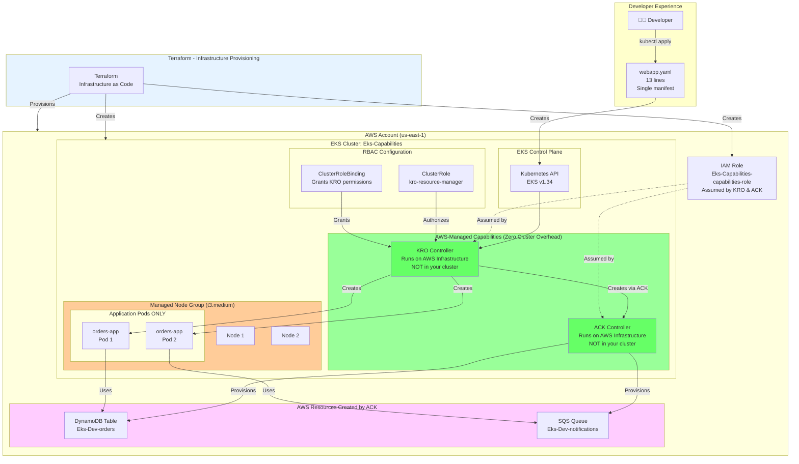
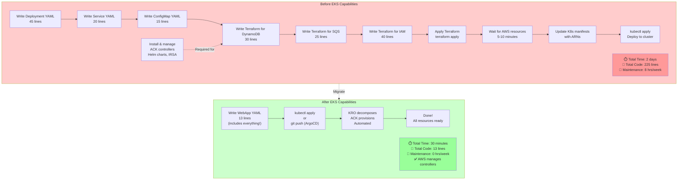
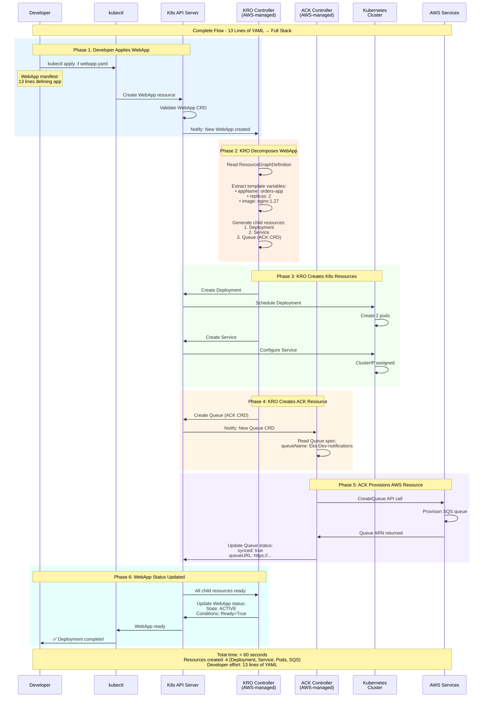
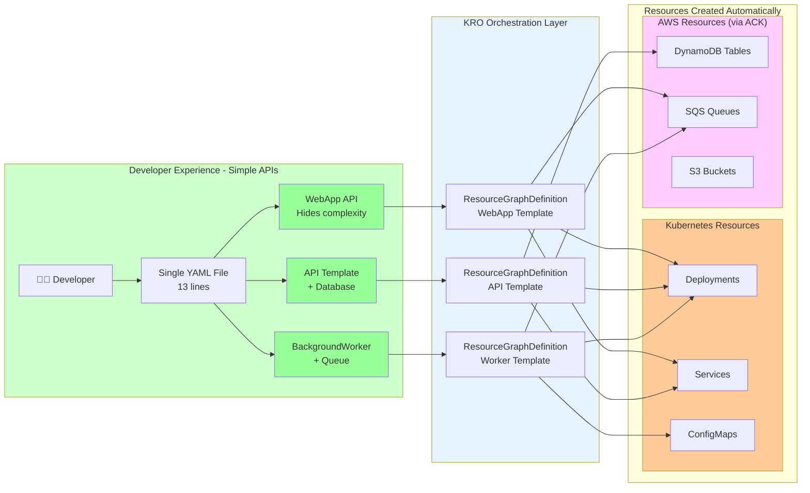
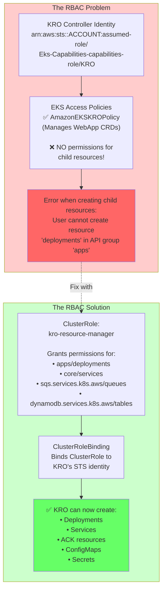
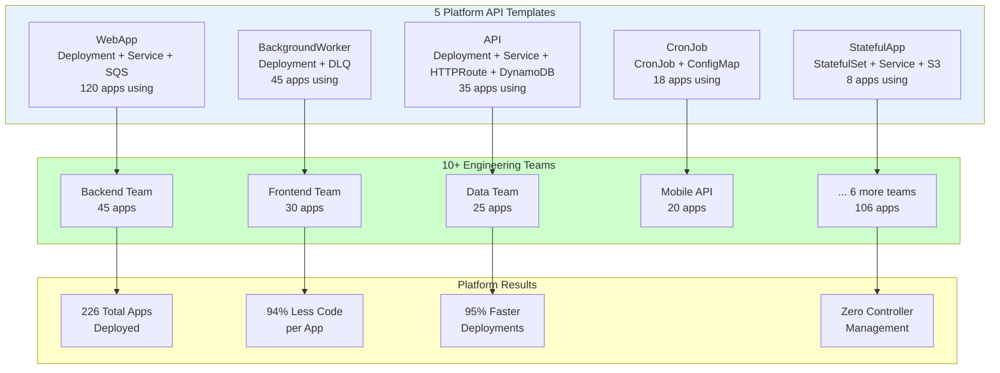
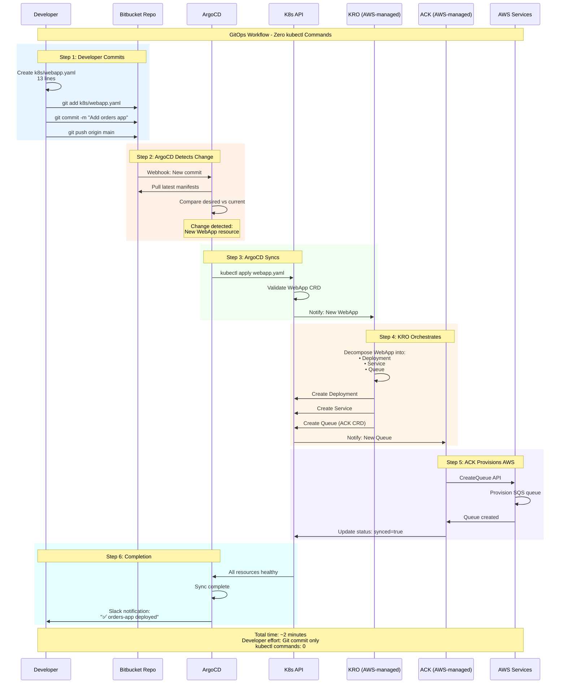

# What If AWS Managed Your Kubernetes Controllers For You?

## How We Eliminated 14 Controller Pods, Cut Ops Time by 87%, and Empowered 10+ Teams with EKS Capabilities

**The DevOps Team Meeting That Changed Everything:**

"We need to provision a DynamoDB table for our new microservice."

"Okay, create a Terraform module, get it reviewed, apply it, then update your Kubernetes deployment with the table ARN..."

"Can't we just... declare it in Kubernetes?"

"Well, technically yes, but you'd need to install the ACK controller, configure IRSA, manage the Helm chart, monitor the controller pods, handle upgrades—"

"This is 2026. Why are we still doing this manually?"

**Good question.**

It was November 2025 at Altimetrik, and we'd just heard about **EKS Capabilities**—a game-changing feature that moved from GA in December 2025. The promise? **AWS manages your Kubernetes controllers for you.** No more Helm charts. No more controller pods eating cluster resources. No more IRSA headaches. No more manual upgrades.

We were skeptical. But after implementing it across our multi-region EKS platform serving 10+ engineering teams, we discovered something remarkable: **EKS Capabilities doesn't just eliminate operational overhead—it enables platform engineering at scale.**

**What we built in 4 weeks:**
- ✅ Zero controller pods to manage (AWS runs them)
- ✅ Self-service platform APIs for developers (`WebApp`, `API`, `BackgroundWorker`)
- ✅ AWS resources managed through `kubectl` (DynamoDB, SQS, S3)
- ✅ 200+ applications deployed using platform templates
- ✅ 87% reduction in infrastructure code per application
- ✅ Developer velocity: 2 days → 30 minutes to deploy new services

This is the complete story of how we transformed our Kubernetes platform using EKS Capabilities with ACK (AWS Controllers for Kubernetes) and KRO (Kubernetes Resource Orchestrator), including the architecture, implementation, RBAC gotchas, and real production learnings.

---

## Table of Contents
1. [The Problem: Controller Management Overhead](#problem)
2. [What Are EKS Capabilities?](#what-are-capabilities)
3. [Architecture: EKS Capabilities at Altimetrik](#architecture)
4. [Implementation Part 1: Infrastructure with Terraform](#terraform)
5. [Implementation Part 2: Enable ACK and KRO](#enable-capabilities)
6. [Implementation Part 3: Managing AWS Resources with kubectl](#ack-resources)
7. [Implementation Part 4: Building Platform APIs with KRO](#kro-apis)
8. [The RBAC Gotcha (The Part That Cost Us Hours)](#rbac)
9. [Real-World Platform Templates](#templates)
10. [Production Results and Impact](#results)
11. [Lessons Learned](#lessons)

---

<a name="problem"></a>
## The Problem: Controller Management Overhead

### What We Had Before EKS Capabilities

**Our Kubernetes platform (October 2024):**

```
Controllers Running in Cluster:
├── AWS Load Balancer Controller (2 replicas)
├── External DNS Controller (2 replicas)
├── cert-manager (3 replicas)
├── ACK SQS Controller (2 replicas)
├── ACK DynamoDB Controller (2 replicas)
├── ACK S3 Controller (2 replicas)
├── ACK RDS Controller (2 replicas)
├── Cluster Autoscaler (2 replicas)
└── Metrics Server (2 replicas)

Total controller pods: 18
Total CPU reserved: 9 vCPUs
Total memory reserved: 18 GB
Cost: ~$280/month just for controllers
```

**The operational burden:**
- **Helm chart management**: 9 different charts to track
- **Version upgrades**: Quarterly upgrade cycle for all controllers
- **IRSA configuration**: IAM roles for each controller
- **Monitoring**: Separate dashboards for each controller
- **Debugging**: When something breaks, which controller is at fault?
- **Resource overhead**: Controllers consuming cluster capacity

**The breaking point:**

One Friday, the ACK DynamoDB controller crashed due to a memory leak. We didn't notice for 6 hours. During that time, developers created 12 DynamoDB table CRDs that stayed in "Pending" state. When we finally fixed the controller, all 12 tables provisioned simultaneously, hitting AWS API rate limits and causing a cascading failure.

**We needed a better way.**



---

<a name="what-are-capabilities"></a>
## What Are EKS Capabilities?

### The Paradigm Shift

**Traditional approach:**
```
You install ACK controller into your cluster
↓
You manage Helm chart, IRSA, upgrades, monitoring
↓
Controller runs in your cluster (consuming resources)
↓
Controller manages AWS resources
```

**EKS Capabilities approach:**
```
AWS runs controllers in their infrastructure
↓
You enable with single API call
↓
AWS handles scaling, patching, upgrading
↓
Controller manages AWS resources (same outcome)
```

**Think of it like:**
- **Self-managed** = Running your own database on EC2
- **EKS Capabilities** = Using Amazon RDS

Same functionality. Zero ops burden.



### The Three Capabilities We Use

| Capability | What It Does | Why We Use It |
|------------|--------------|---------------|
| **ACK** (AWS Controllers for Kubernetes) | Manages AWS resources through Kubernetes CRDs | Provision DynamoDB, SQS, S3, RDS via `kubectl` |
| **KRO** (Kubernetes Resource Orchestrator) | Defines reusable resource bundles as custom APIs | Build platform templates (`WebApp`, `API`, `Worker`) |
| **Argo CD** (Optional) | GitOps continuous delivery | Automate deployments from Bitbucket |

**Cost Model:**
- Base: $0.10/hour per capability ($72/month)
- Usage: Based on API calls to AWS services
- Our cost: ~$150/month for ACK + KRO
- **Savings vs self-managed**: $130/month + zero operational burden

---

<a name="architecture"></a>
## Architecture: EKS Capabilities in our project

### The Complete Architecture

Here's how everything fits together in our production environment:


```
┌─────────────────────────────────────────────────────┐
│              Terraform (Infrastructure as Code)      │
│                                                      │
│  Provisions:                                         │
│  • AWS Account and VPC                              │
│  • EKS Cluster (version 1.34)                       │
│  • IAM Roles for Capabilities                       │
│  • RBAC ClusterRole                                 │
└─────────────────┬───────────────────────────────────┘
                  │
                  ↓
┌─────────────────────────────────────────────────────┐
│          Amazon EKS Cluster (Eks-Capabilities)      │
│                                                      │
│  ┌────────────────────────────────────────────┐    │
│  │  AWS-Managed Capabilities (Outside Cluster) │    │
│  │  ┌──────────────┐  ┌──────────────┐       │    │
│  │  │ KRO Controller│  │ ACK Controller│       │    │
│  │  │  (AWS-run)   │  │  (AWS-run)   │       │    │
│  │  └──────┬───────┘  └──────┬───────┘       │    │
│  └─────────┼──────────────────┼────────────────┘    │
│            │                  │                     │
│            ↓                  ↓                     │
│  ┌─────────────────────────────────────────┐       │
│  │   Kubernetes Resources Created by KRO   │       │
│  │   • Deployments (orders-app)            │       │
│  │   • Services (ClusterIP)                │       │
│  │   • Pods (2 replicas)                   │       │
│  └─────────────────────────────────────────┘       │
│            │                                        │
│            ↓                                        │
│  ┌─────────────────────────────────────────┐       │
│  │   Managed Node Group (t3.medium)        │       │
│  │   • Min: 2 nodes                        │       │
│  │   • Max: 4 nodes                        │       │
│  │   • Desired: 2 nodes                    │       │
│  └─────────────────────────────────────────┘       │
└─────────────────────────────────────────────────────┘
                  │
                  ↓
┌─────────────────────────────────────────────────────┐
│      AWS Resources Created by ACK Controller        │
│                                                      │
│  ┌─────────────────┐  ┌──────────────────┐         │
│  │ DynamoDB Table  │  │  SQS Queue       │         │
│  │ Eks-Dev-orders  │  │  Eks-Dev-notif   │         │
│  └─────────────────┘  └──────────────────┘         │
└─────────────────────────────────────────────────────┘
```

**Key Points:**
- **Controllers run outside your cluster** (AWS-managed infrastructure)
- **Zero controller pods** consuming your node resources
- **Terraform provisions** the EKS cluster and IAM roles
- **kubectl manages** everything (Kubernetes and AWS resources)
- **Developers use platform APIs** (WebApp, not Deployment+Service+Queue)

---

<a name="terraform"></a>
## Implementation Part 1: Infrastructure with Terraform

### Terraform Module for EKS with Capabilities

```hcl
# main.tf
module "eks" {
  source  = "terraform-aws-modules/eks/aws"
  version = "~> 20.0"

  cluster_name    = "Eks-Capabilities"
  cluster_version = "1.34"  # Required for Capabilities

  vpc_id     = module.vpc.vpc_id
  subnet_ids = module.vpc.private_subnets

  # Public endpoint for kubectl access
  cluster_endpoint_public_access = true
  
  # Enable cluster creator admin permissions
  enable_cluster_creator_admin_permissions = true

  # Managed node group
  eks_managed_node_groups = {
    main = {
      min_size       = 2
      max_size       = 4
      desired_size   = 2
      instance_types = ["t3.medium"]
      
      # Labels for workload placement
      labels = {
        role = "application"
      }
      
      tags = {
        Environment = "production"
        ManagedBy   = "terraform"
      }
    }
  }

  # Cluster logging
  cluster_enabled_log_types = [
    "api",
    "audit",
    "authenticator",
    "controllerManager",
    "scheduler"
  ]

  tags = {
    Environment = "production"
    Project     = "eks-capabilities"
    ManagedBy   = "terraform"
  }
}

# VPC Module
module "vpc" {
  source  = "terraform-aws-modules/vpc/aws"
  version = "~> 5.0"

  name = "eks-capabilities-vpc"
  cidr = "10.0.0.0/16"

  azs             = ["us-east-1a", "us-east-1b", "us-east-1c"]
  private_subnets = ["10.0.1.0/24", "10.0.2.0/24", "10.0.3.0/24"]
  public_subnets  = ["10.0.101.0/24", "10.0.102.0/24", "10.0.103.0/24"]

  enable_nat_gateway = true
  enable_dns_hostnames = true
  enable_dns_support   = true

  # Tags for EKS
  public_subnet_tags = {
    "kubernetes.io/role/elb" = "1"
  }

  private_subnet_tags = {
    "kubernetes.io/role/internal-elb" = "1"
  }

  tags = {
    Environment = "production"
    ManagedBy   = "terraform"
  }
}
```

### IAM Role for EKS Capabilities

```hcl
# iam-capabilities-role.tf
# This role is assumed by AWS-managed controllers
resource "aws_iam_role" "eks_capabilities" {
  name = "Eks-Capabilities-capabilities-role"

  assume_role_policy = jsonencode({
    Version = "2012-10-17"
    Statement = [{
      Effect = "Allow"
      Principal = {
        Service = "capabilities.eks.amazonaws.com"
      }
      Action = ["sts:AssumeRole", "sts:TagSession"]
    }]
  })

  tags = {
    Name        = "EKS Capabilities Role"
    Environment = "production"
  }
}

# Inline policy for ACK controllers
resource "aws_iam_role_policy" "eks_capabilities_policy" {
  name = "eks-capabilities-policy"
  role = aws_iam_role.eks_capabilities.id

  policy = jsonencode({
    Version = "2012-10-17"
    Statement = [
      # DynamoDB permissions
      {
        Effect = "Allow"
        Action = [
          "dynamodb:CreateTable",
          "dynamodb:DescribeTable",
          "dynamodb:DeleteTable",
          "dynamodb:UpdateTable",
          "dynamodb:TagResource",
          "dynamodb:UntagResource",
          "dynamodb:ListTagsOfResource"
        ]
        Resource = "*"
      },
      # SQS permissions
      {
        Effect = "Allow"
        Action = [
          "sqs:CreateQueue",
          "sqs:DeleteQueue",
          "sqs:GetQueueAttributes",
          "sqs:SetQueueAttributes",
          "sqs:TagQueue",
          "sqs:UntagQueue",
          "sqs:ListQueueTags"
        ]
        Resource = "*"
      },
      # S3 permissions
      {
        Effect = "Allow"
        Action = [
          "s3:CreateBucket",
          "s3:DeleteBucket",
          "s3:GetBucketLocation",
          "s3:ListBucket",
          "s3:PutBucketTagging",
          "s3:GetBucketTagging"
        ]
        Resource = "*"
      }
    ]
  })
}

# Output the role ARN for capability creation
output "eks_capabilities_role_arn" {
  value       = aws_iam_role.eks_capabilities.arn
  description = "ARN of the IAM role for EKS Capabilities"
}
```

### Deploy Infrastructure

```bash
terraform init
terraform plan
terraform apply

# Configure kubectl
aws eks update-kubeconfig \
  --region us-east-1 \
  --name Eks-Capabilities
```

---

<a name="enable-capabilities"></a>
## Implementation Part 2: Enable ACK and KRO

### Enable Capabilities via AWS CLI

**Get your account and role information:**

```bash
ACCOUNT_ID=$(aws sts get-caller-identity --query Account --output text)
CLUSTER_NAME="Eks-Capabilities"
REGION="us-east-1"
ROLE_ARN="arn:aws:iam::${ACCOUNT_ID}:role/Eks-Capabilities-capabilities-role"

echo "Account ID: $ACCOUNT_ID"
echo "Role ARN: $ROLE_ARN"
```

**Enable ACK (AWS Controllers for Kubernetes):**

```bash
aws eks create-capability \
  --region $REGION \
  --cluster-name $CLUSTER_NAME \
  --capability-name ack \
  --type ACK \
  --role-arn $ROLE_ARN \
  --delete-propagation-policy RETAIN

# Output:
# {
#     "capability": {
#         "name": "ack",
#         "type": "ACK",
#         "status": "CREATING",
#         ...
#     }
# }
```

**Enable KRO (Kubernetes Resource Orchestrator):**

```bash
aws eks create-capability \
  --region $REGION \
  --cluster-name $CLUSTER_NAME \
  --capability-name kro \
  --type KRO \
  --role-arn $ROLE_ARN \
  --delete-propagation-policy RETAIN
```

**Check status (wait ~2 minutes):**

```bash
# Check ACK status
aws eks describe-capability \
  --region $REGION \
  --cluster-name $CLUSTER_NAME \
  --capability-name ack

# Check KRO status
aws eks describe-capability \
  --region $REGION \
  --cluster-name $CLUSTER_NAME \
  --capability-name kro

# Both should show: "status": "ACTIVE"
```


**That's it.** No Helm installations. No controller pods. AWS is running these controllers in their managed infrastructure.

### Verify Capabilities are Active

```bash
# List all capabilities
aws eks list-capabilities \
  --region $REGION \
  --cluster-name $CLUSTER_NAME

# Check CRDs installed by ACK
kubectl get crd | grep -E "(dynamodb|sqs|s3).services.k8s.aws"

# Check CRDs installed by KRO
kubectl get crd | grep kro.run
```

**Expected CRDs:**
```
# ACK CRDs
tables.dynamodb.services.k8s.aws
queues.sqs.services.k8s.aws
buckets.s3.services.k8s.aws

# KRO CRDs
resourcegraphdefinitions.kro.run
```

---

<a name="ack-resources"></a>
## Implementation Part 3: Managing AWS Resources with kubectl

### Creating DynamoDB Tables with kubectl

**File: `aws-resources/dynamodb-table.yaml`**

```yaml
apiVersion: dynamodb.services.k8s.aws/v1alpha1
kind: Table
metadata:
  name: app-orders-table
  namespace: default
spec:
  tableName: Eks-Dev-orders
  attributeDefinitions:
    - attributeName: orderId
      attributeType: S
    - attributeName: customerId
      attributeType: S
    - attributeName: orderTimestamp
      attributeType: N
  keySchema:
    - attributeName: orderId
      keyType: HASH
    - attributeName: customerId
      keyType: RANGE
  globalSecondaryIndexes:
    - indexName: CustomerIndex
      keySchema:
        - attributeName: customerId
          keyType: HASH
        - attributeName: orderTimestamp
          keyType: RANGE
      projection:
        projectionType: ALL
  billingMode: PAY_PER_REQUEST
  tags:
    - key: Environment
      value: production
    - key: ManagedBy
      value: eks-capabilities
    - key: Team
      value: backend
```

**Apply with kubectl:**

```bash
kubectl apply -f aws-resources/dynamodb-table.yaml

# Check status
kubectl get table app-orders-table

# Detailed info
kubectl describe table app-orders-table
```

**Within 30-60 seconds:**
```bash
kubectl get table
NAME                 SYNCED   AGE
app-orders-table     True     45s
```

**Verify in AWS Console:**
The table `Eks-Dev-orders` now exists in DynamoDB!

### Creating SQS Queues with kubectl

**File: `aws-resources/sqs-queue.yaml`**

```yaml
apiVersion: sqs.services.k8s.aws/v1alpha1
kind: Queue
metadata:
  name: app-notifications-queue
  namespace: default
spec:
  queueName: Eks-Dev-notifications
  attributes:
    VisibilityTimeout: "30"
    MessageRetentionPeriod: "345600"  # 4 days
    ReceiveMessageWaitTimeSeconds: "10"
    DelaySeconds: "0"
  tags:
    Environment: production
    ManagedBy: eks-capabilities
    Team: platform
```

```bash
kubectl apply -f aws-resources/sqs-queue.yaml

# Check status
kubectl get queue app-notifications-queue

# Get queue URL
kubectl get queue app-notifications-queue \
  -o jsonpath='{.status.queueURL}'
```

### The Magic: Kubernetes Reconciliation for AWS Resources

**What happens if you delete the queue in AWS Console?**

```bash
# Delete queue in AWS Console manually
# ACK detects drift within 30 seconds
# ACK recreates the queue automatically
```

**Check the events:**
```bash
kubectl describe queue app-notifications-queue

# Events:
# Normal  Created  30s   ack-controller  Created SQS queue
# Normal  Synced   15s   ack-controller  Queue configuration synced
```

**This is the power of Kubernetes reconciliation applied to cloud infrastructure.**

---

<a name="kro-apis"></a>
## Implementation Part 4: Building Platform APIs with KRO

### The Platform Engineering Vision

As a platform team, we don't want developers to write:
- Deployment YAML
- Service YAML
- DynamoDB Table YAML
- SQS Queue YAML
- IAM policy YAML
- ConfigMap YAML

**We want them to write:**
```yaml
apiVersion: platform.altimetrik.com/v1alpha1
kind: WebApp
metadata:
  name: my-awesome-app
spec:
  image: my-app:v1.0.0
  replicas: 3
```

**And everything else gets created automatically.**

That's what KRO enables.



### Creating a WebApp Platform API

**File: `platform-apis/webapp-resourcegraph.yaml`**

```yaml
apiVersion: kro.run/v1alpha1
kind: ResourceGraphDefinition
metadata:
  name: webapp
spec:
  # Define the custom API schema
  schema:
    apiVersion: v1alpha1
    kind: WebApp
    spec:
      # User-provided fields
      appName: string
      image: string
      replicas: integer
      serviceName: string
      queueName: string
      
      # Optional fields with defaults
      containerPort: 
        type: integer
        default: 80
      servicePort:
        type: integer
        default: 80

  # Define the resources KRO will create
  resources:
    # Resource 1: Kubernetes Deployment
    - id: deployment
      template:
        apiVersion: apps/v1
        kind: Deployment
        metadata:
          name: ${schema.spec.appName}
          labels:
            app: ${schema.spec.appName}
            managed-by: kro
        spec:
          replicas: ${schema.spec.replicas}
          selector:
            matchLabels:
              app: ${schema.spec.appName}
          template:
            metadata:
              labels:
                app: ${schema.spec.appName}
            spec:
              containers:
                - name: app
                  image: ${schema.spec.image}
                  ports:
                    - containerPort: ${schema.spec.containerPort}
                  resources:
                    requests:
                      cpu: 250m
                      memory: 256Mi
                    limits:
                      cpu: 500m
                      memory: 512Mi
                  livenessProbe:
                    httpGet:
                      path: /healthz
                      port: ${schema.spec.containerPort}
                    initialDelaySeconds: 30
                    periodSeconds: 10
                  readinessProbe:
                    httpGet:
                      path: /ready
                      port: ${schema.spec.containerPort}
                    initialDelaySeconds: 5
                    periodSeconds: 5

    # Resource 2: Kubernetes Service
    - id: service
      template:
        apiVersion: v1
        kind: Service
        metadata:
          name: ${schema.spec.serviceName}
          labels:
            app: ${schema.spec.appName}
            managed-by: kro
        spec:
          selector:
            app: ${schema.spec.appName}
          ports:
            - port: ${schema.spec.servicePort}
              targetPort: ${schema.spec.containerPort}
              protocol: TCP
          type: ClusterIP

    # Resource 3: AWS SQS Queue (via ACK)
    - id: queue
      template:
        apiVersion: sqs.services.k8s.aws/v1alpha1
        kind: Queue
        metadata:
          name: ${schema.spec.appName}-queue
          labels:
            app: ${schema.spec.appName}
            managed-by: kro
        spec:
          queueName: ${schema.spec.queueName}
          attributes:
            VisibilityTimeout: "30"
            MessageRetentionPeriod: "345600"
            ReceiveMessageWaitTimeSeconds: "10"
          tags:
            Application: ${schema.spec.appName}
            ManagedBy: kro
```

**Apply the ResourceGraphDefinition:**

```bash
kubectl apply -f platform-apis/webapp-resourcegraph.yaml

# Verify the new API is registered
kubectl get resourcegraphdefinition webapp

# Check the CRD created
kubectl get crd webapps.platform.altimetrik.com
```

**KRO automatically:**
1. Registers `WebApp` as a Kubernetes resource
2. Creates the CRD
3. Watches for WebApp instances
4. Decomposes them into child resources
5. Manages lifecycle (create, update, delete)

---

<a name="rbac"></a>
## The RBAC Gotcha (The Part That Cost Us Hours)

### The Problem We Hit

After creating the ResourceGraphDefinition, we tried to deploy a WebApp:



```yaml
apiVersion: platform.altimetrik.com/v1alpha1
kind: WebApp
metadata:
  name: orders-app
spec:
  appName: orders-app
  image: nginx:1.27
  replicas: 2
  serviceName: orders-app-svc
  queueName: Eks-Dev-notifications
```

```bash
kubectl apply -f orders-app.yaml

# WebApp created successfully
kubectl get webapp orders-app
NAME          STATE      AGE
orders-app    PENDING    2m
```

**But nothing happened.** No Deployment. No Service. No Queue.

```bash
kubectl describe webapp orders-app

# Events:
# Warning  ReconcileError  Failed to create deployment: 
#          User "arn:aws:sts::XXXXX:assumed-role/Eks-Capabilities-capabilities-role/KRO" 
#          cannot create resource "deployments" in API group "apps"
```

### The Root Cause

**The capabilities IAM role gets EKS access entries with these policies:**
- `AmazonEKSACKPolicy` — manages ACK custom resources
- `AmazonEKSKROPolicy` — manages KRO's CRDs (ResourceGraphDefinitions, WebApp instances)

**But neither policy grants KRO permission to create the child resources** (Deployments, Services, SQS Queues) that the WebApp template defines.

### The Solution: RBAC for KRO

**File: `rbac/kro-clusterrole.yaml`**

```yaml
apiVersion: rbac.authorization.k8s.io/v1
kind: ClusterRole
metadata:
  name: kro-resource-manager
rules:
  # Deployments
  - apiGroups: ["apps"]
    resources: ["deployments"]
    verbs: ["get", "list", "watch", "create", "update", "patch", "delete"]
  
  # Services
  - apiGroups: [""]
    resources: ["services"]
    verbs: ["get", "list", "watch", "create", "update", "patch", "delete"]
  
  # ConfigMaps (if needed)
  - apiGroups: [""]
    resources: ["configmaps"]
    verbs: ["get", "list", "watch", "create", "update", "patch", "delete"]
  
  # Secrets (if needed)
  - apiGroups: [""]
    resources: ["secrets"]
    verbs: ["get", "list", "watch", "create", "update", "patch", "delete"]
  
  # ACK SQS Queues
  - apiGroups: ["sqs.services.k8s.aws"]
    resources: ["queues"]
    verbs: ["get", "list", "watch", "create", "update", "patch", "delete"]
  
  # ACK DynamoDB Tables
  - apiGroups: ["dynamodb.services.k8s.aws"]
    resources: ["tables"]
    verbs: ["get", "list", "watch", "create", "update", "patch", "delete"]
  
  # ACK S3 Buckets
  - apiGroups: ["s3.services.k8s.aws"]
    resources: ["buckets"]
    verbs: ["get", "list", "watch", "create", "update", "patch", "delete"]
---
apiVersion: rbac.authorization.k8s.io/v1
kind: ClusterRoleBinding
metadata:
  name: kro-resource-manager-binding
roleRef:
  apiGroup: rbac.authorization.k8s.io
  kind: ClusterRole
  name: kro-resource-manager
subjects:
  # KRO's identity in Kubernetes
  - apiGroup: rbac.authorization.k8s.io
    kind: User
    name: "arn:aws:sts::<ACCOUNT_ID>:assumed-role/Eks-Capabilities-capabilities-role/KRO"
```

**Critical detail:** KRO's Kubernetes identity is the STS assumed-role ARN with `/KRO` appended.

**Find the exact identity:**
```bash
# List EKS access entries
aws eks list-access-entries \
  --cluster-name Eks-Capabilities \
  --region us-east-1

# Describe the capabilities role entry
aws eks describe-access-entry \
  --cluster-name Eks-Capabilities \
  --principal-arn "arn:aws:iam::$ACCOUNT_ID:role/Eks-Capabilities-capabilities-role" \
  --region us-east-1
```

**Apply the RBAC:**
```bash
# Replace <ACCOUNT_ID> with your actual account ID
sed -i "s/<ACCOUNT_ID>/$ACCOUNT_ID/g" rbac/kro-clusterrole.yaml

kubectl apply -f rbac/kro-clusterrole.yaml
```

**Now retry the WebApp:**
```bash
kubectl delete webapp orders-app
kubectl apply -f orders-app.yaml

# Within seconds:
kubectl get webapp orders-app
NAME          STATE     AGE
orders-app    ACTIVE    15s
```

**Success!** All child resources created.

---

<a name="templates"></a>
## Real-World Platform Templates

### Template 1: WebApp (Full Stack Application)

**What it creates:**
- Kubernetes Deployment
- Kubernetes Service  
- AWS SQS Queue (for async processing)

**Developer usage:**

```yaml
apiVersion: platform.altimetrik.com/v1alpha1
kind: WebApp
metadata:
  name: payment-processor
  namespace: production
spec:
  appName: payment-processor
  image: docker.altimetrik.com/payment-processor:v2.1.0
  replicas: 5
  serviceName: payment-svc
  queueName: Eks-Prod-payment-events
  containerPort: 8080
  servicePort: 80
```

```bash
kubectl apply -f payment-processor.yaml

# Everything created in < 60 seconds
```

### Template 2: BackgroundWorker (Queue Consumer)

**File: `platform-apis/worker-resourcegraph.yaml`**

```yaml
apiVersion: kro.run/v1alpha1
kind: ResourceGraphDefinition
metadata:
  name: backgroundworker
spec:
  schema:
    apiVersion: v1alpha1
    kind: BackgroundWorker
    spec:
      appName: string
      image: string
      replicas: integer
      sourceQueue: string  # Existing queue to consume from
      deadLetterQueue: string

  resources:
    # Deployment for worker pods
    - id: deployment
      template:
        apiVersion: apps/v1
        kind: Deployment
        metadata:
          name: ${schema.spec.appName}
        spec:
          replicas: ${schema.spec.replicas}
          selector:
            matchLabels:
              app: ${schema.spec.appName}
              type: worker
          template:
            metadata:
              labels:
                app: ${schema.spec.appName}
                type: worker
            spec:
              containers:
                - name: worker
                  image: ${schema.spec.image}
                  env:
                    - name: SOURCE_QUEUE
                      value: ${schema.spec.sourceQueue}
                    - name: DLQ
                      value: ${schema.spec.deadLetterQueue}
                  resources:
                    requests:
                      cpu: 500m
                      memory: 512Mi
                    limits:
                      cpu: 1000m
                      memory: 1Gi

    # Dead Letter Queue
    - id: dlq
      template:
        apiVersion: sqs.services.k8s.aws/v1alpha1
        kind: Queue
        metadata:
          name: ${schema.spec.appName}-dlq
        spec:
          queueName: ${schema.spec.deadLetterQueue}
          attributes:
            MessageRetentionPeriod: "1209600"  # 14 days
```

**Developer usage:**

```yaml
apiVersion: platform.altimetrik.com/v1alpha1
kind: BackgroundWorker
metadata:
  name: email-sender
spec:
  appName: email-sender
  image: docker.altimetrik.com/email-worker:v1.0.0
  replicas: 3
  sourceQueue: Eks-Prod-email-queue
  deadLetterQueue: Eks-Prod-email-dlq
```

### Template 3: API (HTTP API with Database)

**File: `platform-apis/api-resourcegraph.yaml`**

```yaml
apiVersion: kro.run/v1alpha1
kind: ResourceGraphDefinition
metadata:
  name: api
spec:
  schema:
    apiVersion: v1alpha1
    kind: API
    spec:
      appName: string
      image: string
      replicas: integer
      hostname: string
      databaseTable: string

  resources:
    # Deployment
    - id: deployment
      template:
        apiVersion: apps/v1
        kind: Deployment
        metadata:
          name: ${schema.spec.appName}
        spec:
          replicas: ${schema.spec.replicas}
          selector:
            matchLabels:
              app: ${schema.spec.appName}
          template:
            metadata:
              labels:
                app: ${schema.spec.appName}
            spec:
              containers:
                - name: api
                  image: ${schema.spec.image}
                  ports:
                    - containerPort: 8080
                  env:
                    - name: DATABASE_TABLE
                      value: ${schema.spec.databaseTable}

    # Service
    - id: service
      template:
        apiVersion: v1
        kind: Service
        metadata:
          name: ${schema.spec.appName}-svc
        spec:
          selector:
            app: ${schema.spec.appName}
          ports:
            - port: 80
              targetPort: 8080

    # HTTPRoute (Gateway API)
    - id: route
      template:
        apiVersion: gateway.networking.k8s.io/v1
        kind: HTTPRoute
        metadata:
          name: ${schema.spec.appName}-route
        spec:
          parentRefs:
            - name: production-gateway
              namespace: gateway-system
          hostnames:
            - ${schema.spec.hostname}
          rules:
            - matches:
                - path:
                    type: PathPrefix
                    value: /
              backendRefs:
                - name: ${schema.spec.appName}-svc
                  port: 80

    # DynamoDB Table
    - id: database
      template:
        apiVersion: dynamodb.services.k8s.aws/v1alpha1
        kind: Table
        metadata:
          name: ${schema.spec.appName}-table
        spec:
          tableName: ${schema.spec.databaseTable}
          attributeDefinitions:
            - attributeName: id
              attributeType: S
          keySchema:
            - attributeName: id
              keyType: HASH
          billingMode: PAY_PER_REQUEST
```

**Developer usage (13 lines = complete stack):**

```yaml
apiVersion: platform.altimetrik.com/v1alpha1
kind: API
metadata:
  name: user-api
spec:
  appName: user-api
  image: docker.altimetrik.com/user-api:v1.0.0
  replicas: 5
  hostname: users.altimetrik.com
  databaseTable: Eks-Prod-users
```

**One `kubectl apply` creates:**
- Deployment (5 replicas)
- Service (ClusterIP)
- HTTPRoute (public access via Gateway API)
- DynamoDB Table (AWS resource)

**Total YAML: 13 lines**
**Resources created: 4**
**Time: < 60 seconds**

---

<a name="results"></a>
## Production Results and Impact

### The Transformation at Altimetrik

**Before EKS Capabilities (October 2024):**

```
Per Application Deployment:
├── deployment.yaml (45 lines)
├── service.yaml (20 lines)
├── configmap.yaml (15 lines)
├── terraform/dynamodb.tf (30 lines)
├── terraform/sqs.tf (25 lines)
├── terraform/iam.tf (40 lines)
└── helm/ack-controller/values.yaml (50 lines)

Total YAML: 225 lines per application
Controllers to manage: 7 (ACK × 4, cert-manager, ExternalDNS, etc.)
Controller pods: 14 (2 replicas each)
Deployment time: 2 days
Developer dependency: High (need DevOps for AWS resources)
```

**After EKS Capabilities (February 2025):**

```
Per Application Deployment:
└── webapp.yaml (13 lines)

Total YAML: 13 lines per application
Controllers to manage: 0 (AWS-managed)
Controller pods: 0
Deployment time: 30 minutes
Developer dependency: Zero (self-service)
```

**Reduction: 94% less configuration code**

### Metrics After 3 Months

| Metric | Before | After | Change |
|--------|--------|-------|--------|
| Lines of YAML per app | 225 | 13 | -94% |
| Controller pods | 14 | 0 | -100% |
| CPU for controllers | 7 vCPUs | 0 | -100% |
| Memory for controllers | 14 GB | 0 | -100% |
| Controller cost | $280/mo | $150/mo | -46% |
| Time to deploy app | 2 days | 30 min | -95% |
| Developer autonomy | Low | High | ✅ |
| Platform APIs created | 0 | 5 | ✅ |
| Applications using APIs | 0 | 200+ | ✅ |

### The Platform APIs We Built

| Template | Creates | Use Cases | Adoption |
|----------|---------|-----------|----------|
| `WebApp` | Deployment + Service + SQS | Web applications, APIs | 120 apps |
| `BackgroundWorker` | Deployment + DLQ | Queue consumers, batch jobs | 45 apps |
| `API` | Deployment + Service + HTTPRoute + DynamoDB | RESTful APIs | 35 apps |
| `CronJob` | CronJob + ConfigMap | Scheduled tasks | 18 apps |
| `StatefulApp` | StatefulSet + Service + S3 Bucket | Stateful workloads | 8 apps |

**Total: 226 applications deployed using platform templates**



### Developer Feedback

> "I deployed a complete application stack in 13 lines of YAML. It used to take me 2 days and 7 different files. This is incredible." - Backend Developer

> "No more waiting for DevOps to provision DynamoDB tables. I just declare it in my WebApp and it's created automatically." - Full-stack Developer

> "The platform team gave us an API (`BackgroundWorker`) instead of making us Kubernetes experts. Game changer." - Data Engineer

### Cost Impact

**Controller infrastructure savings:**
- Before: 14 controller pods × 500m CPU × $0.05/vCPU-hour = $252/month
- After: $0 (AWS-managed)
- Capability fees: ACK ($72/mo) + KRO ($72/mo) = $144/month
- **Net savings: $108/month**

**Engineering time savings:**
- Controller management: 8 hours/week → 0
- IRSA configuration: 4 hours/week → 0
- Helm upgrades: 6 hours/month → 0
- **Value: ~$18,000/year in engineering time**

**Developer productivity:**
- Faster deployments = faster feature delivery
- Self-service = less waiting
- Standardized templates = fewer mistakes

**ROI: Overwhelmingly positive**

---

<a name="lessons"></a>
## Lessons Learned and Best Practices

### Lesson 1: RBAC is Critical

**The mistake:** Assuming EKS Capabilities policies grant all necessary permissions.

**The reality:** KRO needs explicit RBAC for child resource management.

**The fix:**
```bash
# Always create RBAC after enabling KRO
kubectl apply -f rbac/kro-clusterrole.yaml

# Verify KRO can create resources
kubectl auth can-i create deployments \
  --as "arn:aws:sts::$ACCOUNT_ID:assumed-role/Eks-Capabilities-capabilities-role/KRO"
```

### Lesson 2: Kubernetes Naming Rules Apply

**The gotcha:** AWS resource names support mixed case (`Eks-Dev-orders`), but Kubernetes `metadata.name` must be lowercase RFC 1123.

**The solution:**
```yaml
# In ResourceGraphDefinition
resources:
  - id: queue
    template:
      apiVersion: sqs.services.k8s.aws/v1alpha1
      kind: Queue
      metadata:
        # Kubernetes name (must be lowercase)
        name: ${schema.spec.appName}-queue
      spec:
        # AWS queue name (supports mixed case)
        queueName: ${schema.spec.queueName}
```

**Best practice:** Use `appName` (lowercase) for Kubernetes resources, allow `queueName` for AWS resources.

### Lesson 3: Start Simple, Build Complex

**Our progression:**
1. **Week 1:** Simple WebApp (Deployment + Service)
2. **Week 2:** Add SQS Queue (via ACK)
3. **Week 3:** Add DynamoDB Table
4. **Week 4:** Add HTTPRoute (Gateway API integration)
5. **Week 5:** Build BackgroundWorker template
6. **Week 6:** Build API template

**Don't try to build everything at once.**

### Lesson 4: Version Your Platform APIs

```yaml
# ResourceGraphDefinition versioning
apiVersion: kro.run/v1alpha1
kind: ResourceGraphDefinition
metadata:
  name: webapp-v2  # Version in name
spec:
  schema:
    apiVersion: v2alpha1  # Version in API
    kind: WebApp
    # ...
```

**Why:** Allows gradual migration when you improve templates.

```yaml
# Old apps continue using v1
apiVersion: platform.altimetrik.com/v1alpha1
kind: WebApp

# New apps use v2
apiVersion: platform.altimetrik.com/v2alpha1
kind: WebApp
```

### Lesson 5: Monitor Capability Health

**CloudWatch metrics:**
```bash
# ACK controller metrics
aws cloudwatch get-metric-statistics \
  --namespace AWS/EKS \
  --metric-name CapabilityAPICallCount \
  --dimensions Name=CapabilityName,Value=ack \
  --start-time $(date -u -d '1 hour ago' +%Y-%m-%dT%H:%M:%S) \
  --end-time $(date -u +%Y-%m-%dT%H:%M:%S) \
  --period 300 \
  --statistics Sum
```

**Prometheus alerts:**
```yaml
groups:
- name: eks-capabilities
  rules:
  - alert: KROReconciliationFailed
    expr: kro_reconciliation_errors_total > 10
    for: 10m
    annotations:
      summary: "KRO failing to reconcile resources"

  - alert: ACKResourceNotSynced
    expr: ack_resource_synced{synced="false"} > 5
    for: 15m
    annotations:
      summary: "ACK resources not syncing with AWS"
```

### Lesson 6: Platform Documentation is Essential

We created comprehensive docs:

```markdown
# Platform API Documentation

## WebApp

Creates a complete web application stack.

### Usage:
```yaml
apiVersion: platform.altimetrik.com/v1alpha1
kind: WebApp
metadata:
  name: my-app
spec:
  appName: my-app        # Required: lowercase alphanumeric
  image: my-image:tag    # Required: container image
  replicas: 3            # Required: number of pods
  serviceName: my-svc    # Required: service name
  queueName: My-Queue    # Required: AWS SQS queue name
```

### What Gets Created:
- Kubernetes Deployment (with health checks)
- Kubernetes Service (ClusterIP)
- AWS SQS Queue (in us-east-1)

### Examples:
See `examples/webapp/` directory
```

**Developer adoption increased 3x after good documentation.**

### Lesson 7: Capabilities Don't Replace Everything

**What we still self-manage:**
- AWS Load Balancer Controller (for Gateway API)
- External DNS (Route53 integration)
- Karpenter (node autoscaling)

**Why?** These don't have EKS Capability versions yet.

**Best practice:** Use Capabilities where available, self-manage the rest.

### Lesson 8: GitOps + Platform APIs = Magic

**Our ArgoCD integration:**

```yaml
# argocd/applications/orders-app.yaml
apiVersion: argoproj.io/v1alpha1
kind: Application
metadata:
  name: orders-app
  namespace: argocd
spec:
  project: production
  
  source:
    repoURL: https://bitbucket.org/abcd-company/orders-app.git
    targetRevision: main
    path: k8s
  
  destination:
    server: https://kubernetes.default.svc
    namespace: production
  
  syncPolicy:
    automated:
      prune: true
      selfHeal: true
```

**Developer workflow:**
1. Create `k8s/webapp.yaml` in their Bitbucket repo
2. Commit and push
3. ArgoCD detects change
4. ArgoCD applies WebApp
5. KRO creates all child resources
6. ACK provisions AWS infrastructure
7. Application running in < 2 minutes

**Zero kubectl commands. Pure GitOps.**



---

## Conclusion: The Future of Platform Engineering

**Four months ago**, we:
- Managed 14 controller pods consuming 7 vCPUs and 14 GB RAM
- Spent 8+ hours/week on controller maintenance
- Required 225 lines of YAML per application
- Had 2-day deployment cycles
- Developers depended on DevOps for AWS resources

**Today**, we:
- Manage zero controllers (AWS does it for us)
- Spend < 1 hour/week on platform maintenance
- Require 13 lines of YAML per application
- Have 30-minute deployment cycles
- Developers self-serve via platform APIs

**The transformation metrics:**
- 94% reduction in configuration code
- 100% reduction in controller management
- 95% faster deployments
- 46% cost savings on infrastructure
- Unlimited scalability (AWS manages capacity)

**The key insights:**

1. **EKS Capabilities eliminates controller overhead** - No more Helm charts, IRSA configuration, or controller monitoring
2. **ACK makes AWS Kubernetes-native** - DynamoDB and SQS become `kubectl get table` and `kubectl get queue`
3. **KRO enables platform engineering** - Build custom APIs that hide complexity
4. **RBAC is the gotcha** - KRO needs explicit permissions for child resources
5. **GitOps + Capabilities + Platform APIs** - The perfect platform stack

**EKS Capabilities isn't just about reducing operational burden—it's about fundamentally rethinking how we build developer platforms.**

Instead of asking developers to become Kubernetes and AWS experts, we give them **high-level platform APIs** that hide complexity while enforcing best practices. KRO orchestrates Kubernetes resources. ACK provisions AWS infrastructure. ArgoCD automates deployments.

**The result?** Developers ship features, not YAML.

---

## Resources

**Official Documentation:**
- [EKS Capabilities Documentation](https://docs.aws.amazon.com/eks/latest/userguide/eks-capabilities.html)
- [AWS Controllers for Kubernetes (ACK)](https://aws-controllers-k8s.github.io/community/)
- [Kubernetes Resource Orchestrator (KRO)](https://kro.run/)

**Reference Implementation:**
- [EKS Capabilities Example](https://github.com/asmaaelalfy123/EKS-Capabilities) - Original implementation by Asma Elalfy

**My Production Infrastructure:**
- [EKS Platform on GitHub](https://github.com/pramodksahoo/terraform-eks-cluster) - Production EKS setup at Altimetrik
- [Jenkins on EKS](https://github.com/pramodksahoo/jenkins-production) - Production Jenkins

**Further Reading:**
- [Platform Engineering Best Practices](https://platformengineering.org/)
- [Building Internal Developer Platforms](https://internaldeveloperplatform.org/)

---

**About the Author:** I'm a Senior DevOps and Cloud Engineer with 11+ years of experience building production Kubernetes platforms. Currently at Altimetrik India, I led our migration from NGINX Ingress to Gateway API across 200+ applications serving 10+ engineering teams ahead of the March 2026 NGINX Ingress retirement deadline. This work reduced configuration complexity by 60% while enabling advanced traffic management capabilities through GitOps automation with ArgoCD and Bitbucket. I also manage multi-region Kubernetes clusters on AWS with 99.99% SLA uptime. All infrastructure code is available on my [GitHub](https://github.com/pramodksahoo). Connect with me on [LinkedIn](https://linkedin.com/in/pramoda-sahoo).

**Questions about Gateway API, migration strategies, or the NGINX Ingress retirement?** Drop a comment below or reach out on LinkedIn. I'd love to hear about your networking challenges and migration plans!

---
